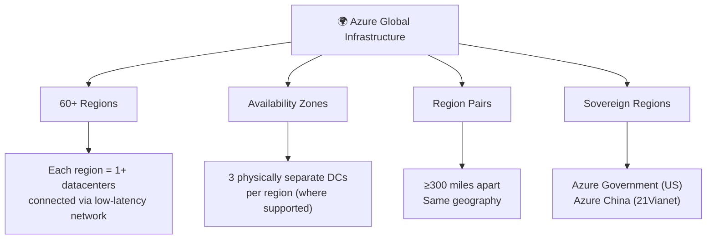
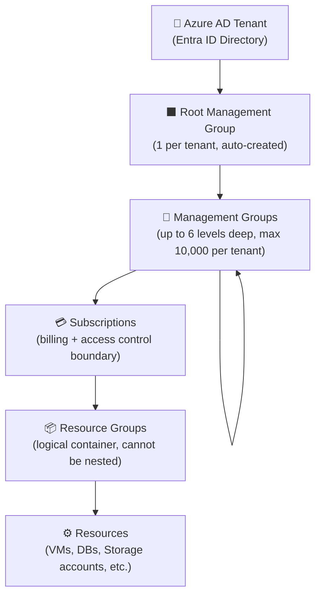
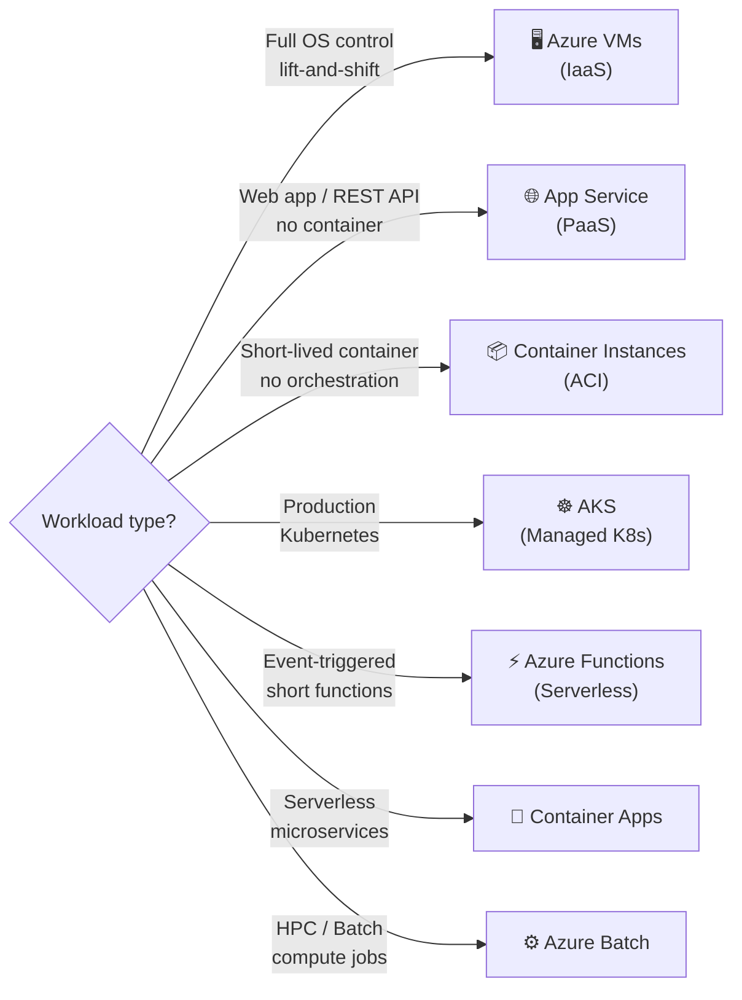
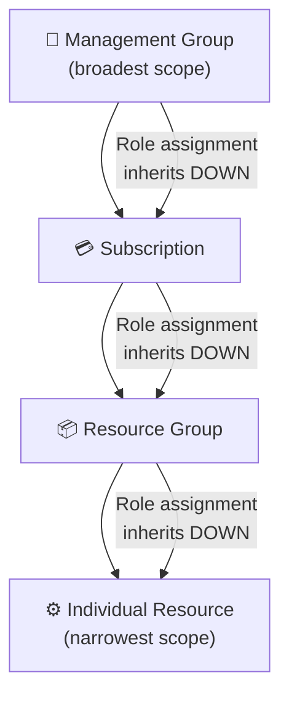

# 00 — Azure Prerequisites & Core Architecture Fundamentals

> Based on: *Describe the core architectural components of Azure* (Microsoft Learn)
> 📁 [← Back to Home](./)

---

## 🏗️ Azure Physical Infrastructure

### Global Infrastructure Overview

---

### Regions

- 📍 A **region** is a geographic area containing one or more datacenters networked with low latency
- 🌐 Some services are **global** (e.g., Entra ID, Azure DNS, Azure Front Door) — no region selection needed
- ⚠️ Not all services are available in all regions — always check regional availability

> **Exam Caveat ⚠️:** Data residency is a common exam theme. Some EU compliance scenarios require selecting regions within the EU (e.g., West Europe, North Europe, Germany West Central).

---

### Availability Zones (AZs)

| Attribute | Detail |
|-----------|--------|
| Definition | Physically separate datacenters within a single region |
| Minimum per region | 3 zones (where supported) |
| Independence | Separate power, cooling, and networking |
| SLA uplift | Moves VM SLA from **99.9%** → **99.99%** |

**Zone-aware service types:**

| Type | Behaviour | Examples |
|------|-----------|---------|
| **Zonal** | Pinned to a specific zone (you choose) | VMs, Managed Disks |
| **Zone-redundant** | Automatically spreads across zones | ZRS Storage, Azure SQL, App Gateway v2 |
| **Non-zonal** (regional) | No zone awareness | Basic tier services |

> **Exam Caveat ⚠️:** AZs protect against **datacenter-level** failures only — not regional failures. To survive a region outage you need geo-redundancy or multi-region architecture.

---

### Region Pairs

- 🔗 Every region is **automatically paired** with another region ≥300 miles away in the same geography
- 🔄 During planned Azure maintenance, only **one region in a pair** is updated at a time
- ⚡ During a widespread outage, **one region per pair is prioritised** for faster recovery
- 📁 Some GRS storage automatically replicates to the **paired region**

**Notable EU Region Pairs:**

| Primary | Pair |
|---------|------|
| West Europe (Netherlands) | North Europe (Ireland) |
| Germany West Central | Germany North |
| France Central | France South |
| Sweden Central | Sweden South |
| UK South | UK West |

> **Exam Caveat ⚠️:** You cannot choose your own region pair — it is Microsoft-defined. If data sovereignty requires keeping data within a specific country, verify the pair is in the same country before choosing GRS.

---

## 🏢 Azure Management Hierarchy

### Key Rules — Hierarchy

- 📏 Management Groups: max **6 levels** deep (not counting root or subscription level)
- 📊 Max **10,000** management groups per tenant
- 🔁 Each subscription/MG has exactly **one parent**; a parent can have many children
- 🚫 Resource groups **cannot be nested** inside each other
- 🗑️ Deleting a resource group **deletes all resources** inside it
- ↔️ Resources can be moved between resource groups (with some service exceptions)
- 🔒 Policies and RBAC **inherit downward** through the hierarchy

> **Exam Caveat ⚠️:** Tags do **not** inherit automatically from resource groups to resources. You need Azure Policy to enforce tag inheritance.

---

## 🖥️ Azure Compute Services

### Compute Service Comparison

### Virtual Machines — Key SKU Families

| Series | Optimised For | Example Use Case |
|--------|--------------|-----------------|
| **B-series** | Burstable CPU | Dev/test, low-traffic apps |
| **D-series** | Balanced (general purpose) | Web servers, app servers, mid-size DBs |
| **E-series** | Memory-optimised | In-memory DBs, SAP HANA (small) |
| **F-series** | Compute-optimised | Batch processing, gaming |
| **M-series** | Very large memory | SAP HANA (large), large in-memory DBs |
| **L-series** | Storage-optimised | High IOPS NoSQL, data warehousing |
| **N-series (GPU)** | GPU workloads | ML training, rendering, visualisation |
| **H-series** | HPC | Simulations, fluid dynamics, modelling |

**VM Managed Disk SKUs:**

| Disk Type | Max IOPS | Latency | SLA |
|-----------|---------|---------|-----|
| Standard HDD | 500 IOPS | High | No SLA |
| Standard SSD | 6,000 IOPS | Medium | ✅ 99.9% |
| Premium SSD | 20,000 IOPS | Low | ✅ 99.9% |
| Premium SSD v2 | 80,000 IOPS | Very low | ✅ 99.9% |
| Ultra Disk | 160,000 IOPS | Sub-ms | ✅ 99.9% |

> **Exam Caveat ⚠️:** Ultra Disks require a compatible VM size **and** must be in the same Availability Zone as the VM. They cannot be used as OS disks.

### Azure App Service — Pricing Tiers

| Tier | Instances | Auto-scale | Slots | Custom Domains | VNET Integration | SLA |
|------|-----------|-----------|-------|---------------|-----------------|-----|
| **Free (F1)** | Shared | ❌ | 0 | ❌ | ❌ | No SLA |
| **Shared (D1)** | Shared | ❌ | 0 | ✅ | ❌ | No SLA |
| **Basic (B1–B3)** | Dedicated | Manual | 0 | ✅ | ❌ | **99.95%** |
| **Standard (S1–S3)** | Dedicated | ✅ | 5 | ✅ | ❌ | **99.95%** |
| **Premium (P0–P3v3)** | Dedicated | ✅ | 20 | ✅ | ✅ (Regional) | **99.95%** |
| **Isolated (I1–I3v2)** | Dedicated ASE | ✅ | 20 | ✅ | ✅ (Dedicated VNet) | **99.95%** |

> **Exam Caveats ⚠️:**
> - **Deployment slots** (staging/production swap) require **Standard** tier or above
> - **VNET Integration** (outbound) requires **Premium** tier or above
> - **App Service Environment (ASE / Isolated)** gives full VNet injection — use for regulated industries

---

## 🌐 Azure Networking Services

### Virtual Network (VNet) — Key Facts

- 🔒 VNets are **scoped to a single region** — use VNet Peering for cross-region connectivity
- 🌐 Resources within the same VNet can communicate by default
- 📊 VNets support multiple subnets; each subnet gets a contiguous IP range from the VNet address space
- 🔗 VNet Peering traffic travels on the **Microsoft backbone** (not public internet)
- ⚠️ VNet Peering is **not transitive** — A↔B and B↔C does not mean A↔C (use Azure Virtual WAN or route table for transitivity)

**Reserved subnets (must use specific names):**

| Subnet Name | Required For |
|-------------|-------------|
| `GatewaySubnet` | VPN Gateway / ExpressRoute Gateway |
| `AzureFirewallSubnet` | Azure Firewall |
| `AzureFirewallManagementSubnet` | Azure Firewall with forced tunnelling |
| `AzureBastionSubnet` | Azure Bastion |

### Load Balancer Comparison

| Service | OSI Layer | Scope | SSL Offload | WAF | SLA |
|---------|-----------|-------|------------|-----|-----|
| **Azure Load Balancer (Standard)** | L4 | Regional | ❌ | ❌ | **99.99%** |
| **Application Gateway (v2)** | L7 | Regional | ✅ | ✅ (add-on) | **99.95%** |
| **Azure Front Door (Standard/Premium)** | L7 | Global | ✅ | ✅ | **99.99%** |
| **Traffic Manager** | DNS | Global | ❌ | ❌ | **99.99%** |
| **Internal Load Balancer** | L4 | Regional (private) | ❌ | ❌ | **99.99%** |

> **Exam Caveats ⚠️:**
> - Use **Application Gateway** for HTTP/HTTPS within a region with path-based routing or WAF
> - Use **Azure Front Door** for global HTTP distribution across multiple regions with CDN and WAF
> - Use **Traffic Manager** for DNS-based failover of non-HTTP workloads (or multi-region DNS routing)
> - **Basic Load Balancer is being retired** — always use Standard for new designs

---

## 💾 Azure Storage — Core Concepts

### Storage Redundancy SLA Comparison

| Redundancy | Copies | Zones | Regions | Durability | SLA (Read) | SLA (Write) |
|-----------|--------|-------|---------|-----------|-----------|------------|
| **LRS** | 3 | 1 DC | 1 | 11 nines | **99.9%** | **99.9%** |
| **ZRS** | 3 | 3 zones | 1 | 12 nines | **99.9%** | **99.9%** |
| **GRS** | 6 (3+3) | 1 DC each | 2 (paired) | 16 nines | **99.9%** | **99.9%** |
| **RA-GRS** | 6 (3+3) | 1 DC each | 2 (paired) | 16 nines | **99.99%** | **99.9%** |
| **GZRS** | 6 (3z+3) | 3+1 | 2 (paired) | 16 nines | **99.9%** | **99.9%** |
| **RA-GZRS** | 6 (3z+3) | 3+1 | 2 (paired) | 16 nines | **99.99%** | **99.9%** |

> **Exam Caveats ⚠️:**
> - RA-GRS / RA-GZRS = read access to the **secondary** region (higher read SLA)
> - Secondary region data **may be stale** (eventual consistency) — reads could return older data
> - For cross-region restore in Azure Backup, the Recovery Services Vault must use **GRS**

### Blob Storage Access Tiers

| Tier | Min Storage Duration | Access Cost | Storage Cost | Use Case |
|------|---------------------|-------------|--------------|---------|
| **Hot** | None | Lowest | Highest | Active websites, streaming data |
| **Cool** | 30 days | Medium | Medium | Backups, short-term DR |
| **Cold** | 90 days | Higher | Lower | Long-term backups, infrequent access |
| **Archive** | 180 days | Highest | Lowest | Regulatory compliance, rarely accessed |

> **Exam Caveats ⚠️:**
> - **Archive blobs are OFFLINE** — they must be *rehydrated* to Hot or Cool before reading (can take hours)
> - Rehydration priority: **Standard** (up to 15 hours) vs **High** (under 1 hour, higher cost)
> - Early deletion charges apply if you delete before the minimum duration

---

## 🔐 Azure Identity Fundamentals

### Entra ID vs Active Directory DS

| Feature | Microsoft Entra ID (Cloud) | Active Directory DS (On-prem) |
|---------|--------------------------|------------------------------|
| Protocol | OAuth 2.0, OIDC, SAML | Kerberos, NTLM, LDAP |
| Structure | Flat (no OUs, no GPOs) | Hierarchical (OUs, GPOs) |
| Authentication | Token-based (JWTs) | Ticket-based (Kerberos) |
| Device Mgmt | Entra Join + Intune | Group Policy |
| Scope | Cloud + hybrid | On-premises primarily |

### RBAC Scope Hierarchy

- 🔑 Role assignments **inherit downward** — assign at the highest appropriate scope
- 🛡️ **Principle of least privilege** — grant only what is needed at the narrowest scope
- 👥 Always assign roles to **groups**, not individual users (easier to manage at scale)

---

*Next: [01 — Identity, Governance & Monitoring →](./01-identity-governance-monitoring/)*
