# 01 — Design Identity, Governance & Monitoring Solutions
> **Official Exam Weight: 25–30%**
> 📁 [← Back to Home](/az-305-study-notes/)

---

## 🗺️ Domain Overview

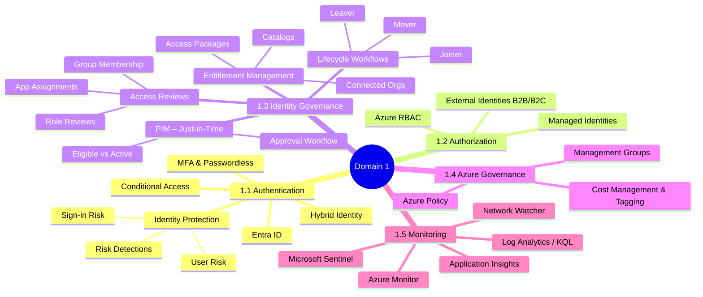
```mermaid
mindmap
  root((Domain 1))
    1.1 Authentication
      Entra ID
      Hybrid Identity
      MFA & Passwordless
      Conditional Access
      Identity Protection
        User Risk
        Sign-in Risk
        Risk Detections
    1.2 Authorization
      Azure RBAC
      Managed Identities
      External Identities B2B/B2C
    1.3 Identity Governance
      PIM – Just-in-Time
        Eligible vs Active
        Approval Workflow
      Access Reviews
        Group Membership
        App Assignments
        Role Reviews
      Entitlement Management
        Catalogs
        Access Packages
        Connected Orgs
      Lifecycle Workflows
        Joiner
        Mover
        Leaver
    1.4 Azure Governance
      Management Groups
      Azure Policy
      Cost Management & Tagging
    1.5 Monitoring
      Azure Monitor
      Log Analytics / KQL
      Application Insights
      Microsoft Sentinel
      Network Watcher
```

---

## 🔐 1.1 Design Authentication Solutions

### Microsoft Entra ID (formerly Azure AD)

**Core Concepts:**

- 🏢 A **Tenant** = one dedicated Entra ID instance per organisation
- 👤 **User** = human identity | **Group** = collection of users
- 🤖 **Service Principal** = non-human app identity (requires secret or cert)
- ✅ **Managed Identity** = auto-managed service principal for Azure resources (no secret needed)
- 🔗 **App Registration** = registers an app in Entra ID to use OAuth/OIDC

### Hybrid Identity — Decision Flow

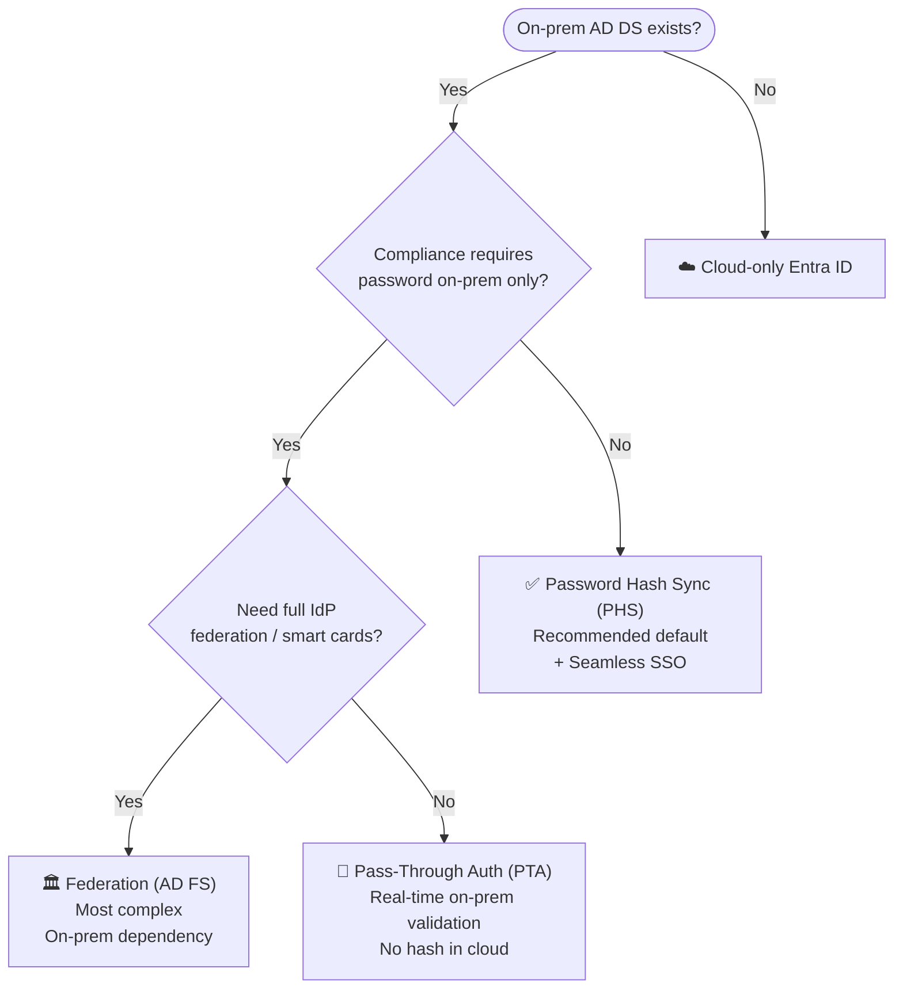
```mermaid
flowchart TD
    Start([On-prem AD DS exists?]) -->|Yes| Q1{Compliance requires\npassword on-prem only?}
    Start -->|No| CloudOnly["☁️ Cloud-only Entra ID"]
    Q1 -->|Yes| Q2{Need full IdP\nfederation / smart cards?}
    Q1 -->|No| PHS["✅ Password Hash Sync (PHS)\nRecommended default\n+ Seamless SSO"]
    Q2 -->|Yes| FED["🏛️ Federation (AD FS)\nMost complex\nOn-prem dependency"]
    Q2 -->|No| PTA["🔄 Pass-Through Auth (PTA)\nReal-time on-prem validation\nNo hash in cloud"]
```

| Method | Password Location | Online Dependency | Best For |
|--------|-----------------|-------------------|---------|
| **PHS** *(Recommended)* | Hash synced to cloud | Works even if on-prem is down | Most organisations |
| **PTA** | On-premises only | Requires on-prem agent | Compliance: no hash in cloud |
| **Federation (AD FS)** | On-premises IdP | Requires AD FS farm | Smart cards, complex claims |

> **Exam Caveats ⚠️:**
> - PHS is the **Microsoft-recommended** default — it's resilient (works even if on-prem is down)
> - PTA requires **at least 3 agents** for HA — failure of all agents = login failure
> - **Seamless SSO** works with both PHS and PTA — auto-signs in users on domain-joined devices

---

### Multi-Factor Authentication (MFA)

**Authentication factors ranked by strength:**

| # | Factor Type | Example | Strength |
|---|-------------|---------|---------|
| 1 | Something you **are** + **have** | FIDO2 Security Key | 🔒🔒🔒🔒🔒 (Strongest) |
| 2 | Something you **are** (biometric) | Windows Hello for Business | 🔒🔒🔒🔒🔒 |
| 3 | Something you **have** (app) | Microsoft Authenticator (passwordless) | 🔒🔒🔒🔒 |
| 4 | Certificate-based Auth | Smart card / PIV | 🔒🔒🔒🔒 |
| 5 | App OTP | Authenticator app TOTP | 🔒🔒🔒 |
| 6 | Hardware OATH token | OATH hardware token | 🔒🔒🔒 |
| 7 | Software OTP | Authenticator app code | 🔒🔒 |
| 8 | SMS / Voice call | SMS code to phone | 🔒 (Weakest) |

> **Exam Caveat ⚠️:** SMS and voice call MFA should be **avoided** for high-security scenarios — SIM swapping attacks. Exam scenarios should favour Authenticator App or FIDO2.

---

### Conditional Access

**The Conditional Access Policy model:**

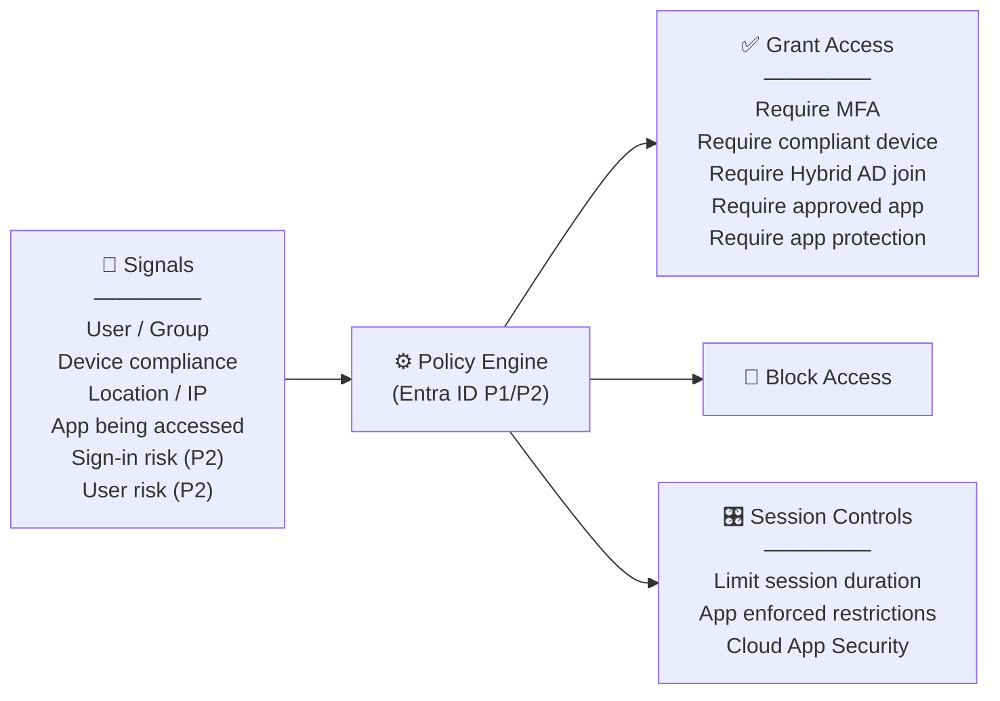
```mermaid
flowchart LR
    SIGNAL["📡 Signals\n—————\nUser / Group\nDevice compliance\nLocation / IP\nApp being accessed\nSign-in risk (P2)\nUser risk (P2)"] --> ENGINE["⚙️ Policy Engine\n(Entra ID P1/P2)"]
    ENGINE --> GRANT["✅ Grant Access\n—————\nRequire MFA\nRequire compliant device\nRequire Hybrid AD join\nRequire approved app\nRequire app protection"]
    ENGINE --> BLOCK["🚫 Block Access"]
    ENGINE --> SESSION["🎛️ Session Controls\n—————\nLimit session duration\nApp enforced restrictions\nCloud App Security"]
```

**Licence requirements:**

| Feature | Required Licence |
|---------|----------------|
| Basic Conditional Access policies | **Entra ID P1** |
| Named Locations, compliance conditions | **Entra ID P1** |
| Risk-based Conditional Access | **Entra ID P2** |
| Sign-in / User risk policies | **Entra ID P2** (part of Identity Protection) |

> **Exam Caveats ⚠️:**
> - **Sign-in risk** and **user risk** conditions require **P2** (Identity Protection)
> - **MFA registration policy** requires P2
> - Conditional Access evaluates **at sign-in time** — it doesn't revoke existing sessions immediately

---

### Entra ID Identity Protection

**What Identity Protection does:** Detects suspicious identity-related activity in real time, assigns a risk level to each event, and feeds those risk signals into Conditional Access policies for automated remediation.

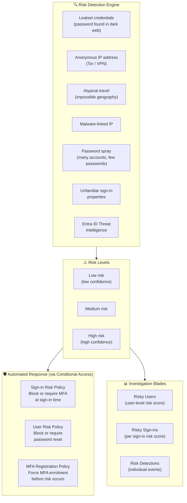
```mermaid
flowchart TD
    subgraph DETECT["🔍 Risk Detection Engine"]
        RD1["Leaked credentials\n(password found in dark web)"]
        RD2["Anonymous IP address\n(Tor / VPN)"]
        RD3["Atypical travel\n(impossible geography)"]
        RD4["Malware-linked IP"]
        RD5["Password spray\n(many accounts, few passwords)"]
        RD6["Unfamiliar sign-in\nproperties"]
        RD7["Entra ID Threat\nIntelligence"]
    end

    subgraph RISK["⚠️ Risk Levels"]
        LOW["Low risk\n(low confidence)"]
        MED["Medium risk"]
        HIGH["High risk\n(high confidence)"]
    end

    subgraph POLICY["🛡️ Automated Response (via Conditional Access)"]
        CA_SIGNIN["Sign-in Risk Policy\nBlock or require MFA\nat sign-in time"]
        CA_USER["User Risk Policy\nBlock or require\npassword reset"]
        CA_MFA["MFA Registration Policy\nForce MFA enrolment\nbefore risk occurs"]
    end

    subgraph BLADE["📊 Investigation Blades"]
        RISKY_U["Risky Users\n(user-level risk score)"]
        RISKY_S["Risky Sign-ins\n(per sign-in risk score)"]
        DETECT_B["Risk Detections\n(individual events)"]
    end

    DETECT --> RISK
    RISK --> POLICY
    RISK --> BLADE
```

**Risk types — User Risk vs Sign-in Risk:**

| Dimension | User Risk | Sign-in Risk |
|-----------|-----------|-------------|
| **What it measures** | Cumulative risk on an account (e.g., leaked credential) | Risk of a specific authentication attempt |
| **Persists until** | Manually dismissed or remediated | Resolved at end of sign-in session |
| **Self-remediation** | Secure password change (if SSPR enabled) | Complete MFA challenge |
| **Admin action** | Dismiss user risk / confirm compromised | Dismiss / confirm sign-in |
| **CA condition** | `User risk` ≥ Low/Medium/High | `Sign-in risk` ≥ Low/Medium/High |

**Key risk detections to know:**

| Detection | Risk Type | Why It Matters |
|-----------|-----------|---------------|
| Leaked credentials | User risk | Password found in credential dump — almost always High |
| Anonymous IP | Sign-in risk | Tor exit node or anonymising proxy |
| Atypical travel | Sign-in risk | Sign-in from two locations impossible to travel between |
| Password spray | Sign-in / User risk | Broad low-volume attack across many accounts |
| Entra ID Threat Intel | Both | Microsoft's own threat intelligence feed |

> **Exam Caveats ⚠️:**
> - Identity Protection requires **Entra ID P2** — the risk detections page and automated policies are not available in P1
> - **Risk ≠ blocked**: by itself Identity Protection only *scores* risk. You need a **Conditional Access policy** with a risk condition to take action
> - Users can **self-remediate** without admin intervention if SSPR and MFA are enabled — this is the recommended path for sign-in risk
> - **Confirm compromised** escalates risk to High and triggers any CA policies at that level; **Dismiss** clears the risk without treatment

---

## 👤 1.2 Design Authorization Solutions

### Azure RBAC — Built-in Roles

| Role | Can Manage Resources | Can Manage Access | Can Assign Roles |
|------|---------------------|-------------------|-----------------|
| **Owner** | ✅ Full | ✅ Full | ✅ Yes |
| **Contributor** | ✅ Full | ❌ No | ❌ No |
| **Reader** | 👁️ View only | ❌ No | ❌ No |
| **User Access Administrator** | ❌ No | ✅ Full | ✅ Yes |

**Service-specific roles to know:**

| Role | Scope |
|------|-------|
| Network Contributor | Manage VNets, NSGs, route tables — no VM access |
| Virtual Machine Contributor | Manage VMs — no VNet or storage access |
| Storage Blob Data Contributor | Read/write/delete Blob containers and data |
| Key Vault Administrator | Manage Key Vault and all objects (P1 operations) |
| Key Vault Secrets Officer | Manage secrets only (not keys or certs) |
| SQL DB Contributor | Manage SQL databases — not security policies |
| Monitoring Contributor | Read all monitoring data, edit monitoring settings |

> **Exam Caveats ⚠️:**
> - **Contributor ≠ Owner** — a Contributor cannot assign roles or manage access
> - To grant access to others, you need **Owner** or **User Access Administrator**
> - Custom roles are supported but rarely needed — know when built-ins fall short

### Managed Identities — Deep Dive

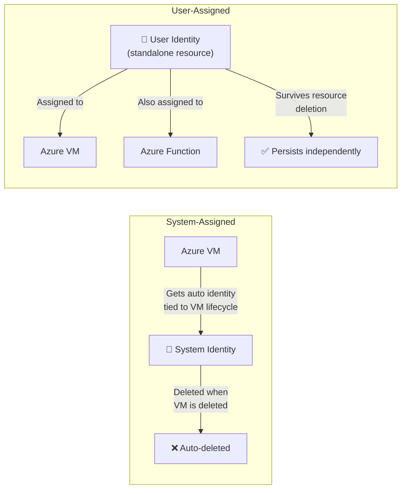
```mermaid
graph LR
    subgraph "System-Assigned"
        VM1["Azure VM"] -->|"Gets auto identity\ntied to VM lifecycle"| MSI1["🤖 System Identity"]
        MSI1 -->|"Deleted when\nVM is deleted"| GONE["❌ Auto-deleted"]
    end
    subgraph "User-Assigned"
        UA["🤖 User Identity\n(standalone resource)"] -->|"Assigned to"| VM2["Azure VM"]
        UA -->|"Also assigned to"| APP["Azure Function"]
        UA -->|"Survives resource\ndeletion"| PERSIST["✅ Persists independently"]
    end
```

| Feature | System-Assigned | User-Assigned |
|---------|----------------|--------------|
| Lifecycle | Tied to the resource | Independent resource |
| Shared across resources | ❌ No | ✅ Yes |
| Created by | Enabling on a resource | Creating standalone resource |
| Best for | Single resource, simple use case | Multiple resources sharing same identity |

> **Exam Caveats ⚠️:**
> - Managed Identities can authenticate to **any service that supports Entra ID authentication**
> - Use **system-assigned** for simple single-resource scenarios
> - Use **user-assigned** when multiple resources need the same permissions or when the identity must survive resource deletion

---

## 🛡️ 1.3 Design Identity Governance Solutions

**Identity Governance** = ensuring the right people have the right access to the right resources for the right amount of time — and that access is periodically validated and automatically revoked when no longer needed.

Microsoft Entra ID Governance covers four pillars:

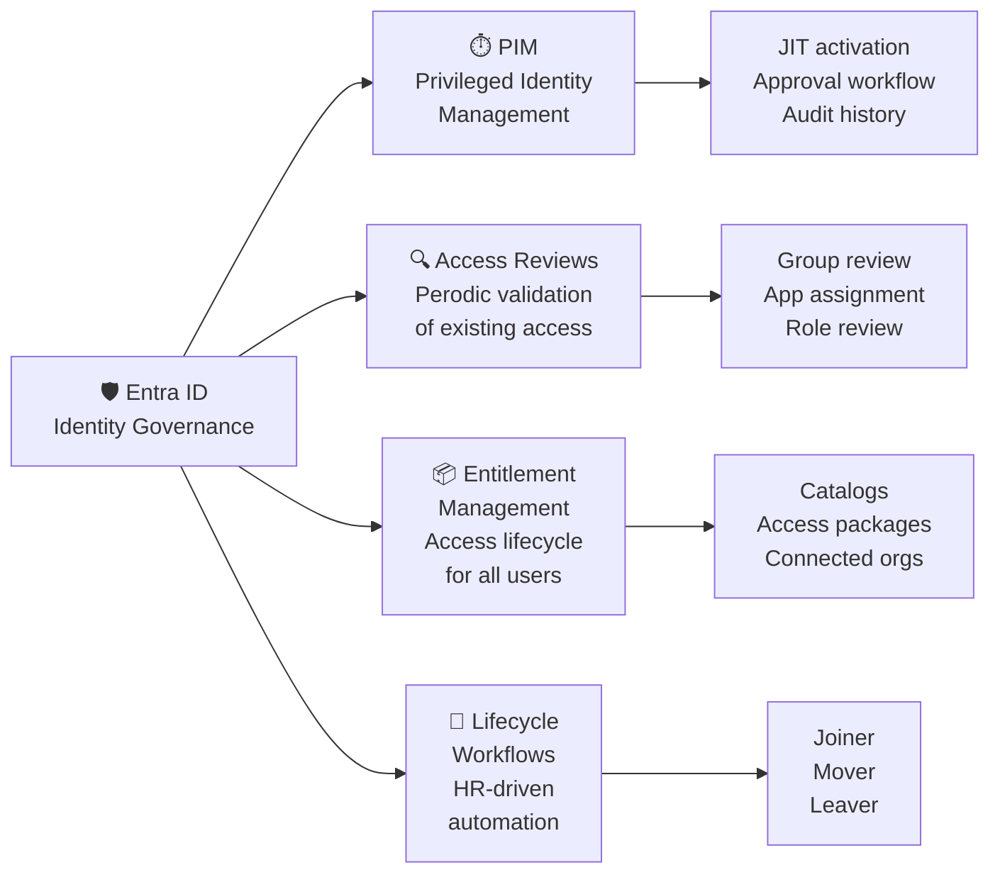
```mermaid
graph LR
    GOVROOT["🛡️ Entra ID\nIdentity Governance"]
    PIM_N["⏱️ PIM\nPrivileged Identity\nManagement"]
    AR["🔍 Access Reviews\nPerodic validation\nof existing access"]
    EM["📦 Entitlement\nManagement\nAccess lifecycle\nfor all users"]
    LW["🔄 Lifecycle\nWorkflows\nHR-driven\nautomation"]

    GOVROOT --> PIM_N
    GOVROOT --> AR
    GOVROOT --> EM
    GOVROOT --> LW

    PIM_N --> PIM_J["JIT activation\nApproval workflow\nAudit history"]
    AR --> AR_S["Group review\nApp assignment\nRole review"]
    EM --> EM_S["Catalogs\nAccess packages\nConnected orgs"]
    LW --> LW_S["Joiner\nMover\nLeaver"]
```

| Pillar | Licence | Core Question Answered |
|--------|---------|----------------------|
| PIM | P2 | Who has privileged access *right now* and why? |
| Access Reviews | P2 | Does this person *still need* this access? |
| Entitlement Management | P2 | How does someone *request and get* access? |
| Lifecycle Workflows | Entra ID Governance (P2+) | What happens *automatically* when someone joins, moves, or leaves? |

---

### ⏱️ Privileged Identity Management (PIM)

**What PIM provides:**

- ⏱️ **Just-in-time (JIT)** privileged access — elevate role only when needed
- 📋 **Approval workflow** — require approval before activation
- 🔐 **MFA on activation** — always require MFA to activate a privileged role
- ⏰ **Time-bound** — access expires automatically
- 📊 **Access reviews** — periodically validate who still needs privileged roles
- 📜 **Audit history** — full log of all activations and changes

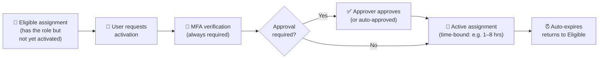
```mermaid
flowchart LR
    ELIG["👤 Eligible assignment\n(has the role but\nnot yet activated)"]
    REQ["📝 User requests\nactivation"]
    MFA_P["🔐 MFA verification\n(always required)"]
    APPR{Approval\nrequired?}
    APPROV["✅ Approver approves\n(or auto-approved)"]
    ACTIVE["🔑 Active assignment\n(time-bound: e.g. 1–8 hrs)"]
    EXPIRE["⏰ Auto-expires\nreturns to Eligible"]

    ELIG --> REQ --> MFA_P --> APPR
    APPR -->|Yes| APPROV --> ACTIVE
    APPR -->|No| ACTIVE
    ACTIVE --> EXPIRE
```

| Concept | Detail |
|---------|--------|
| Licence required | **Entra ID P2** |
| Covers | Entra ID roles (e.g. Global Admin) + Azure RBAC roles |
| Role states | **Eligible** (assigned, not active) · **Active** (currently elevated) |
| Max activation duration | Configurable per role (typically 1–8 hours) |
| Standing access | Anti-pattern — PIM eliminates permanently active admin roles |
| SLA | **99.99%** (standard Entra ID) |

> **Exam Caveats ⚠️:**
> - PIM requires **Entra ID P2** — not available in P1
> - **Eligible** role = person *can* activate it but hasn't yet. **Active** role = currently elevated.
> - Global Administrator is the highest Entra ID role — PIM can require dual approval for it
> - PIM covers both **Entra ID directory roles** (e.g. Global Admin, Security Admin) and **Azure resource roles** (e.g. Owner on a subscription)

---

### 🔍 Access Reviews

Access Reviews provide a structured, recurring process to validate that assigned access is still appropriate — and automatically remove it when it isn't.

**What can be reviewed:**

| Review Target | Who Typically Reviews | Frequency Options |
|--------------|----------------------|------------------|
| Group membership | Group owner, manager, or self | Weekly / Monthly / Quarterly / Semi-annual / Annual |
| Application assignments | App owner or designated reviewer | Same |
| Entra ID directory roles | Security admin or Global Admin | Same |
| Azure resource roles (via PIM) | Resource owner | Same |
| Privileged role assignments | PIM reviewer | Same |

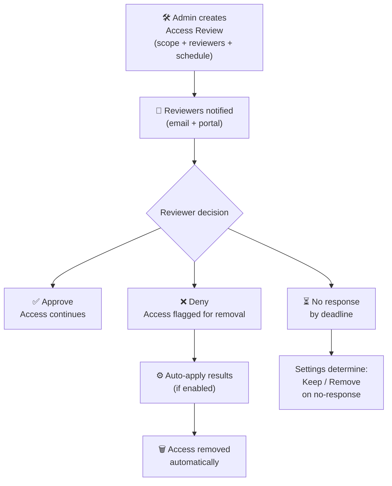
```mermaid
flowchart TD
    CREATE["🛠️ Admin creates\nAccess Review\n(scope + reviewers + schedule)"]
    NOTIFY["📧 Reviewers notified\n(email + portal)"]
    REVIEW{"Reviewer decision"}
    APPROVE["✅ Approve\nAccess continues"]
    DENY["❌ Deny\nAccess flagged for removal"]
    NORESPONSE["⏳ No response\nby deadline"]
    AUTOAPPLY["⚙️ Auto-apply results\n(if enabled)"]
    REMOVE["🗑️ Access removed\nautomatically"]
    KEEPDEFAULT["Settings determine:\nKeep / Remove\non no-response"]

    CREATE --> NOTIFY --> REVIEW
    REVIEW --> APPROVE
    REVIEW --> DENY --> AUTOAPPLY --> REMOVE
    REVIEW --> NORESPONSE --> KEEPDEFAULT
```

**Key configuration decisions:**

| Setting | Options | Exam Relevance |
|---------|---------|---------------|
| **Reviewers** | Resource owners · Managers · Selected users · Self-review | Self-review = users approve own access (light-touch) |
| **Duration** | 1–180 days | Longer = more time for reviewers; missed reviews = risk |
| **Auto-apply results** | On / Off | Must be On to remove access automatically at close |
| **On no response** | Keep access / Remove access / Take recommendations | "Remove access" = safest; "Recommendations" = ML-assisted |
| **Recommendations** | Based on last sign-in activity | Users with no sign-in in 30+ days flagged for removal |

> **Exam Caveats ⚠️:**
> - Access Reviews require **Entra ID P2**
> - **Auto-apply must be explicitly enabled** — if off, an admin must manually apply review results after the review period closes
> - Access Reviews are **separate from PIM** but they integrate: PIM has its own built-in access review schedule for privileged roles
> - The exam may describe access reviews as "periodic certification of access" — same concept
> - "On no response → Remove" is the recommended setting for security — reviewers who don't act result in access removal, not continuation

---

### 📦 Entitlement Management

Entitlement Management governs **how access is requested, approved, assigned, and expired** for both internal employees and external guests (B2B). It replaces ad-hoc "email your manager to get SharePoint access" processes with a self-service, policy-driven workflow.

**Core objects:**

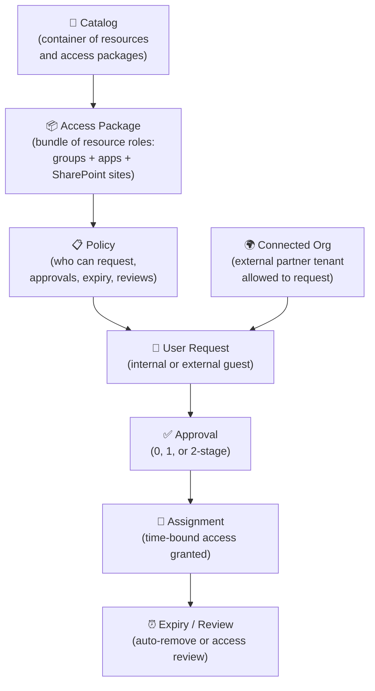
```mermaid
graph TD
    CATALOG["📁 Catalog\n(container of resources\nand access packages)"]
    AP["📦 Access Package\n(bundle of resource roles:\ngroups + apps + SharePoint sites)"]
    POL["📋 Policy\n(who can request,\napprovals, expiry, reviews)"]
    REQ["👤 User Request\n(internal or external guest)"]
    APPROVAL["✅ Approval\n(0, 1, or 2-stage)"]
    ASSIGN["🔑 Assignment\n(time-bound access granted)"]
    EXPIRY["⏰ Expiry / Review\n(auto-remove or access review)"]
    CONN["🌍 Connected Org\n(external partner tenant\nallowed to request)"]

    CATALOG --> AP
    AP --> POL
    POL --> REQ
    REQ --> APPROVAL
    APPROVAL --> ASSIGN
    ASSIGN --> EXPIRY
    CONN --> REQ
```

**Key concepts:**

| Object | Description | Exam Signal |
|--------|-------------|-------------|
| **Catalog** | Container grouping access packages and the resources they reference | "Delegate package management to a department owner" |
| **Access Package** | Bundles one or more resource roles into a single requestable unit | "Single request gives access to group + app + SharePoint" |
| **Policy** | Controls who can request, approval stages, max duration, access reviews | "External partners should get 90-day auto-expiring access" |
| **Connected Organization** | External Entra ID tenant or domain allowed to request access packages | "Contractors from partner.com can self-serve project access" |
| **Assignment** | Active access grant from an approved request | Time-bound; renewed by new request or auto-renewal |

**Entitlement Management vs PIM vs Access Reviews:**

| Feature | PIM | Access Reviews | Entitlement Management |
|---------|-----|---------------|----------------------|
| **Focus** | Privileged role JIT activation | Validating *existing* access | Requesting and granting *new* access |
| **Trigger** | User self-activates | Scheduled review | User submits a request |
| **Best for** | Admin / high-privilege roles | Recurring certification of any access | Self-service access requests (employees + guests) |
| **Handles external users?** | ❌ No | ✅ Yes (guest group membership) | ✅ Yes (Connected Organizations) |
| **Licence** | P2 | P2 | P2 |

> **Exam Caveats ⚠️:**
> - Entitlement Management requires **Entra ID P2**
> - **Connected Organizations** are the mechanism for B2B external access requests — the partner doesn't need to be managed by you, just an Entra ID tenant or verified domain
> - Access packages can contain groups, apps, and SharePoint Online sites — but not individual SharePoint files or folders
> - When an access package policy includes an **access review**, the review is triggered automatically at the configured interval — no manual scheduling needed
> - Entitlement Management does **not** replace RBAC for Azure resource access (subscriptions, VMs, etc.); it manages **directory-level and application access**

---

### 🔄 Lifecycle Workflows

Lifecycle Workflows automate identity tasks that need to happen when an employee **joins, moves within, or leaves** an organisation, triggered by HR system attributes (hire date, department change, last day).

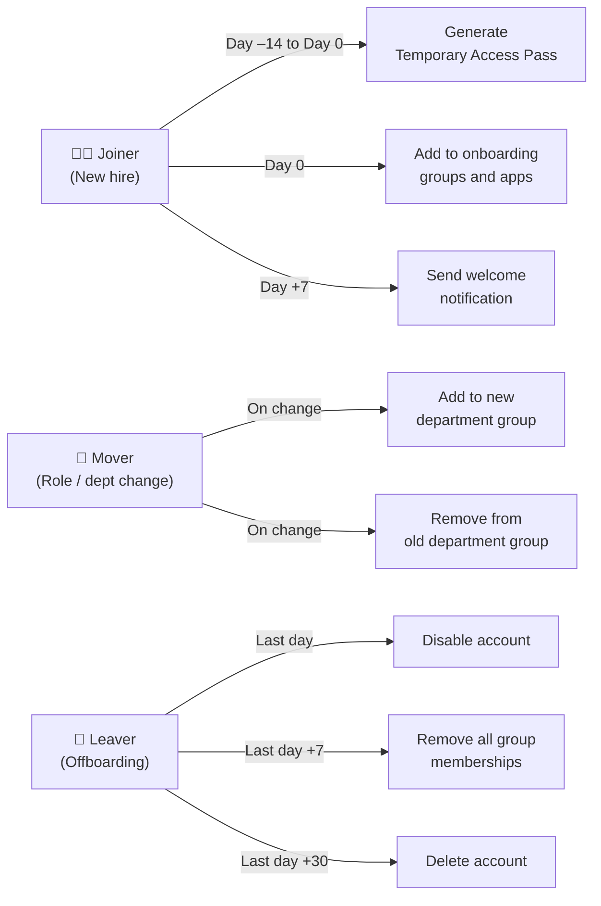
```mermaid
flowchart LR
    JOINER["🧑‍💼 Joiner\n(New hire)"]
    MOVER["🔄 Mover\n(Role / dept change)"]
    LEAVER["🚪 Leaver\n(Offboarding)"]

    JOINER -->|"Day –14 to Day 0"| JT1["Generate\nTemporary Access Pass"]
    JOINER -->|"Day 0"| JT2["Add to onboarding\ngroups and apps"]
    JOINER -->|"Day +7"| JT3["Send welcome\nnotification"]

    MOVER -->|"On change"| MT1["Add to new\ndepartment group"]
    MOVER -->|"On change"| MT2["Remove from\nold department group"]

    LEAVER -->|"Last day"| LT1["Disable account"]
    LEAVER -->|"Last day +7"| LT2["Remove all group\nmemberships"]
    LEAVER -->|"Last day +30"| LT3["Delete account"]
```

| Aspect | Detail |
|--------|--------|
| Licence required | **Microsoft Entra ID Governance** (superset of P2) |
| Trigger | HR attribute changes (employeeHireDate, employeeLeaveDate, jobTitle) |
| Integration | Works with Workday, SAP SuccessFactors, and other HR connectors via Entra provisioning |
| Task types | Generate TAP · Add/remove group membership · Enable/disable account · Delete account · Send email notification |

> **Exam Caveats ⚠️:**
> - Lifecycle Workflows require the **Entra ID Governance** licence — this is distinct from P1 and P2, though P2 is included within it
> - The key differentiator vs Azure AD provisioning is **temporal triggers**: Lifecycle Workflows act *before* the first day (pre-boarding) and *after* the last day (post-offboarding), not just at the moment of account creation
> - **Temporary Access Pass (TAP)** generation on day-1 is a common Lifecycle Workflows exam scenario — it lets a new hire enrol in MFA without needing a password

---

## 🏛️ 1.4 Design Azure Governance Solutions

### Management Group Hierarchy Design Patterns

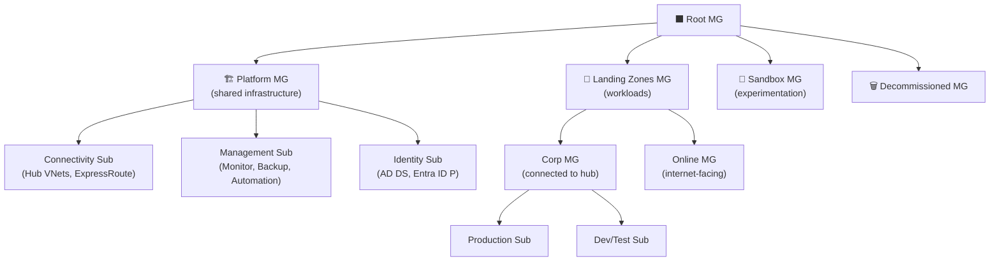
```mermaid
graph TD
    ROOT["⬛ Root MG"]
    PLAT["🏗️ Platform MG\n(shared infrastructure)"]
    LAND["🏢 Landing Zones MG\n(workloads)"]
    SAND["🧪 Sandbox MG\n(experimentation)"]
    DECOM["🗑️ Decommissioned MG"]

    ROOT --> PLAT
    ROOT --> LAND
    ROOT --> SAND
    ROOT --> DECOM

    PLAT --> CONN["Connectivity Sub\n(Hub VNets, ExpressRoute)"]
    PLAT --> MGMT["Management Sub\n(Monitor, Backup, Automation)"]
    PLAT --> ID["Identity Sub\n(AD DS, Entra ID P)"]

    LAND --> CORP["Corp MG\n(connected to hub)"]
    LAND --> ONLINE["Online MG\n(internet-facing)"]

    CORP --> PROD["Production Sub"]
    CORP --> DEV["Dev/Test Sub"]
```

> This follows the **Azure Enterprise-Scale Landing Zone** pattern — the reference architecture Microsoft recommends for large organisations.

### Azure Policy — Effects Ordered by Severity

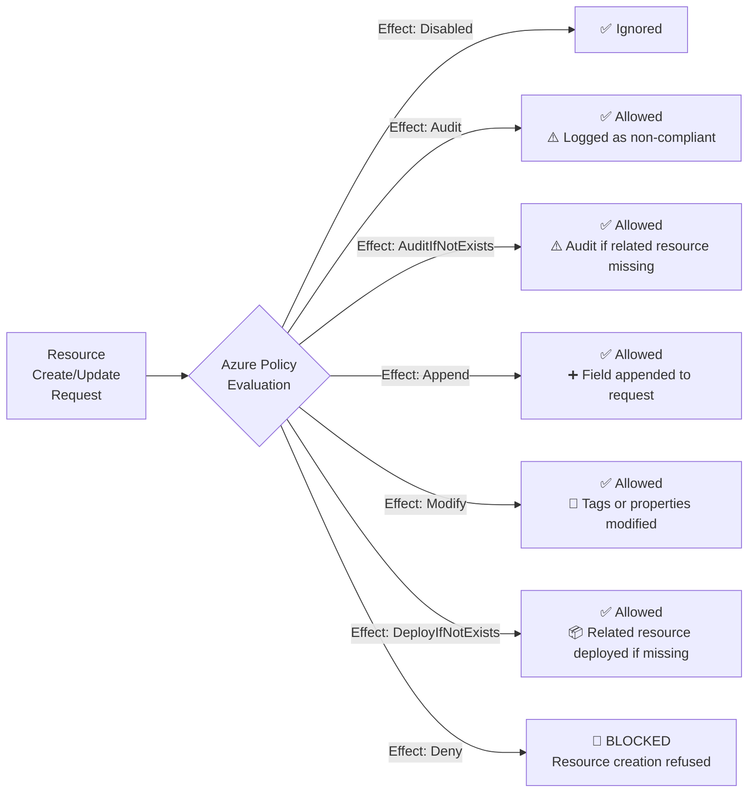
```mermaid
flowchart LR
    RES["Resource\nCreate/Update\nRequest"] --> POL{"Azure Policy\nEvaluation"}
    POL -->|"Effect: Disabled"| PASS1["✅ Ignored"]
    POL -->|"Effect: Audit"| PASS2["✅ Allowed\n⚠️ Logged as non-compliant"]
    POL -->|"Effect: AuditIfNotExists"| PASS3["✅ Allowed\n⚠️ Audit if related resource missing"]
    POL -->|"Effect: Append"| PASS4["✅ Allowed\n➕ Field appended to request"]
    POL -->|"Effect: Modify"| PASS5["✅ Allowed\n🔧 Tags or properties modified"]
    POL -->|"Effect: DeployIfNotExists"| PASS6["✅ Allowed\n📦 Related resource deployed if missing"]
    POL -->|"Effect: Deny"| BLOCK["🚫 BLOCKED\nResource creation refused"]
```

**Policy effects quick reference:**

| Effect | Blocks Creation? | Remediates Existing? | Use Case |
|--------|-----------------|---------------------|---------|
| `Disabled` | ❌ | ❌ | Temporarily turn off a policy |
| `Audit` | ❌ | ❌ | Compliance reporting only |
| `AuditIfNotExists` | ❌ | ❌ | Audit when companion resource missing |
| `Append` | ❌ | ❌ | Add required fields to requests |
| `Modify` | ❌ | ✅ (remediation task) | Enforce tags, modify properties |
| `DeployIfNotExists` | ❌ | ✅ (remediation task) | Deploy companion resource |
| `Deny` | ✅ | ❌ | Hard enforcement — block non-compliant |

> **Exam Caveats ⚠️:**
> - `Audit` logs non-compliance but **never blocks** — resources can still be created
> - `Deny` is a hard stop — plan carefully before applying at scale
> - `DeployIfNotExists` and `Modify` need a **managed identity** to execute remediation tasks
> - Policies assigned at a **Management Group** apply to **all subscriptions underneath** (inheritance)

### Resource Tagging Strategy

**Recommended tag taxonomy:**

| Tag Name | Example Value | Purpose |
|----------|--------------|---------||
| `Environment` | `Production` / `Dev` / `Test` | Filter cost by environment |
| `Owner` | `team-finance@contoso.com` | Accountability and alerts |
| `CostCenter` | `FIN-001` | Chargeback / showback reporting |
| `Application` | `SAP-ERP` | App-level cost aggregation |
| `Department` | `Finance` | Departmental billing |
| `DataClassification` | `Confidential` | Security and compliance |

> **Exam Caveats ⚠️:**
> - Tags do **not inherit** from resource groups to child resources — use Azure Policy to enforce tag inheritance
> - Max **50 tags** per resource
> - Tag values are **case-sensitive** for querying (inconsistent casing breaks reporting)

---

## 📊 1.5 Design Monitoring Solutions

### Azure Monitor Architecture

```mermaid
graph LR
    subgraph Sources["📡 Data Sources"]
        direction TB
        APP["Applications"]
        VM["Virtual Machines"]
        CONT["Containers"]
        RES["Azure Resources"]
        ON["On-premises"]
    end

    subgraph Monitor["📊 Azure Monitor"]
        direction TB
        MET["📈 Metrics\n(time-series,\nnumerical)"]
        LOG["📋 Logs\n(Log Analytics\nWorkspace / KQL)"]
        TRACE["🔍 Traces\n(App Insights)"]
        ACTLOG["📜 Activity Log\n(Azure API ops)"]
    end

    subgraph Actions["⚡ Actions"]
        direction TB
        ALERT["🔔 Alerts"]
        SCALE["⚖️ Autoscale"]
        RUNBOOK["🤖 Automation\nRunbook"]
        LOGIC["🔗 Logic App /\nFunction"]
        ITSM["📟 ITSM\nConnector"]
    end

    Sources --> Monitor
    Monitor --> Actions
```

### Log Analytics Workspace — Design Decisions

| Scenario | Recommendation |
|----------|---------------|
| Single organisation, no compliance constraints | **One workspace per region** |
| Data sovereignty (e.g., must stay in Germany) | **Separate workspace per region** |
| Different retention requirements per workload | **Multiple workspaces** |
| Charge costs back to individual teams | **Multiple workspaces** (or use tags + cost analysis) |
| Security team needs isolated data | **Dedicated security workspace** (for Sentinel) |

> **Exam Caveat ⚠️:** There is a cost to sending data **across regions** to a centralised workspace. For EU data residency, you may need a workspace in each geographic region.

### Application Insights — SKUs & Key Features

| Deployment Mode | Description | Recommended? |
|----------------|-------------|-------------|
| **Workspace-based** (default) | Backed by Log Analytics workspace | ✅ Yes — unified querying |
| **Classic** (legacy) | Standalone, separate storage | ❌ No — being retired |

**Key capabilities:**

| Feature | What it Does | SLA |
|---------|-------------|-----|
| **Availability Tests** | Ping your URL every 5 min from 5+ global locations | **99.9%** |
| **Smart Detection** | AI-based anomaly alerts (no threshold needed) | — |
| **Application Map** | Visual topology of dependencies | — |
| **Live Metrics** | Real-time telemetry stream | — |
| **Failure Analysis** | Drill into failed requests and exceptions | — |
| **User Flows** | How users navigate your app | — |

> **Exam Caveats ⚠️:**
> - Auto-instrumentation requires no code changes (App Service, AKS, Azure Functions) — great for lift-and-shift monitoring
> - **SDK instrumentation** gives more detail (custom events, dependencies) but requires code changes
> - Application Insights data feeds into the **same Log Analytics workspace** in workspace-based mode — unified KQL queries

### Microsoft Sentinel — SIEM & SOAR

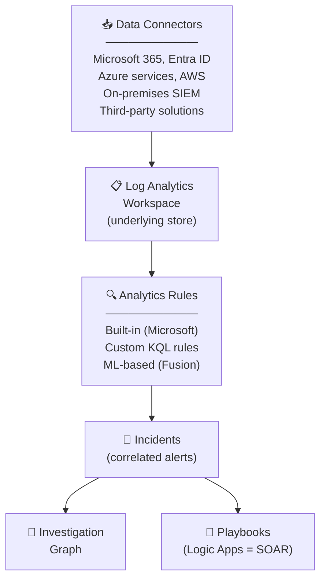
```mermaid
flowchart TD
    DC["📥 Data Connectors\n————————\nMicrosoft 365, Entra ID\nAzure services, AWS\nOn-premises SIEM\nThird-party solutions"]
    LA["📋 Log Analytics\nWorkspace\n(underlying store)"]
    ANA["🔍 Analytics Rules\n————————\nBuilt-in (Microsoft)\nCustom KQL rules\nML-based (Fusion)"]
    INC["🚨 Incidents\n(correlated alerts)"]
    INV["🔬 Investigation\nGraph"]
    PLAY["🤖 Playbooks\n(Logic Apps = SOAR)"]

    DC --> LA --> ANA --> INC --> INV
    INC --> PLAY
```

| Feature | Sentinel | Azure Monitor Alerts |
|---------|----------|---------------------|
| Focus | Security threats | Operational issues |
| Data sources | Multi-cloud, on-prem, third-party | Azure-native |
| SOAR automation | ✅ Logic App Playbooks | ✅ Action Groups |
| AI/ML threat detection | ✅ Fusion ML | ❌ Limited |
| Licence required | Sentinel workspace (pay per GB) | Included with Monitor |
| SLA | **99.9%** | **99.9%** |

> **Exam Caveat ⚠️:** Sentinel is built **on top of** a Log Analytics Workspace. You need to provision a workspace first. Costs are based on data ingestion (GB/day) — design data collection carefully to avoid surprise costs.

---

## 🎯 Domain 1 — Exam Scenario Quick-Reference

| Scenario | Answer |
|----------|--------|
| App on Azure VM needs to call Key Vault, no credentials in code | System-assigned **Managed Identity** + KV access policy |
| Multiple Azure Functions all need the same permissions | **User-assigned Managed Identity** shared across them |
| Admin needs elevated access only for 2 hours with approval | **PIM** eligible role assignment (requires Entra ID P2) |
| Enforce resource tagging across 50 subscriptions | **Azure Policy (Deny)** assigned at **Management Group** |
| Block VM creation in any region outside EU | **Azure Policy (Deny)** — `allowedLocations` built-in |
| Monitor app performance, failure rates, dependency calls | **Application Insights** |
| Detect suspicious sign-ins and security threats | **Microsoft Sentinel** |
| Require MFA only when sign-in is from outside EU | **Conditional Access** — Named Locations + require MFA |
| User needs read access to a storage account only | **Storage Blob Data Reader** role (RBAC) |
| Audit which resources don't have required tags (no block) | **Azure Policy (Audit)** effect |
| Auto-deploy a Log Analytics agent to all new VMs | **Azure Policy (DeployIfNotExists)** |
| User account flagged as compromised — force password reset | **Identity Protection** User Risk Policy → require password change on high risk |
| Detect sign-in from Tor exit node and block automatically | **Identity Protection** Sign-in Risk Policy (Anonymous IP detection) + **Conditional Access** block on High risk |
| Employee's leaked credential detected — what risk type? | **User risk** (not sign-in risk) — persists on account until remediated |
| Quarterly review of who has access to the Finance app | **Access Reviews** on application assignment, quarterly recurrence, auto-apply |
| Remove stale guest access automatically after 90-day review | **Access Reviews** — on no response: Remove access, auto-apply enabled |
| External contractor needs access to 3 SharePoint sites + 1 app | **Entitlement Management** access package bundling all four resources |
| Partner company employees should self-request project access | **Entitlement Management** + **Connected Organization** for partner tenant |
| New hire should get MFA enrolled before first day, auto | **Lifecycle Workflows** (Joiner) → Generate Temporary Access Pass task |
| Disable account and remove all groups on last day automatically | **Lifecycle Workflows** (Leaver) → Disable account + Remove group memberships tasks |
| Department head needs to certify their team's app access monthly | **Access Reviews** — reviewer = manager, monthly recurrence, self-review option |

---

*← [00 - Azure Prerequisites](/az-305-study-notes/00-azure-prerequisites/) | [02 - Data Storage Solutions →](/az-305-study-notes/02-data-storage-solutions/)*
