# 01 — Design Identity, Governance & Monitoring Solutions
> **Official Exam Weight: 25–30%**
> 📁 [← Back to Home](./)

---

## 🗺️ Domain Overview

```mermaid
mindmap
  root((Domain 1\n25–30%))
    Identity & Auth
      Entra ID
      Hybrid Identity
      MFA & Passwordless
      External Identities B2B/B2C
    Authorisation
      Azure RBAC
      Managed Identities
      PIM – Just-in-Time
      Conditional Access
    Governance
      Management Groups
      Azure Policy
      Blueprints
      Cost Management & Tagging
    Monitoring
      Azure Monitor
      Log Analytics / KQL
      Application Insights
      Microsoft Sentinel
      Network Watcher
```

---

## 🔐 1.1 Design Authentication Solutions

### Microsoft Entra ID (formerly Azure AD)

**Core Concepts:**

- 🏢 A **Tenant** = one dedicated Entra ID instance per organisation
- 👤 **User** = human identity | **Group** = collection of users
- 🤖 **Service Principal** = non-human app identity (requires secret or cert)
- ✅ **Managed Identity** = auto-managed service principal for Azure resources (no secret needed)
- 🔗 **App Registration** = registers an app in Entra ID to use OAuth/OIDC

### Hybrid Identity — Decision Flow

```mermaid
flowchart TD
    Start([On-prem AD DS exists?]) -->|Yes| Q1{Compliance requires\npassword on-prem only?}
    Start -->|No| CloudOnly["☁️ Cloud-only Entra ID"]
    Q1 -->|Yes| Q2{Need full IdP\nfederation / smart cards?}
    Q1 -->|No| PHS["✅ Password Hash Sync (PHS)\nRecommended default\n+ Seamless SSO"]
    Q2 -->|Yes| FED["🏛️ Federation (AD FS)\nMost complex\nOn-prem dependency"]
    Q2 -->|No| PTA["🔄 Pass-Through Auth (PTA)\nReal-time on-prem validation\nNo hash in cloud"]
```

| Method | Password Location | Online Dependency | Best For |
|--------|-----------------|-------------------|---------|
| **PHS** *(Recommended)* | Hash synced to cloud | Works even if on-prem is down | Most organisations |
| **PTA** | On-premises only | Requires on-prem agent | Compliance: no hash in cloud |
| **Federation (AD FS)** | On-premises IdP | Requires AD FS farm | Smart cards, complex claims |

> **Exam Caveats ⚠️:**
> - PHS is the **Microsoft-recommended** default — it's resilient (works even if on-prem is down)
> - PTA requires **at least 3 agents** for HA — failure of all agents = login failure
> - **Seamless SSO** works with both PHS and PTA — auto-signs in users on domain-joined devices

---

### Multi-Factor Authentication (MFA)

**Authentication factors ranked by strength:**

| # | Factor Type | Example | Strength |
|---|-------------|---------|---------|
| 1 | Something you **are** + possession | FIDO2 Security Key | 🔒🔒🔒🔒🔒 Strongest |
| 2 | Something you **are** (biometric) | Windows Hello for Business | 🔒🔒🔒🔒🔒 |
| 3 | Something you **have** (app) | Microsoft Authenticator (passwordless) | 🔒🔒🔒🔒 |
| 4 | Certificate-based Auth | Smart card / PIV | 🔒🔒🔒🔒 |
| 5 | App OTP | Authenticator app TOTP | 🔒🔒🔒 |
| 6 | Hardware OATH token | OATH hardware token | 🔒🔒🔒 |
| 7 | Software OTP | Authenticator app code | 🔒🔒 |
| 8 | SMS / Voice call | SMS code to phone | 🔒 Weakest |

> **Exam Caveat ⚠️:** SMS and voice call MFA should be **avoided** for high-security scenarios — SIM swapping attacks. Exam scenarios should favour Authenticator App or FIDO2.

---

### Conditional Access

**The Conditional Access Policy model:**

```mermaid
flowchart LR
    SIGNAL["📡 Signals\n—————\nUser / Group\nDevice compliance\nLocation / IP\nApp being accessed\nSign-in risk (P2)\nUser risk (P2)"] --> ENGINE["⚙️ Policy Engine\n(Entra ID P1/P2)"]
    ENGINE --> GRANT["✅ Grant Access\n—————\nRequire MFA\nRequire compliant device\nRequire Hybrid AD join\nRequire approved app\nRequire app protection"]
    ENGINE --> BLOCK["🚫 Block Access"]
    ENGINE --> SESSION["🎛️ Session Controls\n—————\nLimit session duration\nApp enforced restrictions\nCloud App Security"]
```

**Licence requirements:**

| Feature | Required Licence |
|---------|----------------|
| Basic Conditional Access policies | **Entra ID P1** |
| Risk-based Conditional Access | **Entra ID P2** |
| Named Locations, compliance conditions | **Entra ID P1** |
| Sign-in / User risk policies | **Entra ID P2** (Identity Protection) |

> **Exam Caveats ⚠️:**
> - **Sign-in risk** and **user risk** conditions require **P2** (Identity Protection)
> - **MFA registration policy** requires P2
> - Conditional Access evaluates **at sign-in time** — it doesn't revoke existing sessions immediately

---

## 👤 1.2 Design Authorisation Solutions

### Azure RBAC — Built-in Roles

| Role | Can Manage Resources | Can Manage Access | Can Assign Roles |
|------|---------------------|-------------------|-----------------|
| **Owner** | ✅ Full | ✅ Full | ✅ Yes |
| **Contributor** | ✅ Full | ❌ No | ❌ No |
| **Reader** | 👁️ View only | ❌ No | ❌ No |
| **User Access Administrator** | ❌ No | ✅ Full | ✅ Yes |

**Service-specific roles to know:**

| Role | Scope |
|------|-------|
| Network Contributor | Manage VNets, NSGs, route tables — no VM access |
| Virtual Machine Contributor | Manage VMs — no VNet or storage access |
| Storage Blob Data Contributor | Read/write/delete Blob containers and data |
| Key Vault Administrator | Manage Key Vault and all objects (P1 operations) |
| Key Vault Secrets Officer | Manage secrets only (not keys or certs) |
| SQL DB Contributor | Manage SQL databases — not security policies |
| Monitoring Contributor | Read all monitoring data, edit monitoring settings |

> **Exam Caveats ⚠️:**
> - **Contributor ≠ Owner** — a Contributor cannot assign roles or manage access
> - To grant access to others, you need **Owner** or **User Access Administrator**
> - Custom roles are supported but rarely needed — know when built-ins fall short

### Managed Identities — Deep Dive

```mermaid
graph LR
    subgraph "System-Assigned"
        VM1["Azure VM"] -->|"Gets auto identity\ntied to VM lifecycle"| MSI1["🤖 System Identity"]
        MSI1 -->|"Deleted when\nVM is deleted"| GONE["❌ Auto-deleted"]
    end
    subgraph "User-Assigned"
        UA["🤖 User Identity\n(standalone resource)"] -->|"Assigned to"| VM2["Azure VM"]
        UA -->|"Also assigned to"| APP["Azure Function"]
        UA -->|"Survives resource\ndeletion"| PERSIST["✅ Persists independently"]
    end
```

| Feature | System-Assigned | User-Assigned |
|---------|----------------|--------------|
| Lifecycle | Tied to the resource | Independent resource |
| Shared across resources | ❌ No | ✅ Yes |
| Created by | Enabling on a resource | Creating standalone resource |
| Best for | Single resource, simple use case | Multiple resources sharing same identity |

> **Exam Caveats ⚠️:**
> - Managed Identities can authenticate to **any service that supports Entra ID authentication**
> - Use **system-assigned** for simple single-resource scenarios
> - Use **user-assigned** when multiple resources need the same permissions or when the identity must survive resource deletion

### Privileged Identity Management (PIM)

**What PIM provides:**

- ⏱️ **Just-in-time (JIT)** privileged access — elevate role only when needed
- 📋 **Approval workflow** — require approval before activation
- 🔐 **MFA on activation** — always require MFA to activate a privileged role
- ⏰ **Time-bound** — access expires automatically
- 📊 **Access reviews** — periodically validate who still needs access
- 📜 **Audit history** — full log of all activations and changes

| Requirement | Detail |
|-------------|--------|
| Licence required | **Entra ID P2** |
| Covers | Azure RBAC roles + Entra ID roles |
| Max activation duration | Configurable (e.g., 1 hour, 8 hours) |
| SLA | Standard Entra ID SLA (**99.99%**) |

> **Exam Caveats ⚠️:**
> - PIM requires **Entra ID Premium P2** — not included in P1
> - "Eligible" role = assigned but not yet activated; "Active" role = currently active
> - Standing access (always-on admin roles) is an anti-pattern — PIM enforces JIT

---

## 🏛️ 1.3 Design Governance Solutions

### Management Group Hierarchy Design Patterns

```mermaid
graph TD
    ROOT["⬛ Root MG"]
    PLAT["🏗️ Platform MG\n(shared infrastructure)"]
    LAND["🏢 Landing Zones MG\n(workloads)"]
    SAND["🧪 Sandbox MG\n(experimentation)"]
    DECOM["🗑️ Decommissioned MG"]

    ROOT --> PLAT
    ROOT --> LAND
    ROOT --> SAND
    ROOT --> DECOM

    PLAT --> CONN["Connectivity Sub\n(Hub VNets, ExpressRoute)"]
    PLAT --> MGMT["Management Sub\n(Monitor, Backup, Automation)"]
    PLAT --> ID["Identity Sub\n(AD DS, Entra ID P)"]

    LAND --> CORP["Corp MG\n(connected to hub)"]
    LAND --> ONLINE["Online MG\n(internet-facing)"]

    CORP --> PROD["Production Sub"]
    CORP --> DEV["Dev/Test Sub"]
```

> This follows the **Azure Enterprise-Scale Landing Zone** pattern — the reference architecture Microsoft recommends for large organisations.

### Azure Policy — Effects Ordered by Severity

```mermaid
flowchart LR
    RES["Resource\nCreate/Update\nRequest"] --> POL{"Azure Policy\nEvaluation"}
    POL -->|"Effect: Disabled"| PASS1["✅ Ignored"]
    POL -->|"Effect: Audit"| PASS2["✅ Allowed\n⚠️ Logged as non-compliant"]
    POL -->|"Effect: AuditIfNotExists"| PASS3["✅ Allowed\n⚠️ Audit if related resource missing"]
    POL -->|"Effect: Append"| PASS4["✅ Allowed\n➕ Field appended to request"]
    POL -->|"Effect: Modify"| PASS5["✅ Allowed\n🔧 Tags or properties modified"]
    POL -->|"Effect: DeployIfNotExists"| PASS6["✅ Allowed\n📦 Related resource deployed if missing"]
    POL -->|"Effect: Deny"| BLOCK["🚫 BLOCKED\nResource creation refused"]
```

**Policy effects quick reference:**

| Effect | Blocks Creation? | Remediates Existing? | Use Case |
|--------|-----------------|---------------------|---------|
| `Disabled` | ❌ | ❌ | Temporarily turn off a policy |
| `Audit` | ❌ | ❌ | Compliance reporting only |
| `AuditIfNotExists` | ❌ | ❌ | Audit when companion resource missing |
| `Append` | ❌ | ❌ | Add required fields to requests |
| `Modify` | ❌ | ✅ (remediation task) | Enforce tags, modify properties |
| `DeployIfNotExists` | ❌ | ✅ (remediation task) | Deploy companion resource |
| `Deny` | ✅ | ❌ | Hard enforcement — block non-compliant |

> **Exam Caveats ⚠️:**
> - `Audit` logs non-compliance but **never blocks** — resources can still be created
> - `Deny` is a hard stop — plan carefully before applying at scale
> - `DeployIfNotExists` and `Modify` need a **managed identity** to execute remediation tasks
> - Policies assigned at a **Management Group** apply to **all subscriptions underneath** (inheritance)

### Resource Tagging Strategy

**Recommended tag taxonomy:**

| Tag Name | Example Value | Purpose |
|----------|--------------|---------|
| `Environment` | `Production` / `Dev` / `Test` | Filter cost by environment |
| `Owner` | `team-finance@contoso.com` | Accountability and alerts |
| `CostCenter` | `FIN-001` | Chargeback / showback reporting |
| `Application` | `SAP-ERP` | App-level cost aggregation |
| `Department` | `Finance` | Departmental billing |
| `DataClassification` | `Confidential` | Security and compliance |

> **Exam Caveats ⚠️:**
> - Tags do **not inherit** from resource groups to child resources — use Azure Policy to enforce tag inheritance
> - Max **50 tags** per resource
> - Tag values are **case-sensitive** for querying (inconsistent casing breaks reporting)

---

## 📊 1.4 Design Monitoring Solutions

### Azure Monitor Architecture

```mermaid
graph LR
    subgraph Sources["📡 Data Sources"]
        direction TB
        APP["Applications"]
        VM["Virtual Machines"]
        CONT["Containers"]
        RES["Azure Resources"]
        ON["On-premises"]
    end

    subgraph Monitor["📊 Azure Monitor"]
        direction TB
        MET["📈 Metrics\n(time-series,\nnumerical)"]
        LOG["📋 Logs\n(Log Analytics\nWorkspace / KQL)"]
        TRACE["🔍 Traces\n(App Insights)"]
        ACTLOG["📜 Activity Log\n(Azure API ops)"]
    end

    subgraph Actions["⚡ Actions"]
        direction TB
        ALERT["🔔 Alerts"]
        SCALE["⚖️ Autoscale"]
        RUNBOOK["🤖 Automation\nRunbook"]
        LOGIC["🔗 Logic App /\nFunction"]
        ITSM["📟 ITSM\nConnector"]
    end

    Sources --> Monitor
    Monitor --> Actions
```

### Log Analytics Workspace — Design Decisions

| Scenario | Recommendation |
|----------|---------------|
| Single organisation, no compliance constraints | **One workspace per region** |
| Data sovereignty (e.g., must stay in Germany) | **Separate workspace per region** |
| Different retention requirements per workload | **Multiple workspaces** |
| Charge costs back to individual teams | **Multiple workspaces** (or use tags + cost analysis) |
| Security team needs isolated data | **Dedicated security workspace** (for Sentinel) |

> **Exam Caveat ⚠️:** There is a cost to sending data **across regions** to a centralised workspace. For EU data residency, you may need a workspace in each geographic region.

### Application Insights — SKUs & Key Features

| Deployment Mode | Description | Recommended? |
|----------------|-------------|-------------|
| **Workspace-based** (default) | Backed by Log Analytics workspace | ✅ Yes — unified querying |
| **Classic** (legacy) | Standalone, separate storage | ❌ No — being retired |

**Key capabilities:**

| Feature | What it Does | SLA |
|---------|-------------|-----|
| **Availability Tests** | Ping your URL every 5 min from 5+ global locations | **99.9%** |
| **Smart Detection** | AI-based anomaly alerts (no threshold needed) | — |
| **Application Map** | Visual topology of dependencies | — |
| **Live Metrics** | Real-time telemetry stream | — |
| **Failure Analysis** | Drill into failed requests and exceptions | — |
| **User Flows** | How users navigate your app | — |

> **Exam Caveats ⚠️:**
> - Auto-instrumentation requires no code changes (App Service, AKS, Azure Functions) — great for lift-and-shift monitoring
> - **SDK instrumentation** gives more detail (custom events, dependencies) but requires code changes
> - Application Insights data feeds into the **same Log Analytics workspace** in workspace-based mode — unified KQL queries

### Microsoft Sentinel — SIEM & SOAR

```mermaid
flowchart TD
    DC["📥 Data Connectors\n————————\nMicrosoft 365, Entra ID\nAzure services, AWS\nOn-premises SIEM\nThird-party solutions"]
    LA["📋 Log Analytics\nWorkspace\n(underlying store)"]
    ANA["🔍 Analytics Rules\n————————\nBuilt-in (Microsoft)\nCustom KQL rules\nML-based (Fusion)"]
    INC["🚨 Incidents\n(correlated alerts)"]
    INV["🔬 Investigation\nGraph"]
    PLAY["🤖 Playbooks\n(Logic Apps = SOAR)"]

    DC --> LA --> ANA --> INC --> INV
    INC --> PLAY
```

| Feature | Sentinel | Azure Monitor Alerts |
|---------|----------|---------------------|
| Focus | Security threats | Operational issues |
| Data sources | Multi-cloud, on-prem, third-party | Azure-native |
| SOAR automation | ✅ Logic App Playbooks | ✅ Action Groups |
| AI/ML threat detection | ✅ Fusion ML | ❌ Limited |
| Licence required | Sentinel workspace (pay per GB) | Included with Monitor |
| SLA | **99.9%** | **99.9%** |

> **Exam Caveat ⚠️:** Sentinel is built **on top of** a Log Analytics Workspace. You need to provision a workspace first. Costs are based on data ingestion (GB/day) — design data collection carefully to avoid surprise costs.

---

## 🎯 Domain 1 — Exam Scenario Quick-Reference

| Scenario | Answer |
|----------|--------|
| App on Azure VM needs to call Key Vault, no credentials in code | System-assigned **Managed Identity** + KV access policy |
| Multiple Azure Functions all need the same permissions | **User-assigned Managed Identity** shared across them |
| Admin needs elevated access only for 2 hours with approval | **PIM** eligible role assignment (requires Entra ID P2) |
| Enforce resource tagging across 50 subscriptions | **Azure Policy (Deny)** assigned at **Management Group** |
| Block VM creation in any region outside EU | **Azure Policy (Deny)** — `allowedLocations` built-in |
| Monitor app performance, failure rates, dependency calls | **Application Insights** |
| Detect suspicious sign-ins and security threats | **Microsoft Sentinel** |
| Require MFA only when sign-in is from outside EU | **Conditional Access** — Named Locations + require MFA |
| User needs read access to a storage account only | **Storage Blob Data Reader** role (RBAC) |
| Audit which resources don't have required tags (no block) | **Azure Policy (Audit)** effect |
| Auto-deploy a Log Analytics agent to all new VMs | **Azure Policy (DeployIfNotExists)** |

---

*← [00 - Azure Prerequisites](./00-azure-prerequisites/) | [02 - Data Storage Solutions →](./02-data-storage-solutions/)*
