# 02 — Design Data Storage Solutions
> **Official Exam Weight: 25–30%**
> 📁 [← Back to Home](/az-305-study-notes/)

---

## 🗺️ Domain Overview

```mermaid
mindmap
  root((Domain 2\n25–30%))
    Relational Storage
      Azure SQL Database
      SQL Managed Instance
      SQL on Azure VM
      Azure DB for PostgreSQL
      Azure DB for MySQL
    Non-Relational
      Cosmos DB NoSQL
      Cosmos DB MongoDB API
      Cosmos DB Table API
      Cosmos DB Cassandra
      Cosmos DB Gremlin
    Object Storage
      Azure Blob Storage
      Azure Data Lake Gen2
      Azure Files
      Azure Queues
    Integration & Analytics
      Azure Data Factory
      Azure Databricks
      Azure Synapse Analytics
      Azure Stream Analytics
```

---

## 🗄️ 2.1 Design Relational Data Storage

### Azure SQL Service Selection

```mermaid
flowchart TD
    START([Which SQL service?]) --> Q1{Need 100% SQL Server\nfeature compatibility?\nSQL Agent, CLR, SSISDB,\nlinked servers, etc.}
    Q1 -->|Yes| Q2{Need full OS control\nor third-party tools\nor BYOL for max control?}
    Q1 -->|No| SQLDB["✅ Azure SQL Database\n(Best PaaS — standard SQL workloads)"]
    Q2 -->|Yes| SQLVM["🖥️ SQL Server on Azure VM\n(IaaS — full control, 100% compat)"]
    Q2 -->|No| SQLMI["✅ Azure SQL Managed Instance\n(Best lift-and-shift PaaS\nnear-100% compatibility)"]
```

### Azure SQL Service Comparison

| Feature | Azure SQL DB | SQL Managed Instance | SQL on Azure VM |
|---------|-------------|---------------------|-----------------|
| **Service Model** | PaaS | PaaS | IaaS |
| **SQL Server compat** | ~95% | ~99% | 100% |
| **SQL Agent** | ❌ (use Elastic Jobs) | ✅ | ✅ |
| **CLR** | ❌ | ✅ | ✅ |
| **Linked Servers** | ❌ | ✅ | ✅ |
| **SSISDB** | ❌ | ✅ | ✅ |
| **Cross-DB queries** | Same server only | ✅ | ✅ |
| **Backup management** | Automatic | Automatic | Manual |
| **Patching** | Automatic | Automatic | Manual |
| **SLA** | **99.99%** | **99.99%** | **99.9%** (Premium SSD) |
| **Max DB size** | 4 TB (GP) / 100 TB (Hyperscale) | 16 TB | Limited by disk |

> **Exam Caveats ⚠️:**
> - **SQL MI** is the recommended PaaS target for on-premises SQL Server lift-and-shift migrations
> - SQL MI uses a **dedicated VNet subnet** — it's network-isolated by design
> - SQL MI does NOT support **Windows Authentication from Azure AD** in the same way SQL DB does (check current docs)
> - **Elastic Jobs** replaces SQL Agent for Azure SQL Database

### Azure SQL Database Tiers

**Business Critical tier — High Availability built in:**

| Tier | HA Mechanism | Readable Secondaries | SLA |
|------|--------------|---------------------|-----|
| General Purpose | Azure Storage replication | ❌ | **99.99%** |
| Business Critical | Always On AG (3 replicas) | ✅ 1 free readable replica | **99.99%** |
| Hyperscale | Multiple page server replicas | ✅ Up to 4 | **99.9%–99.99%** |

> **Exam Caveats ⚠️:**
> - **Azure Hybrid Benefit** only works with the **vCore** model — can save up to **55%**
> - **Business Critical** includes a **free readable secondary** — useful for reporting workloads
> - **Hyperscale** supports up to **100 TB** and rapid scaling but doesn't support all SQL DB features

### Active Geo-Replication vs Auto-Failover Groups

| Feature | Active Geo-Replication | Auto-Failover Groups |
|---------|----------------------|---------------------|
| Supported on | SQL Database | SQL Database + SQL MI |
| Max readable secondaries | 4 | 1 (secondary region) |
| Failover type | Manual only | Manual **or** Automatic |
| Same connection string after failover | ❌ String changes | ✅ Listener endpoint stays same |
| RPO | < 5 seconds | < 5 seconds |
| RTO (auto) | N/A | < 30 seconds |
| Use case | Custom failover logic | Transparent app failover |

> **Exam Caveats ⚠️:**
> - **Auto-Failover Groups** are preferred in exam scenarios requiring **transparent failover** (same endpoint)
> - Active Geo-Replication gives you more control but requires application-level handling of the new endpoint

### Open-Source Managed Databases

| Service | Engine | SLA | Flexible Server HA | Zone-Redundant |
|---------|--------|-----|-------------------|----------------|
| **Azure DB for PostgreSQL** | PostgreSQL 11–16 | **99.9%** | ✅ | ✅ (99.99%) |
| **Azure DB for MySQL** | MySQL 5.7, 8.0 | **99.9%** | ✅ | ✅ (99.99%) |

> **Exam Caveat ⚠️:** "Flexible Server" is the current recommended deployment mode for both PostgreSQL and MySQL. The older "Single Server" mode is **deprecated** — do not recommend it in exam scenarios.

---

## 🌐 2.2 Design Non-Relational Data Storage (Cosmos DB)

### Cosmos DB — API Selection

```mermaid
graph TD
    Q{Migrating existing\napp or starting fresh?}
    Q -->|Existing MongoDB app| MON["🍃 MongoDB API\n(wire-protocol compatible)"]
    Q -->|Existing Cassandra app| CASS["📦 Cassandra API\n(CQL compatible)"]
    Q -->|Existing Table Storage app| TABLE["📋 Table API\n(key-value, Table Storage compat)"]
    Q -->|Graph data / relationships| GREM["🕸️ Gremlin API\n(Apache TinkerPop)"]
    Q -->|New app — document store| NOSQL["✅ NoSQL API (Core/SQL)\nNative, richest feature set\nSQL-like query syntax"]
    Q -->|PostgreSQL + distributed scale| PG["🐘 PostgreSQL API\n(Citus distributed)"]
```

### Cosmos DB Consistency Levels — Visualised

```mermaid
graph LR
    S["🔒 Strong\n(Highest consistency\nHighest latency/cost)"]
    BS["📊 Bounded Staleness\n(Lag by K ops or T time)"]
    SE["👤 Session (Default)\n(Per-session consistency)"]
    CP["📋 Consistent Prefix\n(Ordered, no gaps)"]
    EV["⚡ Eventual\n(Lowest latency/cost\nNo order guarantee)"]

    S --> BS --> SE --> CP --> EV
```

| Level | Guarantee | Use Case | SLA |
|-------|-----------|---------|-----|
| **Strong** | Linearizable — always read latest | Financial transactions, inventory | **99.999%** (multi-region write) |
| **Bounded Staleness** | Read within K versions or T interval | Multi-region apps needing near-consistency | **99.999%** |
| **Session** *(default)* | Consistent within a session | User profiles, shopping carts | **99.999%** |
| **Consistent Prefix** | No out-of-order reads | Social media timelines | **99.999%** |
| **Eventual** | No order guarantee | Like counts, view counters | **99.999%** |

> **Exam Caveats ⚠️:**
> - The **99.999% SLA** applies to **multi-region write configurations**
> - Single-region Cosmos DB SLA is **99.99%**
> - **Session consistency** is the default — most apps don't need to change it
> - Strong consistency is **not available** with multi-region write configurations

### Cosmos DB Capacity Modes

| Mode | Billing | Scale | Best For |
|------|---------|-------|---------|
| **Provisioned Throughput** | Per RU/s provisioned | Manual or autoscale | Predictable production workloads |
| **Autoscale Provisioned** | Scales between min and max RU/s | Automatic | Variable workloads |
| **Serverless** | Per RU consumed | Automatic | Dev/test, spiky low-traffic apps |

**Request Unit (RU) rough reference:**

| Operation | Approximate RU Cost |
|-----------|-------------------|
| Read 1 KB item by point-read | 1 RU |
| Write 1 KB item | 5 RU |
| Query (depends on complexity) | Varies widely |
| Stored procedure execution | Varies |

> **Exam Caveat ⚠️:** A **cross-partition query** (no partition key filter) consumes significantly more RUs than a point-read. Partition key design directly impacts cost.

### Cosmos DB Partition Key Design

**Good partition keys:**

- ✅ High cardinality (many distinct values)
- ✅ Even distribution of reads and writes
- ✅ Used frequently in queries (enables point-reads)
- ✅ Examples: `/userId`, `/deviceId`, `/orderId`, `/sessionId`

**Bad partition keys:**

- ❌ Low cardinality: `/status` (Active/Inactive), `/country` (only 50 values)
- ❌ Monotonically increasing: `/timestamp` (all writes go to the same hot partition)
- ❌ Never queried: wastes the partition key benefit

---

## 🗃️ 2.3 Design Object / Blob Storage

### Blob Storage — Access Tier Decision Flow

```mermaid
flowchart TD
    Q1{How frequently is\nthe data accessed?}
    Q1 -->|"Daily / very frequently"| HOT["🔥 Hot Tier\nLowest access cost\nHighest storage cost"]
    Q1 -->|"Occasionally (monthly)"| COOL["❄️ Cool Tier\nMin 30 days\nBalance of cost"]
    Q1 -->|"Rarely (quarterly)"| COLD["🧊 Cold Tier\nMin 90 days\nLower storage cost"]
    Q1 -->|"Almost never\n(compliance archive)"| ARCH["⬛ Archive Tier\nMin 180 days\nOffline — must rehydrate\nLowest storage cost"]
```

**Blob type selection:**

| Blob Type | Optimised For | Examples |
|-----------|--------------|---------|
| **Block Blob** | Large sequential files | Images, videos, documents, backups |
| **Append Blob** | Append-only writes | Log files, audit streams |
| **Page Blob** | Random read/write (512-byte pages) | Azure VM OS and data disks |

> **Exam Caveats ⚠️:**
> - **Archive blobs are OFFLINE** — you cannot read them without rehydrating first (hours to complete)
> - Early deletion fees apply if you delete a blob before minimum storage duration expires
> - **Lifecycle Management Policies** automate tier transitions and deletions — define rule conditions by `daysAfterModificationGreaterThan` or `daysAfterCreationGreaterThan`

### Azure Data Lake Storage Gen2 (ADLS Gen2)

| Feature | Blob Storage | ADLS Gen2 |
|---------|-------------|-----------|
| Hierarchical namespace | ❌ Flat | ✅ True directory structure |
| POSIX ACLs | ❌ | ✅ File and folder-level permissions |
| Hadoop-compatible | ❌ | ✅ (ABFS driver) |
| Analytics compatibility | Limited | ✅ Databricks, Synapse, HDInsight |
| Cost difference | Baseline | Same (just a feature toggle) |
| How to enable | — | Enable "Hierarchical Namespace" at storage account creation |

> **Exam Caveats ⚠️:**
> - ADLS Gen2 = Blob Storage with **Hierarchical Namespace** enabled — NOT a separate service
> - Hierarchical Namespace **cannot be disabled** after the storage account is created
> - Use ADLS Gen2 for all **big data / analytics workloads** in Azure

### Storage Security Model

| Method | Scope | Granularity | Recommended? |
|--------|-------|------------|-------------|
| **Entra ID + RBAC** (Data roles) | Container, blob | Role-based | ✅ Best for Azure resources |
| **User Delegation SAS** | Container, blob | Fine-grained, time-limited | ✅ Best for external users |
| **Service SAS** | Service-level | Fine-grained, time-limited | ✅ Good for external |
| **Account SAS** | Entire account | Coarse | ⚠️ Use sparingly |
| **Storage Account Keys** | Entire account | Full access | ❌ Avoid — too much access |
| **Shared Access Policy** | Stored on server | Can revoke server-side | ✅ Use with Service SAS |

> **Exam Caveats ⚠️:**
> - **User Delegation SAS** is signed with Entra ID credentials (not account keys) — the most secure SAS type
> - Rotating a Storage Account Key **immediately invalidates** all SAS tokens signed with the old key
> - **Private Endpoint** for storage = traffic never leaves your VNet (preferred over Service Endpoints for on-prem access)

---

## 🔄 2.4 Design Data Integration Solutions

### Integration Service Selection

```mermaid
graph TD
    Q{Primary need?}
    Q -->|"ETL / ELT pipelines\ndata movement / orchestration"| ADF["🔄 Azure Data Factory\nBest for: orchestration, copy data\nSupports SSIS lift-and-shift"]
    Q -->|"Large-scale Spark\ncomplex transformations + ML"| ADB["⚡ Azure Databricks\nApache Spark\nPython, Scala, SQL, R"]
    Q -->|"Unified warehouse + analytics\nsingle platform"| SYN["🏛️ Azure Synapse Analytics\nDedicated SQL Pool (DW)\nServerless SQL Pool\nSpark Pool + ADF built-in"]
    Q -->|"Real-time event\nstream processing"| ASA["📡 Azure Stream Analytics\nSQL-like query on streams\nLow-latency"]
    Q -->|"High-throughput\nevent ingestion"| EH["📥 Azure Event Hubs\nKafka-compatible\nRetention 1–90 days"]
```

### Azure Synapse Analytics — Pools Comparison

| Pool Type | Purpose | Billing | Max Scale |
|-----------|---------|---------|----------|
| **Dedicated SQL Pool** | Enterprise data warehouse, high-performance SQL | Per DWU provisioned | 30,000 DWUs |
| **Serverless SQL Pool** | Query ADLS Gen2 data without provisioning | Per TB scanned | Automatic |
| **Apache Spark Pool** | Big data processing, ML, ETL | Per vCore-hour while running | 200 nodes |

> **Exam Caveats ⚠️:**
> - **Serverless SQL Pool** is free to provision — you only pay for queries run (TB scanned)
> - **Dedicated SQL Pool** must be **paused when not in use** to stop billing (a common cost management question)
> - Synapse Link provides **near real-time analytical queries** directly against Cosmos DB data — no ETL needed

### Azure Data Factory — Key Components

| Component | Description |
|-----------|-------------|
| **Pipeline** | Workflow of one or more activities |
| **Activity** | A single step (Copy Data, Notebook, Stored Proc, etc.) |
| **Dataset** | Named reference to data in a linked service |
| **Linked Service** | Connection to data source (like a connection string) |
| **Integration Runtime** | Compute used to execute activities |
| **Trigger** | Schedules or events that start pipelines |

**Integration Runtime Types:**

| IR Type | Use For | Network |
|---------|--------|---------|
| **Azure IR** | Azure data stores and cloud services | Public or Managed VNet |
| **Self-hosted IR** | On-premises or other cloud (AWS, GCP) | Requires agent on your network |
| **Azure-SSIS IR** | Running SSIS packages in Azure | Azure or Managed VNet |

> **Exam Caveats ⚠️:**
> - To run **SSIS packages** in Azure, use ADF with **Azure-SSIS Integration Runtime**
> - Self-hosted IR requires installing an agent — design for **HA with multiple nodes**
> - ADF itself has **99.9% SLA**

---

## 🎯 Domain 2 — Exam Scenario Quick-Reference

| Scenario | Answer |
|----------|--------|
| Lift-and-shift on-prem SQL Server, use SQL Agent, CLR | **Azure SQL Managed Instance** |
| New cloud-native SQL app, standard T-SQL | **Azure SQL Database (vCore, General Purpose)** |
| Multiple DBs with variable workloads sharing resources | **Azure SQL Elastic Pool** |
| Need transparent failover after SQL DB regional outage | **Auto-Failover Group** (same endpoint listener) |
| Globally distributed app, sub-10ms latency, multi-region writes | **Cosmos DB** (multi-region write, Session or Eventual consistency) |
| Existing MongoDB app migrating to Azure | **Cosmos DB MongoDB API** |
| Store 200 TB of rarely accessed compliance archives | **Blob Storage Archive tier** |
| Big data analytics on files stored in Azure Storage | **ADLS Gen2 + Azure Synapse Serverless SQL Pool** |
| Run existing SSIS packages in the cloud | **ADF with Azure-SSIS Integration Runtime** |
| Query data lake directly without provisioning a DW | **Synapse Serverless SQL Pool** |
| Real-time event stream analysis (IoT sensor data) | **Azure Stream Analytics** |
| High-throughput event ingestion (millions/sec) | **Azure Event Hubs** |
| Need 99.999% availability for database | **Cosmos DB with multi-region write** |
| SQL workload cost reduction with existing Windows licence | **Azure Hybrid Benefit** (vCore model) |

---

*[← 01 - Identity, Governance & Monitoring](/az-305-study-notes/01-identity-governance-monitoring/) | [03 - Business Continuity →](/az-305-study-notes/03-business-continuity/)*
