# 03 — Design Business Continuity Solutions
> **Official Exam Weight: 15–20%**
> 📁 [← Back to Home](/az-305-study-notes/)

---

## 🗺️ Domain Overview


---

## ⏱️ 3.1 Core BC/DR Concepts

### Key Metrics — Definitions

```mermaid
graph LR
    subgraph BEFORE["⏪ Before Incident"]
        BACKUP["💾 Last backup\nor replica sync"]
    end

    subgraph INCIDENT["💥 Incident Occurs"]
        FAIL["❌ Service\nFails"]
    end

    subgraph WINDOW_RPO["📊 RPO Window"]
        RPO_NOTE["Data written between\nlast backup and failure\n= LOST DATA\n⟵ RPO measures this gap ⟶"]
    end

    subgraph RECOVERY["🔧 Recovery Phase"]
        DETECT["Detect\nincident"]
        RESTORE["Restore\nservice"]
        ONLINE["✅ Service\nback online"]
    end

    subgraph WINDOW_RTO["📊 RTO Window"]
        RTO_NOTE["Time from failure\nto full recovery\n= DOWNTIME\n⟵ RTO measures this gap ⟶"]
    end

    BACKUP -->|"time passes"| FAIL
    FAIL --> DETECT --> RESTORE --> ONLINE
    BACKUP -.->|"RPO gap"| RPO_NOTE
    FAIL -.->|"RTO gap"| RTO_NOTE
```



| Metric | Full Name | Question it Answers | Lower = ? |
|--------|-----------|--------------------|-----------| 
| **RPO** | Recovery Point Objective | *"How much data can we afford to lose?"* | More expensive |
| **RTO** | Recovery Time Objective | *"How long can we be offline?"* | More expensive |
| **SLA** | Service Level Agreement | *"What uptime does Azure guarantee?"* | Higher = better |
| **MTTR** | Mean Time to Repair | *"How long to fix on average?"* | Lower = better |
| **MTBF** | Mean Time Between Failures | *"How often does it break?"* | Higher = better |

> **Exam Caveats ⚠️:**
> - In exam scenarios, lower RPO and RTO = **more redundancy = higher cost**
> - The exam will often ask you to choose the **cheapest solution that meets the RTO/RPO requirement**
> - Never confuse RPO (data loss) with RTO (downtime)

---

### SLA Calculations

**Single-service SLA examples:**

| Service | Tier / Config | SLA Uptime | Downtime / Month |
|---------|--------------|-----------|-----------------|
| Azure VM | Single VM, Premium SSD | **99.9%** | ~43 min/month |
| Azure VM | Availability Set (2+ VMs) | **99.95%** | ~22 min/month |
| Azure VM | Availability Zones (2+ VMs) | **99.99%** | ~4.4 min/month |
| Azure SQL DB | General Purpose | **99.99%** | ~4.4 min/month |
| Azure SQL DB | Business Critical | **99.99%** | ~4.4 min/month |
| Cosmos DB | Single region | **99.99%** | ~4.4 min/month |
| Cosmos DB | Multi-region write | **99.999%** | ~26 sec/month |
| App Service | Standard/Premium | **99.95%** | ~22 min/month |
| Azure Storage | LRS / ZRS / GRS | **99.9%** | ~43 min/month |
| Azure Storage | RA-GRS / RA-GZRS | **99.99%** (read) | ~4.4 min/month |
| Azure Kubernetes Service | Standard tier | **99.95%** | ~22 min/month |
| AKS + Availability Zones | Standard tier + AZs | **99.99%** | ~4.4 min/month |

### Composite SLA — Serial Dependencies

When services depend on each other **in series**, multiply the SLAs:

```mermaid
graph LR
    WEB["🌐 Web App\nSLA: 99.95%"] --> SQL["🗄️ SQL Database\nSLA: 99.99%"] --> STOR["💾 Storage\nSLA: 99.9%"]

    RESULT["📊 Composite SLA\n= 99.95% × 99.99% × 99.9%\n= 99.84%"]
```



> ⚠️ **Composite SLA is always lower than the weakest component** in a serial chain.

### Composite SLA — Parallel (Redundant) Services

When services are **parallel** (either one can serve the request), availability increases:

```
Parallel availability = 1 - (probability both fail)
= 1 - ((1 - 0.999) × (1 - 0.999))
= 1 - (0.001 × 0.001)
= 1 - 0.000001
= 99.9999%
```

> **Exam Caveats ⚠️:**
> - Adding redundancy in **parallel** improves availability
> - Adding dependencies in **series** always lowers the composite SLA
> - The exam frequently tests composite SLA math with 2–3 services in a dependency chain

---

## 🏗️ 3.2 High Availability Design

### Availability Sets vs Availability Zones

```mermaid
graph TD
    subgraph "Availability Set"
        direction LR
        DC1["🏢 Single Datacenter"]
        DC1 --> FD1["🔧 Fault Domain 1\n(Rack A)"]
        DC1 --> FD2["🔧 Fault Domain 2\n(Rack B)"]
        DC1 --> FD3["🔧 Fault Domain 3\n(Rack C)"]
        FD1 --> VM1["VM 1"]
        FD2 --> VM2["VM 2"]
        FD3 --> VM3["VM 3"]
    end

    subgraph "Availability Zones"
        direction LR
        REGION["🌍 Azure Region"]
        REGION --> Z1["🏢 Zone 1\n(DC A)"]
        REGION --> Z2["🏢 Zone 2\n(DC B)"]
        REGION --> Z3["🏢 Zone 3\n(DC C)"]
        Z1 --> VMZ1["VM 1"]
        Z2 --> VMZ2["VM 2"]
        Z3 --> VMZ3["VM 3"]
    end
```



| Feature | Availability Set | Availability Zones |
|---------|-----------------|-------------------|
| Protects against | Rack / hardware failure | Entire datacenter failure |
| Scope | Single datacenter | Multiple DCs in same region |
| Fault Domains | 2–3 (separate racks) | 1 per zone (separate DCs) |
| Update Domains | 5–20 (rolling updates) | Independent per zone |
| SLA | **99.95%** | **99.99%** |
| Extra cost | ❌ Free | ⚠️ Minor inter-zone data transfer cost |
| VM type required | Any | Zone-compatible SKU |

> **Exam Caveats ⚠️:**
> - **Availability Sets do NOT protect** against datacenter failure — only Availability Zones do
> - You **cannot convert** an existing VM into an Availability Set or Zone — must redeploy
> - Not all regions support Availability Zones — always check regional availability
> - **Azure Load Balancer Standard** + Availability Zones = zone-redundant load balancing (99.99% SLA)

### Zone-Redundant Services SLAs

| Service | Zone-Redundant Mode | SLA |
|---------|-------------------|-----|
| Azure Load Balancer Standard | Zone-redundant frontend | **99.99%** |
| Application Gateway v2 | Zone-redundant deployment | **99.95%** |
| Azure SQL Database | Zone-redundant config (BC/GP) | **99.99%** |
| Azure Storage ZRS | Automatic across zones | **99.9%** |
| Azure Kubernetes Service | Zone-spread node pools | **99.99%** |
| Azure Cache for Redis | Zone-redundant (Premium) | **99.9%** |
| Azure Service Bus | Zone-redundant (Premium) | **99.9%** |

---

## 💾 3.3 Design Azure Backup Solutions

### Backup Vault Types

```mermaid
graph LR
    subgraph "Recovery Services Vault"
        RSV1["✅ Azure VMs"]
        RSV2["✅ SQL on Azure VM"]
        RSV3["✅ SAP HANA on Azure VM"]
        RSV4["✅ Azure Files"]
        RSV5["✅ On-prem (MARS agent)"]
        RSV6["✅ On-prem VMware/Hyper-V (MABS)"]
    end

    subgraph "Backup Vault (newer)"
        BV1["✅ Azure Managed Disks"]
        BV2["✅ Azure Blob Storage"]
        BV3["✅ Azure Database for PostgreSQL"]
        BV4["✅ Azure Kubernetes Service (preview)"]
    end
```



> **Exam Caveat ⚠️:** Know which vault type supports which workload. Azure VMs = Recovery Services Vault. Managed Disks / Blobs = Backup Vault.

### Backup Redundancy Options

| Redundancy | Copies | SLA | Cross-Region Restore? | Use Case |
|-----------|--------|-----|-----------------------|---------|
| **LRS** | 3 in same DC | — | ❌ | Cost-optimised, no geo requirement |
| **ZRS** | 3 across zones | — | ❌ | Zone failure protection |
| **GRS** | 6 (3+3 paired region) | — | ✅ (must be enabled) | Cross-region DR |

> **Exam Caveat ⚠️:** For **Cross-Region Restore** (CRR), the Recovery Services Vault must use **GRS** redundancy AND the CRR feature must be explicitly enabled. This approximately doubles storage cost.

### Soft Delete Protection

| Feature | Default State | Retention After Delete | Cost |
|---------|--------------|----------------------|------|
| Soft Delete (Azure VMs) | ✅ Always-on (cannot disable) | **14 additional days** | Free |
| Soft Delete (SQL / SAP HANA) | Must be enabled | 14 additional days | Free |
| Soft Delete (Azure Files) | Must be enabled | 14 additional days | Free |

> **Exam Caveats ⚠️:**
> - Soft delete protects against **accidental deletion** and **ransomware** that deletes backups
> - VM soft delete is **always-on** — you cannot disable it
> - During the soft delete period, data counts toward storage billing

### Enhanced Backup Policy (Hourly Backups)

- **Standard policy:** Daily backups only
- **Enhanced policy:** Up to **hourly** backups (every 1–24 hours)
- Required for: SQL Server (log backups), SAP HANA, and Azure VM hourly snapshots
- Lower RPO achieved with enhanced policy

---

## 🔄 3.4 Azure Site Recovery (ASR)

### ASR Supported Scenarios

```mermaid
graph LR
    subgraph "Sources"
        VM1["☁️ Azure VMs\n(Region A)"]
        VM2["🖥️ VMware VMs\n(On-premises)"]
        VM3["🖥️ Hyper-V VMs\n(On-premises)"]
        VM4["🖥️ Physical Servers\n(Windows / Linux)"]
    end

    subgraph "Target"
        AZ["☁️ Azure\n(Secondary Region\nor different Availability Zone)"]
    end

    VM1 -->|"Azure-to-Azure"| AZ
    VM2 -->|"VMware-to-Azure"| AZ
    VM3 -->|"Hyper-V-to-Azure"| AZ
    VM4 -->|"Physical-to-Azure"| AZ
```



### ASR Key Metrics

| Metric | Value | Notes |
|--------|-------|-------|
| **RPO (Azure-to-Azure)** | < 30 seconds | Continuous replication |
| **RTO** | ~1–2 hours | Time to complete failover + VM boot |
| **Crash-consistent snapshot** | Every 5 minutes | Data as if power was cut |
| **App-consistent snapshot** | Every 1–12 hours (configurable) | VSS snapshot, application-aware |
| **Replication frequency** | Continuous | Not scheduled |
| **SLA** | **99.9%** | ASR service SLA |

> **Exam Caveats ⚠️:**
> - **Crash-consistent** = no guarantee app is in a clean state (like power failure)
> - **App-consistent** = VSS-based, ensures app is in a recoverable state (fewer per day, higher RPO)
> - **Test Failover** uses an isolated VNet — does NOT impact production replication
> - ASR doesn't back up data — it replicates the VM state for DR purposes (use Azure Backup for data protection)

### ASR Recovery Plans

**What Recovery Plans provide:**

- 📋 **Ordered failover** — define which VMs boot first (e.g., AD → DB → App → Web)
- 🤖 **Automation** — include Azure Automation runbooks for scripted steps
- 🧪 **Test failover** — DR drills without impacting production
- 📊 **RTO estimation** — test and measure actual failover time

---

## 🎯 Domain 3 — Exam Scenario Quick-Reference

| Scenario | Answer |
|----------|--------|
| Protect Azure VMs from rack-level failure | **Availability Set** (99.95% SLA) |
| Protect Azure VMs from full datacenter failure | **Availability Zones** (99.99% SLA) |
| Lowest cost option that still gets a VM SLA | **Availability Set** (free, 99.95%) |
| Replicate Azure VMs to another Azure region for DR | **Azure Site Recovery (Azure-to-Azure)** |
| Back up on-premises files to Azure | **MARS Agent + Recovery Services Vault** |
| Back up Azure VM with cross-region restore capability | **Recovery Services Vault + GRS + enable CRR** |
| SQL DB failover without changing connection strings | **Auto-Failover Group** (same listener endpoint) |
| Cosmos DB survives a regional outage automatically | **Enable automatic failover** in Cosmos DB multi-region config |
| Protect backup data from accidental deletion | **Soft Delete** (14-day retention, free) |
| Conduct DR drill without impacting production | **ASR Test Failover** in isolated VNet |
| App needs 99.99% SLA, currently on a single VM | Redeploy across **Availability Zones** + Standard Load Balancer |
| Calculate composite SLA for web + SQL + storage | Multiply all SLAs (result always lower than weakest link) |
| Need hourly backups for Azure VM | Enable **Enhanced Backup Policy** |
| Migrate on-premises Hyper-V VMs to Azure for DR | **ASR Hyper-V-to-Azure** replication |

---

### 📊 HA Tier Quick-Reference Ladder

```mermaid
graph TD
    L1["❌ No redundancy\nSingle point of failure\nNever for production"]
    L2["🟡 Availability Set\n99.95% SLA\nFree — protects against rack failure"]
    L3["🟢 Availability Zones\n99.99% SLA\nProtects against datacenter failure"]
    L4["🔵 Region Pair + ASR / Geo-Replication\nProtects against full region outage\nHigher cost + complexity"]
    L5["🏆 Multi-Region Active-Active\n99.999% SLA (Cosmos DB)\nHighest cost — mission-critical only"]

    L1 --> L2 --> L3 --> L4 --> L5
```



---

[← 02 - Data Storage Solutions](/az-305-study-notes/02-data-storage-solutions/) | [04 - Infrastructure Solutions →](/az-305-study-notes/04-infrastructure-solutions/)
