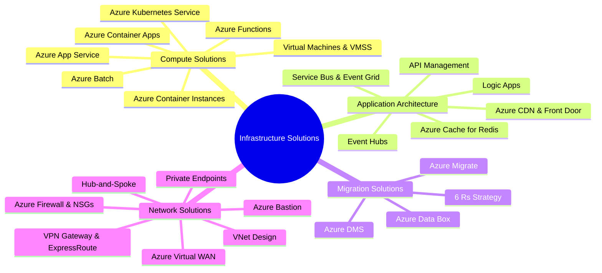
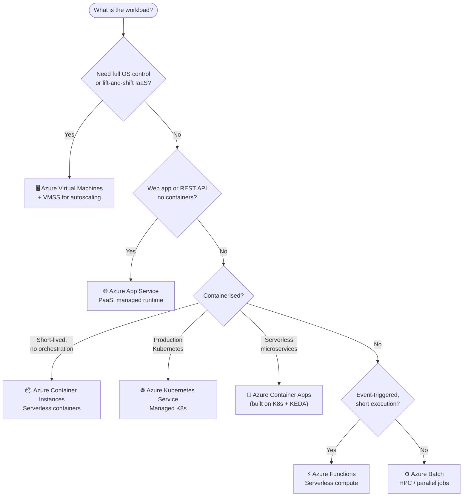
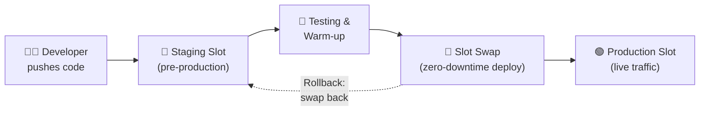
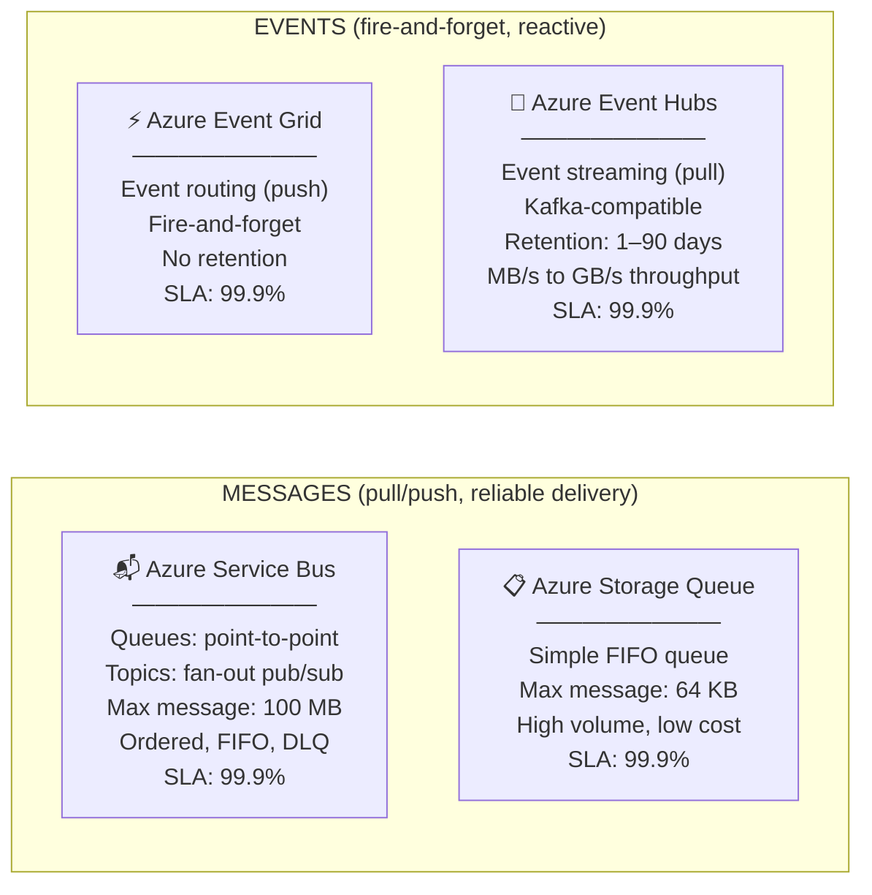
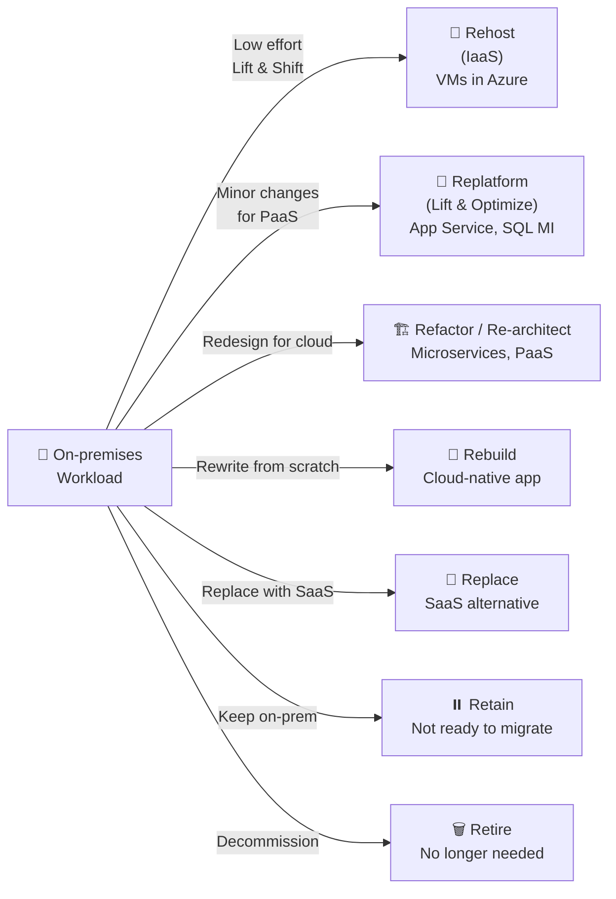
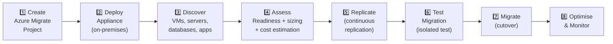
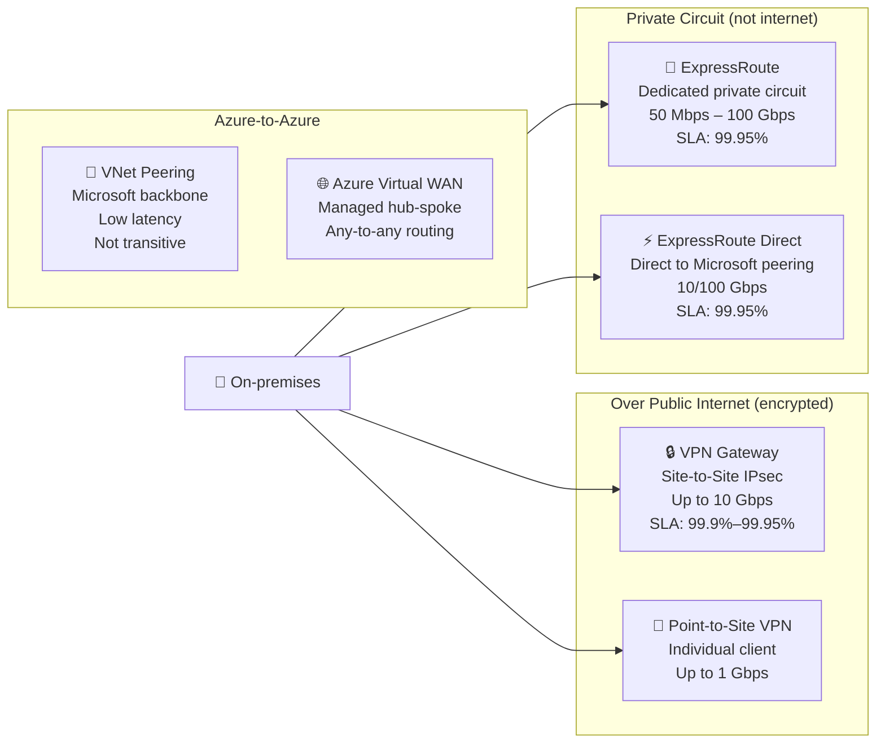
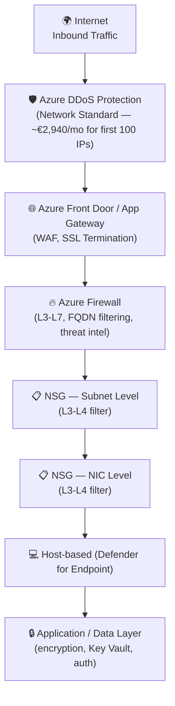
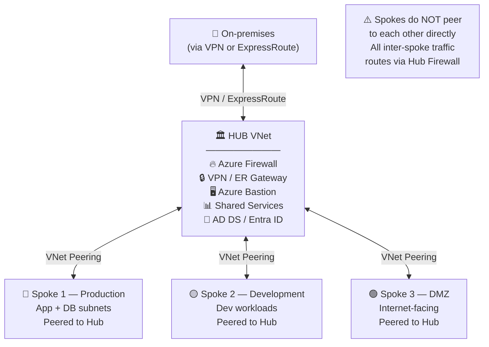

# 04 — Design Infrastructure Solutions
> **Official Exam Weight: 30–35%** — Heaviest Domain
> 📁 [← Back to Home](/az-305-study-notes/)

---

## 🗺️ Domain Overview

---

## 🖥️ 4.1 Design Compute Solutions

### Compute Service Decision Tree

---

### Azure VM Scale Sets (VMSS)

**Key features:**

- 🔢 Scale from 0 to **1,000 VMs** (custom images: 600)
- ⚖️ Autoscale based on metrics (CPU, memory, queue depth) or schedule
- 🔄 **Rolling upgrades** — update VMs in batches to avoid downtime
- 🏗️ Two orchestration modes:

| Mode | Description | Best For |
|------|-------------|---------|
| **Uniform** | All instances identical, same SKU | Stateless workloads, AKS node pools |
| **Flexible** | Mix of VM configs, better fault domain spread | Workloads requiring VM-level flexibility |

> **Exam Caveats ⚠️:**
> - For new VMSS deployments, **Flexible orchestration** is the Microsoft-recommended mode
> - VMSS Autoscale requires **Standard Load Balancer** (not Basic)
> - Define autoscale rules with **cool-down periods** to prevent flapping (scale in/out too rapidly)

---

### Azure Functions — Hosting Plans Comparison

| Plan | Scale | Cold Start | Timeout | VNet Integration | SLA |
|------|-------|-----------|---------|-----------------|-----|
| **Consumption** | Auto (unlimited) | ✅ Yes | 5 min (max 10) | ❌ No | **99.9%** |
| **Flex Consumption** | Auto + pre-provisioned | ✅ Reduced | Unlimited | ✅ Yes | **99.9%** |
| **Premium (EP)** | Auto | ❌ Pre-warmed | Unlimited | ✅ Yes | **99.9%** |
| **Dedicated (App Svc)** | Manual / auto | ❌ Always on | Unlimited | ✅ Yes | **99.9%** |
| **Container Apps** | Auto (KEDA) | ✅ Possible | Unlimited | ✅ Yes | **99.9%** |

> **Exam Caveats ⚠️:**
> - **Consumption plan** cannot use **VNet Integration** — use Premium or Dedicated if needed
> - **Premium plan** eliminates cold starts via pre-warmed instances
> - **Durable Functions** enables stateful workflows across multiple function executions

---

### Azure Kubernetes Service (AKS)

**Key design decisions:**

| Decision | Options |
|---------|---------|
| **Network plugin** | Kubenet (basic, no direct pod IP) vs Azure CNI (each pod gets VNet IP — required for AKS Ingress controllers, policy) |
| **Node pools** | System (K8s system services) + User (your workloads) — separate for isolation |
| **HA** | Availability Zones for node distribution (upgrades to 99.99% SLA) |
| **Autoscaling** | Cluster Autoscaler (nodes) + Horizontal Pod Autoscaler (pods) |
| **Cluster tier** | Free (no SLA) / Standard (99.95%) / Premium (99.95% + LTS) |

**AKS SLAs:**

| Tier | SLA | Notes |
|------|-----|-------|
| **Free** | No SLA | Dev/test only |
| **Standard** | **99.95%** | Production recommended |
| **Standard + Availability Zones** | **99.99%** | Mission-critical production |

> **Exam Caveats ⚠️:**
> - **Azure CNI** is required for: Advanced Networking policies, Windows node pools, Virtual nodes
> - **Kubenet** is simpler but has limitations — use for basic workloads only
> - AKS System node pools **cannot be scaled to 0** — they must always have at least 1 node

---

### Azure App Service — Deployment Slots

**Slot behaviour:**

- ✅ Slots share the same App Service Plan resources
- 🔁 **Swap** exchanges slot content and settings with zero downtime
- ⚙️ Some settings are "slot-sticky" (stay with the slot) vs non-sticky (swap with deployment)
- 📊 **Traffic routing** — send % of traffic to a slot for A/B testing
- Slots per tier: **Standard = 5**, **Premium = 20**, **Isolated = 20**

---

## 🏛️ 4.2 Design Application Architecture

### Messaging Service Comparison

**Detailed comparison — Service Bus vs Storage Queue:**

| Feature | Azure Service Bus | Azure Storage Queue |
|---------|------------------|-------------------|
| Max message size | 256 KB–100 MB | 64 KB |
| Max queue size | 80 GB | Unlimited (storage limit) |
| Guaranteed ordering (FIFO) | ✅ (with sessions) | ❌ Best-effort |
| Dead-letter queue (DLQ) | ✅ | ❌ |
| Duplicate detection | ✅ | ❌ |
| Transactions | ✅ | ❌ |
| Message lock / peek-lock | ✅ | ✅ |
| Pub/sub topics | ✅ | ❌ |
| SLA | **99.9%** | **99.9%** |
| Cost | Higher | Lower |
| Use when | Enterprise messaging, ordering, reliability | Simple, high-volume, cheap queuing |

**Event Grid vs Event Hubs:**

| Feature | Azure Event Grid | Azure Event Hubs |
|---------|-----------------|-----------------|
| Pattern | Event routing (push) | Event streaming (pull/checkpoint) |
| Retention | None (fire-and-forget) | 1–90 days |
| Consumer model | Push to subscribers | Pull via consumer groups |
| Throughput | Millions of events/sec | Millions of events/sec |
| Ordering | ❌ | ✅ (within partition) |
| Replay | ❌ | ✅ |
| Kafka compat | ❌ | ✅ |
| SLA | **99.9%** | **99.9%** |
| Use when | Trigger serverless functions, webhooks | Log aggregation, telemetry, analytics |

> **Exam Caveats ⚠️:**
> - **Service Bus** = enterprise messaging (reliability, ordering, DLQ) — use when message delivery guarantee matters
> - **Event Hubs** = high-throughput streaming (think: Apache Kafka use cases, IoT telemetry)
> - **Event Grid** = reactive programming trigger (e.g., blob created → trigger a function)
> - **Storage Queue** = simplest, cheapest; use only when Service Bus features are not needed

---

### API Management (APIM) — SKU Comparison

| Tier | Units | SLA | VNet Integration | Self-hosted Gateway | Approx Cost/mo |
|------|-------|-----|-----------------|---------------------|---------------|
| **Developer** | 1 | No SLA | ❌ | ❌ | ~€45 |
| **Basic** | 1–2 | **99.9%** | ❌ | ❌ | ~€145 |
| **Standard** | 1–4 | **99.9%** | External VNet | ❌ | ~€725 |
| **Premium** | 1–31 per region | **99.99%** | Internal & External | ✅ | ~€3,000+ |
| **Consumption** | Serverless | **99.9%** | ❌ | ❌ | Pay-per-call |

> **Exam Caveats ⚠️:**
> - **Premium tier** is required for: Internal VNet mode, multi-region deployments, self-hosted gateway
> - **Consumption tier** has no built-in cache and no VNet support — for low-traffic/dev scenarios
> - **99.99% SLA** requires **Premium** with multi-region (2+ regions) deployment

---

### Azure Cache for Redis — Tier Comparison

| Tier | Max Memory | Clustering | Persistence | Geo-Replication | SLA |
|------|-----------|-----------|------------|----------------|-----|
| **Basic** | 53 GB | ❌ | ❌ | ❌ | No SLA |
| **Standard** | 53 GB | ❌ | ❌ | ❌ | **99.9%** |
| **Premium** | 1.2 TB | ✅ | ✅ (RDB/AOF) | ✅ (passive) | **99.9%** |
| **Enterprise** | 2 TB | ✅ | ✅ | ✅ (active-active) | **99.9%** |
| **Enterprise Flash** | 13 TB | ✅ | ✅ | ✅ | **99.9%** |

> **Exam Caveats ⚠️:**
> - **Basic** has no SLA and no replication — dev/test only
> - **Active geo-replication** (multi-region write for Redis) requires **Enterprise** tier
> - **Persistence** (RDB/AOF for data durability) requires **Premium** or higher

---

## 🚀 4.3 Design Migration Solutions

### Migration Strategy — The 6 Rs (+ Retire)

| Strategy | Cloud Benefit | Effort | Time to Cloud |
|----------|--------------|--------|--------------|
| **Rehost** (Lift & Shift) | Low | Low | Fastest |
| **Replatform** (Lift & Optimize) | Medium | Medium | Moderate |
| **Refactor** / Re-architect | High | High | Slower |
| **Rebuild** | Very High | Very High | Slowest |
| **Replace** | Variable | Low | Fast |
| **Retain** | None | None | N/A |
| **Retire** | Cost eliminated | Minimal | Immediate |

> **Exam Caveat ⚠️:** Exam scenarios frequently have budget or time constraints. **Rehost = fastest, lowest risk**. **Refactor = best long-term cloud benefit but most expensive and risky**.

### Azure Migrate — Core Tools

| Tool | Purpose |
|------|---------|
| **Azure Migrate: Discovery & Assessment** | Discover on-prem VMs, assess Azure readiness, estimate costs |
| **Azure Migrate: Server Migration** | Migrate VMware, Hyper-V, physical servers, and cloud VMs to Azure |
| **Azure Database Migration Service (DMS)** | Migrate databases to Azure SQL, MySQL, PostgreSQL |
| **Azure Data Box** | Offline bulk data transfer (40 TB – petabytes) |
| **Azure Data Box Disk** | Offline transfer (up to 35 TB per disk set) |
| **Storage Mover** | Migrate file shares to Azure Files or ADLS Gen2 |

**Azure Migrate Workflow:**

---

## 🌐 4.4 Design Network Solutions

### Connectivity Options Comparison

| Option | Private? | Bandwidth | Latency | SLA | Cost |
|--------|---------|-----------|---------|-----|------|
| **Site-to-Site VPN** | ✅ Encrypted | Up to 10 Gbps | Variable | **99.9%–99.95%** | Low |
| **ExpressRoute** | ✅ True private | 50 Mbps–100 Gbps | Consistent, low | **99.95%** | High |
| **ExpressRoute + VPN** | ✅ Both | ExpressRoute primary | Low + failover | **99.95%+** | Highest |
| **VNet Peering** | ✅ (Azure backbone) | Limited by VMs | Very low | Depends on VMs | Low |
| **Azure Virtual WAN** | ✅ | Aggregated | Low | **99.9%** | Medium-High |

> **Exam Caveats ⚠️:**
> - **ExpressRoute** = private circuit, NOT over public internet — for sensitive data, regulatory requirements
> - **VPN Gateway** = encrypted **over** the public internet (still passes through internet infrastructure)
> - **VNet Peering is NOT transitive** — use Azure Virtual WAN or custom route tables for hub-and-spoke transitivity
> - ExpressRoute does **NOT have built-in failover** — pair with VPN Gateway for resilience

### Network Security Layering (Defence in Depth)

**Azure Firewall vs NSG:**

| Feature | Azure Firewall | NSG |
|---------|---------------|-----|
| OSI Layer | L3–L7 | L3–L4 |
| FQDN filtering | ✅ (e.g., allow \*.microsoft.com) | ❌ |
| Threat intelligence | ✅ | ❌ |
| TLS inspection | ✅ (Premium) | ❌ |
| Stateful | ✅ | ✅ |
| Scope | Centralised (hub) | Per subnet or NIC |
| SLA | **99.99%** | N/A (free service) |
| Approx cost | ~€1,100+/month | Free |

> **Exam Caveats ⚠️:**
> - **NSGs** are free but operate only at L3-L4 (IP/port) — cannot filter by domain name
> - **Azure Firewall** is required when you need FQDN-based rules or threat intelligence
> - In hub-and-spoke, place **Azure Firewall in the hub** and route all spoke traffic through it

### Private Endpoints vs Service Endpoints

| Feature | Service Endpoints | Private Endpoints |
|---------|------------------|-------------------|
| Resource gets private IP in VNet | ❌ (traffic routes via Azure backbone) | ✅ Yes — private IP in your VNet |
| Accessible from on-premises (VPN/ER) | ❌ | ✅ |
| DNS required | No | ✅ (private DNS zone) |
| Cost | Free | ~€7–10/month per endpoint |
| Network path | Azure backbone (still exits VNet) | Stays entirely in VNet |
| SLA impact | None | None (follows service SLA) |

> **Exam Caveats ⚠️:**
> - **Private Endpoints** are required when on-premises resources need to access Azure PaaS services privately (over VPN or ExpressRoute)
> - Service Endpoints do NOT give on-premises resources access to Azure PaaS services
> - Private Endpoints require a **Private DNS Zone** for name resolution to work correctly

### Hub-and-Spoke Network Topology

**Hub-and-Spoke design rules:**

- ✅ Spokes peer **only to the hub**, never directly to each other
- 🔥 Use a **User Defined Route (UDR)** in each spoke to force traffic through the Hub Firewall
- 🔒 Hub contains all **shared security services** (firewall, gateway, Bastion, monitoring)
- 💰 Centralising shared services in the hub reduces cost compared to per-spoke duplication

---

## 🎯 Domain 4 — Exam Scenario Quick-Reference

| Scenario | Answer |
|----------|--------|
| Modernise .NET app — minimal code changes, PaaS | **Replatform** → Azure App Service |
| Run containerised microservices at enterprise scale | **AKS** (Standard tier + Availability Zones, 99.99% SLA) |
| Serverless API, no cold start tolerance, needs VNet | **Azure Functions Premium (EP) Plan** |
| Decouple order processing, guarantee message ordering | **Azure Service Bus** (queues with sessions) |
| IoT telemetry ingestion at millions of events/sec | **Azure Event Hubs** |
| Route events from blob upload to trigger a function | **Azure Event Grid** |
| Expose internal APIs to external partners securely | **API Management Premium** (Internal VNet mode) |
| Lift-and-shift 500 VMware VMs to Azure | **Azure Migrate (Server Migration)** |
| Migrate 20 TB on-prem SQL Server, minimal downtime | **Azure DMS (online migration)** to SQL MI |
| Transfer 200 TB of files to Azure, internet too slow | **Azure Data Box** (offline transfer) |
| Private connection to Azure — not over public internet | **ExpressRoute** |
| Centrally control all Azure network security (FQDN rules) | **Azure Firewall** in Hub VNet |
| Allow RDP/SSH to VMs without public IPs | **Azure Bastion** |
| Block all traffic except from specific subnets | **NSG with Deny All + specific Allow rules** |
| DDoS protection with analytics and response team | **Azure DDoS Network Protection Standard** |
| Connect multiple Azure regions with any-to-any routing | **Azure Virtual WAN (Standard)** |
| Storage account access from on-premises via VPN | **Private Endpoint** for Storage (not Service Endpoint) |

---

[← 03 - Business Continuity](/az-305-study-notes/03-business-continuity/) | [05 - Well-Architected Framework →](/az-305-study-notes/05-well-architected-framework/)
