# 05 — Azure Well-Architected Framework & Cloud Adoption Framework
> Based on Microsoft Learn modules: *Azure Well-Architected Framework Introduction* & *Cloud Adoption Framework Introduction*
> 📁 [← Back to Home](./)

---

## 🏛️ Part 1: Azure Well-Architected Framework (WAF)

### Five Pillars Overview

```mermaid
graph TD
    WAF["🏛️ Azure Well-Architected Framework"]

    WAF --> REL["🛡️ Reliability\n———————\nSLA targets\nRedundancy\nFault tolerance\nDisaster recovery"]
    WAF --> SEC["🔒 Security\n———————\nZero Trust\nIdentity\nData protection\nNetwork security"]
    WAF --> COST["💰 Cost Optimisation\n———————\nRight-sizing\nReservations\nWaste elimination\nFinOps"]
    WAF --> OPS["⚙️ Operational Excellence\n———————\nIaC (Bicep/Terraform)\nCI/CD\nMonitoring\nIncident management"]
    WAF --> PERF["⚡ Performance Efficiency\n———————\nScaling\nCaching\nPartitioning\nPerformance testing"]
```

> **Exam Tip 🎯:** Many AZ-305 scenario questions can be answered by mapping the scenario to the correct WAF pillar. When in doubt, ask: "which pillar does this requirement address?"

---

## 🛡️ Pillar 1: Reliability

**Goal:** Ensure the workload meets its defined uptime commitments and recovers quickly from failures.

### Design Principles

- 📊 **Define reliability targets** — establish SLO (Service Level Objectives) before designing
- 🔁 **Use redundancy** — eliminate every single point of failure
- ⚡ **Design for failure** — assume components will fail; build self-healing responses
- 🧪 **Test failure modes** — chaos engineering, DR drills, game days
- 📈 **Monitor reliability** — track error rates, availability, and error budgets

### Reliability Patterns

| Pattern | Problem it Solves | Implementation |
|---------|------------------|----------------|
| **Retry with backoff** | Transient failures (e.g., network blip) | Exponential backoff + jitter |
| **Circuit Breaker** | Cascading failures (don't hammer a failing service) | Azure SDK policies, Polly library |
| **Bulkhead** | One component failure bringing down entire system | Separate resource pools per consumer |
| **Health endpoint monitoring** | Detect failures before users do | App Service health probes, AKS liveness probes |
| **Queue-based load levelling** | Traffic spikes overwhelming a component | Service Bus / Storage Queue as buffer |
| **Compensating transaction** | Undo a failed distributed transaction | Saga pattern |
| **Throttling** | Protect a service from being overwhelmed | API Management rate limiting |

> **Exam Caveat ⚠️:** When a scenario describes "Service A fails and takes down Service B and C" — the answer involves the **Circuit Breaker** or **Bulkhead** pattern.

---

## 🔒 Pillar 2: Security

**Goal:** Protect the workload from attacks, unauthorised access, and data breaches throughout its lifecycle.

### Zero Trust Model

```mermaid
graph LR
    ZT["🔐 Zero Trust Principles"]
    ZT --> V["✅ Verify Explicitly\n—————————\nAlways authenticate\nand authorise\nusing all available\ndata points"]
    ZT --> LP["🔽 Use Least Privilege\n—————————\nJust-in-time (PIM)\nJust-enough-access\nRisk-based adaptive\npolicies"]
    ZT --> AB["💥 Assume Breach\n—————————\nMinimise blast radius\nEnd-to-end encryption\nSegment access\nUse analytics to detect"]
```

### Security Layers

| Layer | Key Services | Key Controls |
|-------|-------------|-------------|
| **Identity** | Entra ID, PIM, Conditional Access | MFA, passwordless, JIT access |
| **Network perimeter** | Azure DDoS, Azure Firewall, Front Door | WAF, DDoS protection, forced tunnelling |
| **Network** | VNet, NSG, Private Endpoints | Micro-segmentation, deny-by-default NSGs |
| **Compute** | Defender for Servers, Azure Bastion | Patching, vulnerability scanning |
| **Application** | API Management, Key Vault | Secrets management, input validation |
| **Data** | Storage SSE, TDE, CMK | Encryption at rest and in transit |
| **Monitoring** | Microsoft Sentinel, Defender for Cloud | SIEM, threat detection, Secure Score |

### Azure Key Vault — Tiers

| Feature | Standard Tier | Premium Tier |
|---------|--------------|-------------|
| Secrets | ✅ | ✅ |
| Keys (software-protected) | ✅ | ✅ |
| Keys (HSM-protected) | ❌ | ✅ |
| Certificates | ✅ | ✅ |
| Auto-renewal | ✅ | ✅ |
| FIPS 140-2 Level 2 | ✅ | ✅ |
| FIPS 140-2 Level 3 (HSM) | ❌ | ✅ |
| SLA | **99.9%** | **99.9%** |

> **Exam Caveats ⚠️:**
> - Applications should use **Managed Identity** to access Key Vault — never store credentials
> - **CMK (Customer-Managed Keys)** in Key Vault gives you control over encryption keys for Azure services
> - Key Vault **Soft Delete** is enabled by default (90-day recovery window) and cannot be disabled
> - Key Vault **Purge Protection** prevents immediate permanent deletion (must wait 90 days)

---

## 💰 Pillar 3: Cost Optimisation

**Goal:** Eliminate unnecessary spending and maximise the business value delivered per euro spent on Azure.

### Cost Optimisation Strategies

```mermaid
graph LR
    COST["💰 Cost Optimisation\nStrategies"]
    COST --> RS["📐 Right-Sizing\n20–40% savings\nMatch VM size to\nactual utilisation"]
    COST --> RES["📅 Reservations\nUp to 72% savings\n1-year or 3-year\ncommitment"]
    COST --> HB["🪟 Azure Hybrid Benefit\nUp to 55% savings\nExisting Windows/SQL\nlicences"]
    COST --> SPOT["⚡ Spot VMs\nUp to 90% savings\nFault-tolerant,\nevictable workloads"]
    COST --> AUTO["🕐 Auto-shutdown\nDev/test VMs off\nwhen not in use"]
    COST --> LIFE["📦 Lifecycle Mgmt\nBlob tier transitions\nHot→Cool→Archive"]
```

**Azure Reservations:**

| Commitment | Savings vs Pay-as-you-go | Flexibility |
|-----------|------------------------|------------|
| **1-year reservation** | Up to 40% | ✅ Exchange or cancel (with fee) |
| **3-year reservation** | Up to 72% | ✅ Exchange or cancel (with fee) |
| **Savings Plans (1-year)** | Up to 65% | ✅ More flexible — applies to multiple VM families |
| **Savings Plans (3-year)** | Up to 72% | ✅ More flexible than reservations |

> **Exam Caveats ⚠️:**
> - Reservations apply to: VMs, SQL DB, Cosmos DB, App Service, AKS, Redis, and more
> - **Azure Hybrid Benefit** + **3-year reservation** can save up to **80%** combined
> - **Spot VMs** can be evicted with 30-second notice — only for fault-tolerant/stateless workloads
> - **Azure Advisor** provides personalised recommendations including right-sizing suggestions (free)

---

## ⚙️ Pillar 4: Operational Excellence

**Goal:** Build, deploy, monitor, and run workloads reliably and efficiently through mature processes.

### Infrastructure as Code (IaC) Comparison

| Tool | Language | Scope | Idempotent | Best For |
|------|---------|-------|-----------|---------|
| **ARM Templates** | JSON | Azure-only | ✅ | Legacy / direct ARM compatibility |
| **Bicep** | DSL (compiles to ARM) | Azure-only | ✅ | ✅ Recommended for Azure-only IaC |
| **Terraform** | HCL | Multi-cloud | ✅ | ✅ Recommended for multi-cloud IaC |
| **Pulumi** | Python/TypeScript/etc. | Multi-cloud | ✅ | Developers who prefer real code |
| **Azure CLI / PowerShell** | Bash / PS1 | Azure-only | ❌ (imperative) | Scripts, one-off operations |

> **Exam Caveats ⚠️:**
> - **Bicep** is the Microsoft-recommended IaC for Azure-only deployments (cleaner syntax than ARM JSON)
> - **Terraform** is preferred when you manage resources across Azure, AWS, and GCP
> - ARM Templates are not going away but Bicep is the preferred new format

### CI/CD Pipeline Patterns

```mermaid
flowchart LR
    CODE["👨‍💻 Code\nCommit"] --> CI["🔨 CI Pipeline\n(Build + Test)"]
    CI --> VALIDATE["✅ Validate\n(Linting, unit tests,\nsecurity scan)"]
    VALIDATE --> DEV["🔵 Deploy to Dev\n(auto)"]
    DEV --> STAGING["🟡 Deploy to Staging\n(auto or gated)"]
    STAGING --> PROD["🟢 Deploy to Prod\n(manual approval gate)"]

    subgraph "Tools"
        GH["GitHub Actions"]
        AZD["Azure DevOps Pipelines"]
    end
```

### Monitoring for Operational Excellence

| Tool | What It Monitors | Key Feature |
|------|-----------------|------------|
| **Azure Monitor** | Metrics, logs, alerts | Unified platform for all Azure monitoring |
| **Log Analytics (KQL)** | Log queries and analysis | Complex cross-resource queries |
| **Application Insights** | App performance (APM) | Request tracing, dependency mapping |
| **Azure Monitor Workbooks** | Custom dashboards | Rich interactive visualisations |
| **Service Health** | Azure platform incidents | Affects your subscriptions/regions |
| **Activity Log** | Azure management operations | Audit trail (90-day retention, extend with LA) |
| **Change Analysis** | Infrastructure config changes | "What changed before the incident?" |
| **Azure Advisor** | Recommendations | Cost, security, reliability, performance, ops |

---

## ⚡ Pillar 5: Performance Efficiency

**Goal:** Use resources efficiently and maintain performance as demand scales up or down.

### Scaling Strategies

```mermaid
graph LR
    SCALE["⚖️ Scaling\nStrategies"]
    SCALE --> OUT["↔️ Scale Out\n(Horizontal)\n———————\nAdd more instances\nCloud-native default\nNo downtime"]
    SCALE --> UP["⬆️ Scale Up\n(Vertical)\n———————\nLarger VM SKU\nDowntime needed\nHas ceiling limit"]
    SCALE --> AUTO["🤖 Autoscale\n———————\nMetric-based rules\nSchedule-based rules\nCool-down periods"]
```

**Performance Patterns:**

| Pattern | Service | Benefit |
|---------|---------|---------|
| **Caching** | Azure Cache for Redis | Reduce DB load, sub-ms latency |
| **CDN / Edge caching** | Azure Front Door, Azure CDN | Serve static content from edge nodes |
| **Read replicas** | SQL Business Critical, Cosmos DB | Offload reads from primary |
| **Database partitioning** | Cosmos DB, Azure SQL Hyperscale | Distribute data and queries |
| **CQRS** | Event Hubs + Cosmos DB | Separate read and write paths for independent scaling |
| **Load levelling** | Service Bus, Event Hubs | Absorb traffic spikes |

---

## 🗺️ Part 2: Cloud Adoption Framework (CAF)

### CAF Lifecycle

```mermaid
flowchart LR
    STR["🎯 Strategy\n—————\nBusiness motivations\nBusiness outcomes\nJustification / ROI"]
    PLAN["📋 Plan\n—————\nDigital estate\nOrg readiness\nCloud adoption plan"]
    READY["🏗️ Ready\n—————\nAzure Landing Zones\nEnvironment setup\nGovernance baseline"]
    ADOPT["🚀 Adopt\n—————\nMigrate (lift & shift)\nInnovate (cloud-native)"]
    GOV["🔒 Govern\n—————\nCost management\nSecurity baseline\nResource consistency"]
    MANAGE["📊 Manage\n—————\nOperations baseline\nBusiness alignment\nAdvanced operations"]

    STR --> PLAN --> READY --> ADOPT --> GOV --> MANAGE
    MANAGE -.->|"Continuous\nimprovement"| STR
```

### Stage Details

**Strategy:**
- 🎯 Identify business motivations: cost savings, risk reduction, scalability, innovation
- 📊 Define measurable business outcomes (KPIs)
- 💶 Build financial justification (cloud economics, TCO analysis)

**Plan:**
- 🏘️ **Digital estate** assessment — discover, rationalise (apply the 5/6 Rs) all workloads
- 👥 **Organisational readiness** — skills gaps, team structure, RACI
- 📅 Create a detailed cloud adoption plan with timelines

**Ready (Landing Zones):**
- 🏗️ An **Azure Landing Zone** is a pre-configured, governed Azure environment
- Components of a Landing Zone:

| Component | Examples |
|-----------|---------|
| Management Group hierarchy | Enterprise-Scale MG structure |
| Azure Policy baseline | Tagging, region restrictions, security |
| RBAC model | Platform team vs application team roles |
| Network topology | Hub-spoke, ExpressRoute, DNS |
| Management baseline | Log Analytics workspace, Defender for Cloud |
| Identity baseline | Entra ID, AD DS, Hybrid identity |

**Landing Zone Accelerators:**

| Pattern | For |
|---------|-----|
| **Enterprise-Scale** | Large organisations, complex requirements, many subscriptions |
| **Start Small and Expand** | Smaller organisations, simpler needs, refine over time |

**Adopt:**
- **Migrate track:** Rehost, replatform existing workloads using Azure Migrate
- **Innovate track:** Build new cloud-native capabilities using modern Azure services

**Govern:**
- Five Governance Disciplines: Cost Management, Security Baseline, Identity Baseline, Resource Consistency, Deployment Acceleration
- Implemented via: Azure Policy, Management Groups, RBAC, Blueprints

**Manage:**
- Operational baseline: Log Analytics, Azure Monitor, Backup
- Business alignment: SLAs per workload, criticality classification
- Advanced: Workload-specific operations (e.g., SQL tuning, Kubernetes monitoring)

---

## 🎯 WAF + CAF — Exam Scenario Quick-Reference

| Scenario | Answer |
|----------|--------|
| Service A fails and cascades to bring down Service B | **Circuit Breaker** pattern |
| Prevent one component from starving resources from others | **Bulkhead** pattern |
| Absorb traffic spikes before hitting the database | **Queue-based load levelling** (Service Bus) |
| Recommended IaC for new Azure-only infrastructure | **Bicep** |
| Recommended IaC for multi-cloud (Azure + AWS) | **Terraform** |
| App needs secrets without storing them in code | **Managed Identity** + **Azure Key Vault** |
| Reduce Azure VM costs for a 3-year committed workload | **3-year Reservations** (up to 72% off) |
| VM cost saving with existing Windows Server licences | **Azure Hybrid Benefit** (up to 40%) |
| Dev/test VMs running overnight unnecessarily | **Auto-shutdown** schedule |
| Organisation starting cloud adoption journey | CAF: begin at **Strategy** → **Plan** → **Ready** |
| Need a standardised governed Azure environment for workloads | **Azure Landing Zone** |
| Detect poor security configurations across Azure | **Defender for Cloud — Secure Score** |
| Monitor all Azure operations for audit trail | **Activity Log** (extend with Log Analytics for >90 days) |

---

*← [04 - Infrastructure Solutions](/az-305-study-notes/04-infrastructure-solutions/) | [06 - Quick Reference Cheatsheet →](/az-305-study-notes/06-quick-reference-cheatsheet/)*
