# 06 — Quick Reference Cheatsheet
> Last-minute exam review — key numbers, SLAs, decision tables, and traps
> 📁 [← Back to Home](/az-305-study-notes/)

---

## 📋 Exam At a Glance

| Detail | Value |
|--------|-------|
| Passing Score | **700 / 1000** |
| Duration | **~120 minutes** |
| Cost (EU) | **~€126 EUR** *(varies by EU country + VAT)* |
| Renewal | Annual — free online assessment |

### Domain Weights (Official Ranges)

---

## 🔢 Key Numbers to Memorise

### Azure Architecture Limits

| Fact | Value |
|------|-------|
| Management Group max depth | **6 levels** (excl. root and subscription) |
| Management Groups per tenant | **10,000** |
| Tags per resource | **50** |
| Availability Zones per region (typical) | **3** |
| Availability Set fault domains | **2–3** |
| Availability Set update domains | **5 (default), up to 20** |
| App Service Standard slots | **5** |
| App Service Premium slots | **20** |
| Cosmos DB max logical partition size | **20 GB** |
| SQL Active Geo-Replication max secondaries | **4** |
| Azure VM VMSS max instances (standard) | **1,000** |
| Azure VM VMSS max instances (custom image) | **600** |
| Azure Blob max block blob size | **190.7 TB** |
| Azure Functions Consumption timeout | **5 min (max 10 min)** |
| Soft delete retention | **14 days** |
| Key Vault soft delete retention | **90 days** |

### SLA Uptime Reference Table

```mermaid
graph LR
    subgraph T5["🏆 99.999% — ~26 sec downtime/month"]
        A1["Cosmos DB\nMulti-region write"]
    end
    subgraph T4["✅ 99.99% — ~4.4 min downtime/month"]
        B1["Azure VM\n+ Avail. Zones"]
        B2["Azure SQL DB\nAll tiers"]
        B3["Azure Load Balancer\nStandard"]
        B4["Azure Front Door\nStd / Premium"]
        B5["Traffic Manager"]
        B6["AKS Standard\n+ Avail. Zones"]
        B7["Azure Firewall"]
        B8["Storage RA-GRS\n(read SLA)"]
    end
    subgraph T3["🟡 99.95% — ~22 min downtime/month"]
        C1["App Service\nStd / Premium"]
        C2["Azure VM\n+ Avail. Set"]
        C3["AKS Standard"]
        C4["VPN Gateway\nActive-Active"]
        C5["ExpressRoute"]
    end
    subgraph T2["🟠 99.9% — ~43 min downtime/month"]
        D1["Azure VM\nSingle (Premium SSD)"]
        D2["Storage\nLRS / ZRS / GRS"]
    end
    subgraph T1["❌ No SLA"]
        E1["App Service Free/Shared"]
        E2["AKS Free tier"]
        E3["Redis Basic tier"]
    end
```

| Service | Configuration | SLA | Downtime/Month |
|---------|-------------|-----|---------------|
| **Cosmos DB** | Multi-region write | **99.999%** | ~26 seconds |
| **Azure Storage** | RA-GRS read | **99.99%** | ~4.4 minutes |
| **Azure VM** | 2+ VMs across Availability Zones | **99.99%** | ~4.4 minutes |
| **Azure SQL DB** | General Purpose / Business Critical | **99.99%** | ~4.4 minutes |
| **Azure Load Balancer** | Standard | **99.99%** | ~4.4 minutes |
| **Azure Front Door** | Standard/Premium | **99.99%** | ~4.4 minutes |
| **Traffic Manager** | — | **99.99%** | ~4.4 minutes |
| **App Service** | Standard / Premium | **99.95%** | ~22 minutes |
| **AKS** | Standard tier | **99.95%** | ~22 minutes |
| **AKS** | Standard + Availability Zones | **99.99%** | ~4.4 minutes |
| **Azure Firewall** | — | **99.99%** | ~4.4 minutes |
| **Azure VPN Gateway** | Active-active | **99.95%** | ~22 minutes |
| **ExpressRoute** | — | **99.95%** | ~22 minutes |
| **Azure VM** | Single VM + Premium SSD | **99.9%** | ~43 minutes |
| **Azure VM** | Availability Set (2+ VMs) | **99.95%** | ~22 minutes |
| **App Service** | Basic tier | **99.95%** | ~22 minutes |
| **App Service** | Free / Shared | **No SLA** | — |
| **AKS** | Free tier | **No SLA** | — |
| **Azure Cache for Redis** | Basic | **No SLA** | — |
| **Cosmos DB** | Single region | **99.99%** | ~4.4 minutes |

---

## ⚖️ Service Selection Decision Tables

### SQL Storage Decision

| Requirement | Service |
|------------|---------|
| Full SQL Server compatibility (SQL Agent, CLR, linked servers) | **SQL Managed Instance** |
| 100% SQL Server compat + full OS control | **SQL Server on Azure VM** |
| Standard T-SQL cloud workload, fully managed | **Azure SQL Database** |
| Multiple DBs sharing compute resources flexibly | **Azure SQL Elastic Pool** |
| Highest IOPS + readable secondary included | **SQL DB Business Critical tier** |
| Up to 100 TB database storage | **SQL DB Hyperscale tier** |
| Failover without changing connection string | **Auto-Failover Group** |
| Existing Windows/SQL Server licence to reuse | **Azure Hybrid Benefit (vCore)** |

### Compute Service Decision

| Requirement | Service |
|------------|---------|
| Full OS control, custom software, lift-and-shift | **Azure Virtual Machines** |
| Web app / REST API, managed runtime, no containers | **Azure App Service** |
| One-off short-lived container, no orchestration | **Azure Container Instances (ACI)** |
| Production Kubernetes, enterprise scale | **Azure Kubernetes Service (AKS)** |
| Serverless microservices with autoscaling | **Azure Container Apps** |
| Event-triggered, short-running code | **Azure Functions** |
| No cold start, VNet access for functions | **Azure Functions Premium Plan** |
| HPC, batch processing, parallel scientific jobs | **Azure Batch** |

### Messaging & Events Decision

| Requirement | Service |
|------------|---------|
| Guaranteed FIFO ordering | **Service Bus** (queues with sessions) |
| Dead-letter queue (DLQ) | **Service Bus** |
| Enterprise pub/sub with multiple topic subscribers | **Service Bus Topics** |
| Simple high-volume queue, cheapest option | **Azure Storage Queue** |
| High-throughput event streaming (Kafka-style) | **Azure Event Hubs** |
| Trigger a function when a blob is created | **Azure Event Grid** |
| Real-time stream analytics (IoT, logs) | **Azure Stream Analytics** |

### Networking Decision

| Requirement | Service |
|------------|---------|
| Private connection NOT over public internet | **ExpressRoute** |
| Encrypted connection over public internet | **VPN Gateway (Site-to-Site)** |
| Individual user VPN to Azure | **Point-to-Site VPN** |
| L7 HTTP/HTTPS routing + WAF (regional) | **Application Gateway** |
| Global HTTP load balancing + CDN + WAF | **Azure Front Door** |
| DNS-based failover, non-HTTP | **Traffic Manager** |
| L4 TCP/UDP load balancing (regional) | **Azure Load Balancer Standard** |
| Central firewall with FQDN rules | **Azure Firewall** |
| VM RDP/SSH without public IP | **Azure Bastion** |
| PaaS service access from on-premises privately | **Private Endpoint** (not Service Endpoint) |
| VNet access control at IP/port level | **NSG** |

### High Availability Decision

| SLA Target | Solution |
|-----------|---------|
| 99.9% (VM) | Single VM + Premium SSD |
| 99.95% (VMs) | **Availability Set** (2+ VMs, free) |
| 99.99% (VMs) | **Availability Zones** (2+ VMs across zones) |
| 99.99% (SQL) | Azure SQL DB (any tier) |
| 99.999% (DB) | **Cosmos DB multi-region write** |

---

## 🪪 Entra ID Licence Requirements

| Feature | P1 | P2 |
|---------|----|----|
| Basic Conditional Access | ✅ | ✅ |
| Risk-based Conditional Access | ❌ | ✅ |
| MFA (per-user) | ✅ | ✅ |
| **Privileged Identity Management (PIM)** | ❌ | ✅ |
| **Identity Protection (risk scores)** | ❌ | ✅ |
| **Access Reviews** | ❌ | ✅ |
| **Entitlement Management** | ❌ | ✅ |
| Application Proxy | ✅ | ✅ |
| SSO (unlimited apps) | ✅ | ✅ |
| Named Locations in CA | ✅ | ✅ |
| Device-based Conditional Access | ✅ | ✅ |
| MFA Registration Policy | ❌ | ✅ |

---

## 💰 Azure Cost Optimisation — Savings Reference

| Strategy | Savings vs PAYG | Requirements |
|---------|----------------|-------------|
| **3-year Reservation** | Up to **72%** | 3-year commitment, specific region/SKU |
| **1-year Reservation** | Up to **40%** | 1-year commitment |
| **3-year Savings Plan** | Up to **72%** | More flexible than reservations |
| **Azure Hybrid Benefit (Windows)** | Up to **40%** | Active Windows Server SA licence |
| **Azure Hybrid Benefit (SQL)** | Up to **55%** | Active SQL Server SA licence |
| **Azure Hybrid Benefit + 3yr Reservation** | Up to **80%** | Combined — maximum savings |
| **Dev/Test Pricing** | Variable (~55%) | Visual Studio subscriber, non-production |
| **Spot VMs** | Up to **90%** | Evictable workload tolerance required |
| **Right-sizing** | **20–40%** | Azure Advisor recommendations |

---

## 🚨 Common Exam Traps — Don't Fall For These!

```mermaid
mindmap
  root((❌ Exam Traps))
    Network
      VPN Gateway is NOT private\n(goes over public internet)
      Service Endpoints DON'T\nwork for on-premises access
      VNet Peering is NOT transitive
      Functions Consumption\nhas NO VNet integration
    Storage
      Archive blobs CANNOT be\nread before rehydration
      LRS backup has NO\ncross-region restore
      Tags DON'T inherit\nto child resources
    Identity
      Contributor CANNOT\nmanage access
      PIM requires P2\n(NOT P1)
      Risk-based CA requires P2\n(NOT P1)
    HA & DR
      Availability Sets DON'T\nprotect from DC failure
      Can't convert existing VM\nto AZ or AvSet
      Basic LB is being retired
    SQL
      SQL DB has NO SQL Agent\n(use Elastic Jobs instead)
      Auto-Failover Group\nfor same-endpoint failover
      Hybrid Benefit only\nworks with vCore model
```

**Expanded trap list:**

| ❌ Wrong Assumption | ✅ Correct Answer |
|--------------------|-----------------|
| VPN Gateway = private connection | VPN Gateway is **encrypted over public internet** — ExpressRoute is truly private |
| Service Endpoints = on-prem PaaS access | Service Endpoints don't work from on-prem — use **Private Endpoints** |
| VNet Peering is transitive | VNet Peering is **NOT transitive** — use Virtual WAN or route tables |
| Functions Consumption has VNet integration | Consumption plan has **NO VNet integration** — use Premium plan |
| Archive blobs can be read immediately | Archive blobs must be **rehydrated** first (hours) |
| LRS Backup supports cross-region restore | Cross-region restore requires **GRS** on the vault |
| Tags inherit from resource groups | Tags do **NOT inherit** — use Azure Policy to enforce inheritance |
| Contributor role can assign roles | Contributor **cannot assign roles** — need Owner or User Access Administrator |
| PIM is a P1 feature | PIM requires **Entra ID P2** |
| Risk-based Conditional Access needs P1 | Risk-based CA (sign-in/user risk) requires **P2** |
| Availability Sets protect against datacenter failure | AvSets only protect against **rack/hardware failure** — AZs for DC protection |
| Can convert existing VM to use Availability Zones | You **cannot convert** an existing VM — must redeploy |
| Azure SQL DB includes SQL Agent | Azure SQL DB does NOT have SQL Agent — use **Elastic Jobs** |
| Active Geo-Replication supports SQL MI | Active Geo-Replication is **SQL DB only** — SQL MI uses Auto-Failover Groups |
| Azure Hybrid Benefit works with DTU model | Hybrid Benefit requires **vCore model** for SQL |
| Basic Load Balancer = production ready | **Basic LB is deprecated/retiring** — always use Standard LB |
| Hyperscale SQL has highest SLA | Hyperscale SLA is **99.9%** — lower than General Purpose/Business Critical at 99.99% |
| Cosmos DB Strong consistency + multi-region write | Strong consistency is **not compatible** with multi-region write |

---

## ✅ Pre-Exam Checklist

### Domain 1 — Identity, Governance & Monitoring (25–30%)
- [ ] Entra ID hybrid identity options (PHS vs PTA vs Federation)
- [ ] Conditional Access policy construction and signal types
- [ ] PIM — what it does, P2 requirement, JIT activation
- [ ] RBAC — Owner vs Contributor vs Reader, scope inheritance
- [ ] Managed Identity — system-assigned vs user-assigned
- [ ] Management Group hierarchy design patterns
- [ ] Azure Policy effects (Deny vs Audit vs DeployIfNotExists vs Modify)
- [ ] Azure Monitor architecture — metrics vs logs vs alerts
- [ ] Log Analytics Workspace — single vs multiple workspace decisions
- [ ] Application Insights — workspace-based vs classic, auto vs SDK instrumentation
- [ ] Microsoft Sentinel — SIEM vs Azure Monitor, Log Analytics dependency

### Domain 2 — Data Storage (25–30%)
- [ ] Azure SQL DB vs SQL Managed Instance vs SQL on VM decision tree
- [ ] SQL DB tiers: General Purpose vs Business Critical vs Hyperscale
- [ ] Active Geo-Replication vs Auto-Failover Groups
- [ ] Cosmos DB APIs — when to use each
- [ ] Cosmos DB consistency levels — all 5 levels
- [ ] Cosmos DB partition key design principles
- [ ] Blob storage tiers (Hot/Cool/Cold/Archive) and minimum durations
- [ ] Storage redundancy options (LRS/ZRS/GRS/RA-GRS/GZRS/RA-GZRS)
- [ ] ADLS Gen2 = Blob + hierarchical namespace (cannot be disabled)
- [ ] Private Endpoints vs Service Endpoints for storage
- [ ] Azure Synapse — Dedicated SQL Pool vs Serverless SQL Pool vs Spark

### Domain 3 — Business Continuity (15–20%)
- [ ] RPO vs RTO definitions and exam application
- [ ] Composite SLA calculation (serial = multiply, parallel = 1 - (1-p)^n)
- [ ] Availability Set vs Availability Zones — protection level and SLA
- [ ] Azure Backup vault types — Recovery Services vs Backup Vault
- [ ] Backup redundancy for cross-region restore (must use GRS)
- [ ] Soft Delete — 14 days, VM soft delete is always-on
- [ ] ASR — supported scenarios, RPO < 30 sec, Test Failover concept
- [ ] Auto-Failover Groups — same endpoint listener, < 30 sec RTO

### Domain 4 — Infrastructure Solutions (30–35%)
- [ ] Compute decision tree — VM, App Service, ACI, AKS, Functions, Container Apps
- [ ] Azure Functions hosting plans — Consumption vs Premium vs Dedicated
- [ ] AKS network plugins — Kubenet vs Azure CNI
- [ ] AKS SLAs — Free vs Standard vs Standard + AZs
- [ ] VMSS — Uniform vs Flexible orchestration
- [ ] Service Bus vs Storage Queue vs Event Hubs vs Event Grid
- [ ] API Management SKU tiers and feature gates
- [ ] Azure Cache for Redis SKU tiers (Basic has no SLA)
- [ ] Migration 6 Rs — Rehost, Replatform, Refactor, Rebuild, Replace, Retire
- [ ] Azure Migrate workflow — discovery → assessment → replicate → test → migrate
- [ ] VPN Gateway vs ExpressRoute — encrypted internet vs private circuit
- [ ] Azure Firewall vs NSG — L7 FQDN vs L4 IP/port
- [ ] Hub-and-spoke topology — what goes in the hub, UDRs for spoke routing
- [ ] Private Endpoints vs Service Endpoints — on-prem access requirement
- [ ] Azure Bastion — RDP/SSH without public IPs
- [ ] DDoS Protection tiers — Network Protection Standard for advanced analytics

### Domain cross-cutting
- [ ] Well-Architected Framework — all 5 pillars and key patterns per pillar
- [ ] CAF stages — Strategy, Plan, Ready, Adopt, Govern, Manage
- [ ] Azure Landing Zone concept and components
- [ ] Circuit Breaker and Bulkhead reliability patterns
- [ ] Bicep (Azure-only IaC) vs Terraform (multi-cloud IaC)

---

*Good luck — you've got this! 🎯*

[← 05 - Well-Architected Framework](/az-305-study-notes/05-well-architected-framework/) | [07 — Azure Architectures →](/az-305-study-notes/07-azure-architectures/)

