# 07 — Azure Architectures (AAC)
{: .no_toc }

> Architecture choices by type · Industry compliance & solution selection
> 📁 [← Back to Home](/az-305-study-notes/)
> 🔗 Source: [Azure Architecture Center (AAC)](https://learn.microsoft.com/en-us/azure/architecture/) · [Azure Compliance documentation](https://learn.microsoft.com/en-us/azure/compliance/) · [Microsoft Trust Center](https://www.microsoft.com/en-us/trust-center)

---

Table of Contents

- TOC
{:toc}

---

## 🗺️ Section Overview

```mermaid
mindmap
  root((AAC Appendix))
    Part 1 — By Type
      Compute
      Containers
      Messaging
      Routing & Networking
      Data & Storage
      Security & Identity
      Integration
    Part 2 — By Industry
      Financial Services
      Healthcare
      Government
      Retail
      Energy
      Manufacturing
    Part 3 — Cross-Industry
      Regulatory mapping
      Defender dashboards
```

---

## 📐 Part 1 — Architecture Choices by Type

The Azure Architecture Center (AAC) publishes canonical decision trees for each service category. This part replicates those decision flows as Mermaid diagrams paired with selection tables — the format most useful for AZ-305 scenario questions.

> **Exam Caveats ⚠️**
> AAC decision trees are a **starting point**. AZ-305 scenarios often combine constraints (cost + latency + compliance) that shift the answer away from the functional default. Always read the full scenario for the tiebreaker.

---

### 🖥️ 7.1 Compute

The AAC compute decision tree roots on two questions: **Migrate or Build New**, then branches on control level, event-driven patterns, HPC, and container orchestration needs.

#### Compute — Selection Table

| Scenario | Service | SLA | Key Constraint |
|----------|---------|-----|----------------|
| Lift-and-shift VM workload | **Azure VMs** | 99.9%–99.99% | Full control; highest ops overhead |
| Stateless web app / REST API | **App Service** | 99.95% | No OS access; slot-based deployments |
| Event-driven, short-lived code | **Azure Functions** | 99.95% | Consumption: 5-min default, max 10 min |
| Containerised apps, no K8s ops | **Container Apps** | 99.95% | No direct K8s API; Dapr/KEDA built-in |
| Containerised apps, full K8s | **AKS** | 99.95%–99.99% | You manage node pools; direct API access |
| One-off / burst containers | **Container Instances** | 99.9% | No orchestration; pay-per-second billing |
| Parallel HPC / grid compute | **Azure Batch** | 99.9% | Job-queue model; low-priority VMs save cost |
| VMware workloads unchanged | **Azure VMware Solution** | 99.9% | Dedicated bare-metal; premium cost |
| Physical host isolation | **Azure Dedicated Host** | 99.9% | Regulatory / compliance single-tenant hardware |

> **Exam Caveats ⚠️**
> - ACA vs AKS: scenario says *"no K8s management"* → ACA; says *"custom admission webhooks / pod security"* → AKS.
> - Functions Consumption has a **5-min default timeout (configurable to max 10 min)**. Premium plan removes the cap.
> - **Dedicated Host ≠ Isolated VM size**. Both give physical isolation but Dedicated Host is the exam answer for *"regulatory / compliance isolation"*.
> - App Service **Isolated tier (ASE)** = single-tenant; exam uses it for VNet injection + compliance, not just scale.

---

### 📦 7.2 Containers

| Service | K8s API | Dapr/KEDA | Best For |
|---------|---------|----------|---------|
| **AKS** | ✅ Full | Optional add-on | Enterprise microservices, stateful workloads |
| **Container Apps** | ❌ Abstracted | ✅ Built-in | Event-driven microservices, low-ops teams |
| **Container Instances** | ❌ None | ❌ | One-off jobs, burst, CI runners |
| **App Service (containers)** | ❌ PaaS only | ❌ | Lift-and-shift web containers, slot deploys |
| **Azure Red Hat OpenShift** | ✅ OCP API | ❌ | Orgs with existing OpenShift investment |

---

### 📨 7.3 Messaging

The AAC messaging guide draws a hard line between **messages** (commands that require guaranteed delivery and processing) and **events** (notifications that something happened, fan-out, reactive).

#### Messaging — Comparison Table

| Service | Pattern | Delivery | Max Message | Ordering | Throughput | Use Case |
|---------|---------|----------|-------------|----------|------------|---------|
| **Service Bus** | Broker | At-least-once / exactly-once | 256 KB (Std) / 100 MB (Prem) | ✅ Sessions | Moderate | Financial transactions, order processing |
| **Storage Queue** | Simple queue | At-least-once | 64 KB | ❌ | Very high | Background jobs, simple decoupling |
| **Event Hubs** | Stream log | At-least-once per partition | 1 MB | ✅ Per partition | Millions/sec | Telemetry, IoT, Kafka compat, log ingestion |
| **Event Grid** | Event routing | At-least-once push | 1 MB | ❌ | 10 M events/sec | React to Azure resource changes, webhooks |
| **Durable Functions** | Orchestration | Exactly-once (state-backed) | N/A | ✅ | Low–moderate | Long-running workflows, saga / compensation |
| **Logic Apps** | Integration | At-least-once | Varies | ❌ | Low–moderate | B2B, SaaS connectors, EDI, scheduled |

> **Exam Caveats ⚠️**
> - **Service Bus vs Storage Queue**: sessions / dead-letter / transactions / FIFO → **Service Bus**; millions of messages at minimum cost → **Storage Queue**.
> - **Event Grid vs Event Hubs**: Event Grid = discrete reactive events (blob created, VM deallocated). Event Hubs = continuous high-volume streams (telemetry, Kafka workloads). These are *not* interchangeable.
> - **Durable Functions** is the only native Azure answer for orchestrating multi-step workflows in code with compensation (saga pattern).
> - Service Bus **Premium tier** supports 100 MB messages, VNet injection, Availability Zones, and geo-replication. Standard does not.

---

### 🌐 7.4 Routing & Networking

The AAC load balancing guide splits every decision into two dimensions: **HTTP/HTTPS (L7) vs TCP/UDP (L4)** and **Global vs Regional**.

#### Load Balancing — Selection Table

| Service | Layer | Scope | WAF | SSL Offload | SLA |
|---------|-------|-------|-----|------------|-----|
| **Azure Load Balancer** | L4 | Regional | ❌ | ❌ | 99.99% |
| **Application Gateway** | L7 | Regional | ✅ WAF v2 | ✅ | 99.95% |
| **Azure Front Door** | L7 | Global | ✅ WAF | ✅ | 99.99% |
| **Traffic Manager** | DNS (L7) | Global | ❌ | ❌ | 99.99% |

#### Network Topology — Hub-Spoke vs Virtual WAN

| Dimension | Hub-Spoke | Virtual WAN |
|-----------|-----------|-------------|
| Hub management | Customer manages all services | Microsoft manages virtual hub |
| Routing | UDRs + NVAs, customer-defined | Automated by Virtual WAN engine |
| Spoke-to-spoke transit | Via hub NVA or Firewall only | ✅ Native (Standard tier) |
| Multi-region | Multiple hubs + manual peering | ✅ Global transit backbone |
| Azure Firewall integration | Manual deploy in hub VNet | ✅ Secured Virtual Hub |
| Complexity | Higher | Lower |
| Cost | Lower for simple topologies | Higher; scales for many branches |
| AZ-305 signal word | *"custom / control / NVA"* | *"managed / branch / SD-WAN / global"* |

#### Connectivity — VPN vs ExpressRoute

| Dimension | Azure VPN Gateway | ExpressRoute |
|-----------|-----------------|-------------|
| Medium | Encrypted over public internet | Private circuit via ISP / partner |
| Max bandwidth | 10 Gbps (VpnGw5 AZ) | 100 Gbps |
| Latency | Variable (internet path) | Consistent, low |
| SLA | 99.95% (active-active) | 99.95% |
| Setup time | Minutes | Weeks (circuit provisioning) |
| Data path | Public internet (encrypted) | Private Microsoft backbone only |
| AZ-305 signal word | *"dev/test, remote sites, backup"* | *"private, consistent, regulated, high-bandwidth"* |

> **Exam Caveats ⚠️**
> - **Traffic Manager is DNS-based** — it redirects DNS responses, it does not proxy traffic. It cannot do SSL offload or WAF.
> - **Front Door vs Application Gateway**: AFD is global (multiple regions, CDN edge). AppGW is regional (one VNet). Multi-region scenario → Front Door.
> - **Hub-Spoke peering is non-transitive by default**. Spoke-A cannot reach Spoke-B directly; traffic must route through hub (NVA/Firewall) unless you add direct spoke-to-spoke peering.
> - **ExpressRoute Global Reach**: connects on-premises sites to each other *via* Microsoft backbone — exam catch when the scenario asks about interconnecting two on-prem locations.

---

### 🗄️ 7.5 Data & Storage

```mermaid
flowchart TD
    START([Data or storage need]) --> Q1{Structured or\nunstructured?}

    Q1 -->|Structured relational| Q2{SQL Server\ncompatibility needed?}
    Q1 -->|Structured non-relational| Q3{Primary access\npattern?}
    Q1 -->|Unstructured files\nor blobs| Q4{Access frequency?}
    Q1 -->|Analytics at scale| DW[Synapse Analytics\nMPP T-SQL Spark]

    Q2 -->|Near 100% compat\nSQL Agent CLR linked servers| SQL_MI[SQL Managed Instance\nClosest to on-prem SQL Server]
    Q2 -->|Fully managed PaaS\ncloud-native| SQL_DB[Azure SQL Database\nHyperscale elastic pools]
    Q2 -->|PostgreSQL or MySQL| OSS[Azure DB for PostgreSQL\nor MySQL — managed]

    Q3 -->|Global low-latency\nmulti-master writes| COSMOS[Cosmos DB\nMulti-model multi-API]
    Q3 -->|Simple cheap key-value| TABLE[Table Storage\nLowest cost KV]

    Q4 -->|Hot — frequent daily| HOT[Blob Hot tier]
    Q4 -->|Cool — monthly access| COOL[Blob Cool tier]
    Q4 -->|Archive — rare retrieval| ARCH[Blob Archive tier\nRehydrate hours to 15 hrs]
    Q4 -->|Big data hierarchical POSIX| ADLS[ADLS Gen2\nHNS-enabled Blob]
    Q4 -->|Shared files SMB or NFS| FILES[Azure Files\nSMB 3.0 NFS 4.1]
```

#### Data — Selection Matrix

| Scenario | Service | Key Reason |
|----------|---------|-----------|
| Migrate SQL Server, minimal code changes | **SQL Managed Instance** | SQL Agent, CLR, linked servers, ~100% compat |
| New cloud-native relational app | **Azure SQL Database** | Serverless, Hyperscale, elastic pools, fully PaaS |
| Global multi-region low-latency writes | **Cosmos DB** | Multi-master, tunable consistency, 99.999% SLA |
| IoT / time-series telemetry ingest | **Cosmos DB** | High ingest rate, TTL, partitioned at scale |
| Cheapest simple KV storage | **Table Storage** | No SLA on Basic tier; functional KV at minimum cost |
| Analytics over petabytes | **Synapse Analytics** | MPP columnar engine, Spark, Synapse Link to Cosmos/SQL |
| Data lake with POSIX ACLs | **ADLS Gen2** | Blob + Hierarchical Namespace; folder-level permissions |
| Shared file system for app lift-and-shift | **Azure Files** | SMB 3.0; Azure File Sync bridges on-prem and cloud |
| Long-term backup or compliance archive | **Blob Archive** | Lowest GB price; rehydrate to Hot/Cool before read |

> **Exam Caveats ⚠️**
> - **SQL MI vs SQL DB**: SQL MI is the answer for *"SQL Server Agent jobs / CLR assemblies / linked servers / near-zero migration"*. SQL DB is for greenfield PaaS.
> - **Cosmos DB consistency levels** from strongest to weakest: Strong → Bounded Staleness → Session → Consistent Prefix → Eventual. Strong = highest latency + cost. Exam often tests *which level to choose given RTO/SLA constraints*.
> - **ADLS Gen2** is just Azure Blob Storage with Hierarchical Namespace enabled — it is not a separate service. Enable HNS at account creation; you cannot convert an existing Blob account.
> - **Blob Archive tier** requires rehydration before reading: Standard priority = up to 15 hours; High priority = under 1 hour (higher cost).

---

### 🔒 7.6 Security & Identity Patterns

The AAC security guidance structures defences in layers: perimeter → network → identity → data. Zero-trust requires every layer.

#### Zero-Trust Network Patterns

| Pattern | When to Use | AZ-305 Signal |
|---------|------------|---------------|
| **AppGW before Firewall** | Inspect HTTP/S first, then route east-west | "WAF + east-west inspection in one flow" |
| **Firewall before AppGW** | Filter all traffic before reaching WAF | "Zero-trust, every packet inspected at entry" |
| **Private Endpoint** | PaaS must not be reachable from internet | "Private access only", "no public endpoint" |
| **Service Endpoint** | VNet-scoped route to PaaS (public IP remains) | Cheaper than PE; still has public IP |
| **Azure Bastion** | Secure RDP/SSH without VM public IP | "No public IP on jumpbox / admin VM" |
| **Just-in-Time VM Access** | Time-limited port opening via Defender for Cloud | "Minimize attack surface of admin ports" |

> **Exam Caveats ⚠️**
> - **Private Endpoint vs Service Endpoint**: PE = NIC in your VNet, PaaS gets private IP, traffic never leaves Microsoft backbone. SE = route from VNet to PaaS public IP, traffic still traverses public IP layer. For *"fully private"* exam answers → always Private Endpoint.
> - **Customer Lockbox** = prevents Microsoft support from accessing your data without explicit approval. This is the exam answer for *"even Microsoft operators cannot access our data"*.
> - **CMK vs HYOK**: Customer-Managed Key = key stored in your Key Vault, Azure uses it to encrypt. Hold Your Own Key = key never leaves your HSM (HYOK is a Microsoft 365/Purview concept, not a core Azure compute topic).

---

### ⚙️ 7.7 Integration Patterns

| Pattern | Azure Implementation | When to Use |
|---------|---------------------|-------------|
| Synchronous API gateway | **API Management** | Central auth, throttling, versioning, mock responses |
| Async reliable command | **Service Bus** queues/topics | Decoupled commands, retry, dead-letter, ordering |
| Event fan-out | **Event Grid** subscriptions | One event → many independent subscribers |
| High-volume stream | **Event Hubs** + Stream Analytics | IoT, telemetry, Kafka workloads |
| Long-running / saga | **Durable Functions** | Multi-step workflows with compensation on failure |
| Low-code B2B | **Logic Apps** | EDI, SaaS connectors, scheduled flows, 200+ connectors |

---

## 🏭 Part 2 — Industry Compliance & Solution Selection

Regulatory compliance is a **first-class constraint** in AZ-305. Scenario questions in regulated industries shift the correct service answer — not just the *functional* choice but the *compliance-driven* choice.

> **How to use this section:** When a scenario names a regulated industry, layer the compliance requirements on top of functional service selection. A healthcare scenario with "HIPAA" changes the storage answer from "cheapest option" to "BAA-covered service with encryption + audit logs".

---

### 💰 7.8 Financial Services

**Key frameworks:** PCI DSS v4 · SOC 2 · GDPR (EU) · DORA (EU, from Jan 2025) · EBA cloud guidelines · MiFID II · SOX · Basel III/IV

| Requirement | Service Choice | Why |
|-------------|---------------|-----|
| Cardholder data isolation (PCI DSS) | **Private Endpoints** on all PaaS | Eliminates public endpoint; traffic stays on MSFT backbone |
| Encryption key ownership | **Key Vault Managed HSM** (FIPS 140-2 L3) | HSM-backed; customer controls full key lifecycle |
| Physical host isolation for audit | **Azure Dedicated Host** | Dedicated hardware; no shared tenancy — satisfies strict PCI audits |
| 99.99% uptime for core banking | **SQL DB Business Critical** + **Availability Zones** | Zone-redundant; built-in Always On replicas |
| Immutable audit trail | **Azure Monitor** immutable storage + **Log Analytics** | Tamper-evident log retention; Sentinel for SIEM |
| DORA ICT risk (EU 2025) | **Azure Site Recovery** + multi-region active-active | Contractual RTO/RPO per DORA Article 12 |
| EU data residency | **EU paired regions** (West EU ↔ North EU) | GDPR Article 46; no data leaves EU boundary |
| Payment gateway WAF | **Application Gateway WAF v2** + **Front Door** | OWASP 3.2 ruleset; DDoS Standard on VNet |

---

### 🏥 7.9 Healthcare

**Key frameworks:** HIPAA · HITECH · GDPR (EU) · HITRUST CSF · MDR (EU medical devices) · NHS DSP Toolkit (UK)

Microsoft signs a **HIPAA Business Associate Agreement (BAA)** covering most Azure services. Only BAA-covered services may process PHI.

| Requirement | Service Choice | Why |
|-------------|---------------|-----|
| PHI storage | **Azure Blob Storage** (RA-GRS, encrypted) | BAA-covered; server-side encryption on by default |
| Medical imaging (DICOM) | **Azure Health Data Services** (DICOM service) | Native DICOM + FHIR R4; BAA-covered |
| FHIR interoperability | **Azure Health Data Services** (FHIR service) | HL7 FHIR R4; enables EHR system integration |
| PHI de-identification | **Health Data Services** de-identify API | Safe Harbor and Expert Determination methods |
| Breach / anomaly detection | **Defender for Cloud** + **Sentinel** | HITRUST control mapping; SOC alerting and correlation |
| PHI backup and DR | **Azure Backup** + **Azure Site Recovery** | HITECH requires documented, tested recovery capability |
| Clinical staff identity | **Entra ID** + **PIM** + **Conditional Access** | MFA enforcement; JIT access to PHI records |
| Medical IoT devices | **Azure IoT Hub** + **Azure Sphere** | Secure device attestation; encrypted OTA firmware |
| EU patient data residency | **West Europe** or **North Europe** | GDPR + national health data laws (e.g. Germany DSGVO) |

> **Exam Caveats ⚠️**
> - Exam may not say "HIPAA" — look for: *"patient data", "medical records", "PHI", "EHR", "clinical system"*.
> - Microsoft BAA is a legal agreement, not a technical control. You still have to configure encryption, RBAC, and audit logs correctly.
> - **Azure API for FHIR** (older service) vs **Health Data Services — FHIR service** (newer): exam currently references both; they are functionally equivalent for scenario purposes.

---

### 🏛️ 7.10 Government & Public Sector

**Key frameworks:** FedRAMP Moderate/High · DoD IL4/IL5/IL6 · CJIS · ITAR · NIS2 (EU critical infra) · UK G-Cloud / Cyber Essentials

| Requirement | Service Choice | Why |
|-------------|---------------|-----|
| US Federal workloads (FedRAMP High) | **Azure Government** (USGov Virginia/Iowa) | Physically separated; US citizen personnel only |
| DoD IL5 classified | **Azure Government Secret** | IL5 = classified National Security Systems |
| Criminal justice (CJIS) | **Azure Government** + **CMK** + strict RBAC | FBI CJIS policy: audit, encryption, background checks required |
| EU critical infrastructure (NIS2) | **Azure Policy** region lock + **DDoS Standard** | NIS2 requires incident reporting within 24 h / 72 h |
| Block Microsoft operator access | **Customer Lockbox** + **Managed HSM** | Operator cannot decrypt without explicit customer approval |
| Secure remote admin | **Azure Bastion** + **PIM** JIT | No public IPs on management VMs; time-limited elevation |
| Compliance posture tracking | **Defender for Cloud** (FedRAMP dashboard) | Automated regulatory compliance scoring and evidence |

---

### 🛒 7.11 Retail & E-Commerce

**Key frameworks:** PCI DSS (payment card) · GDPR (EU customers) · CCPA (California) · Consumer protection laws

| Requirement | Service Choice | Why |
|-------------|---------------|-----|
| Payment data isolation (PCI DSS CDE) | **App Service Isolated** (ASE) + **Private Endpoints** | Single-tenant environment; no shared infra |
| Peak traffic (Black Friday) | **App Service Autoscale** + **Azure Front Door** | Horizontal scale-out; global load distribution |
| Product catalogue + low latency | **Cosmos DB** + **Redis Cache** | Global reads from Cosmos; Redis for session/cart cache |
| EU customer data (GDPR) | **EU regions** + **Azure Policy** deny non-EU | Data subject rights require data to stay in EU |
| Real-time fraud detection | **Event Hubs** + **Stream Analytics** | Real-time transaction stream processing |
| Static assets and CDN | **Blob Storage** + **Azure Front Door CDN** | Global edge caching for images, JS, CSS |
| ERP / inventory integration | **Service Bus** + **Logic Apps** | SAP and Dynamics 365 connectors; reliable ordering |

---

### ⚡ 7.12 Energy & Utilities

**Key frameworks:** NERC CIP (North America) · NIS2 (EU critical infra) · IEC 62351 (industrial security) · GDPR (EU smart meters)

| Requirement | Service Choice | Why |
|-------------|---------------|-----|
| OT/ICS network isolation | **Hub-Spoke** dedicated OT spoke + **Azure Firewall Premium** | NERC CIP: strict IT/OT separation; IDPS for industrial protocols |
| Smart meter telemetry ingest | **Azure IoT Hub** + **Event Hubs** | Millions of devices; partitioned streaming at scale |
| SCADA / historian data | **Azure Data Explorer** (ADX) | Time-series optimised; sub-second query on billions of rows |
| Grid anomaly detection | **Stream Analytics** + **Azure Machine Learning** | Real-time pipeline for fault and outage prediction |
| Operational continuity (NIS2) | **Availability Zones** + **Azure Site Recovery** | NIS2 Article 21: resilience of critical systems required |
| Secure remote field access | **Azure Bastion** + **PIM** | No persistent privileged access; JIT for field engineers |

```mermaid
graph TD
    subgraph IT[IT Network]
        CORP[Corporate systems\nApp Service SQL DB]
        HUB2[Hub VNet\nAzure Firewall Premium]
        CORP <--> HUB2
    end

    subgraph OT[OT Network — Isolated Spoke]
        SCADA[SCADA HMI\nAzure IoT Edge]
        ADX2[Azure Data Explorer\nHistorian time-series]
        SCADA --> ADX2
    end

    HUB2 <-->|Firewall inspected\nIDPS policy| OT
    ADX2 --> ML[Azure Machine Learning\nanomaly detection]
    ML --> ALERT[Azure Monitor\nalerts dashboard]
```

---

### 🏭 7.13 Manufacturing

**Key frameworks:** ISO 27001 · GDPR · ITAR (defence manufacturing) · IEC 62443 (industrial cybersecurity) · Industry 4.0

| Requirement | Service Choice | Why |
|-------------|---------------|-----|
| Factory floor IoT ingest | **Azure IoT Hub** + **Event Hubs** | Device-to-cloud at scale; AMQP/MQTT/HTTPS |
| Digital twin modelling | **Azure Digital Twins** | Represent physical asset/factory topology |
| Predictive maintenance | **Azure Machine Learning** + **Azure Data Explorer** | Train on historian; ADX for time-series inference |
| Edge AI inference | **Azure IoT Edge** | Run ML models locally; sync results to cloud |
| ERP / supply chain integration | **API Management** + **Logic Apps** | SAP, Dynamics 365, EDI connectors |
| Large file / CAD sharing | **Azure Files Premium** or **Azure NetApp Files** | NFS v4.1 / SMB; high-performance shared storage |
| ITAR-controlled design data | **Azure Government** + **CMK** + **Private Endpoints** | Defence manufacturing: export-controlled; US-only access |

---

## 📋 Part 3 — Cross-Industry Compliance Quick-Reference

### Regulatory Framework → Azure Controls Mapping

| Framework | Scope | Azure Policy Initiative | Key Service Choices |
|-----------|-------|------------------------|---------------------|
| **PCI DSS v4.0** | Payment card data | ✅ Built-in | Private Endpoints, CMK, WAF, immutable audit logs |
| **HIPAA / HITECH** | US health PHI | ✅ Built-in | BAA, encryption default-on, Defender for Cloud |
| **GDPR** | EU personal data | ✅ Built-in | EU region lock, data subject rights tooling, DPA |
| **FedRAMP High** | US federal systems | ✅ Built-in | Azure Government, CMK, FIPS-validated endpoints |
| **ISO 27001** | Info security | ✅ Built-in | Comprehensive controls across all pillars |
| **SOC 2 Type II** | Service org controls | ✅ Built-in | Monitor, audit, access controls, incident response |
| **NERC CIP** | NA electric grid | Manual — no built-in | OT/IT segmentation, Firewall Premium, IDPS |
| **NIS2** | EU critical infra | Manual | Incident reporting pipeline, resilience, supply chain |
| **DORA** | EU financial digital resilience | Manual | ICT risk framework, 3rd-party risk, RTO/RPO contracts |

### Defender for Cloud — Regulatory Compliance Dashboards

Defender for Cloud provides built-in regulatory compliance dashboards that continuously assess your environment:

| Dashboard | What It Covers |
|-----------|---------------|
| Microsoft Cloud Security Benchmark | Baseline for all Azure resources |
| PCI DSS 4.0 | Payment industry cardholder data |
| HIPAA / HITRUST | Healthcare PHI |
| FedRAMP High | US Federal agency systems |
| ISO 27001:2013 | International information security |
| NIST SP 800-53 R5 | US federal security controls |
| SOC TSP | Service organisation controls |
| CIS Azure Benchmark 1.4 | Azure-specific hardening |

> **Exam Caveats ⚠️**
> - **Azure Policy** = *enforce* controls (deny, audit, modify, deployIfNotExists). **Defender for Cloud** = *score and assess* compliance. **Sentinel** = *detect and respond* to threats. Three distinct tools, three distinct roles — do not conflate them.
> - **Customer Lockbox** is the exam answer when the scenario says *"prevent Microsoft support from accessing our data without approval"*.
> - **Data residency ≠ data sovereignty**: Residency = data stored in a specific region. Sovereignty = legal right to control access regardless of where stored. Both constraints may apply at the same time.
> - The **DORA** regulation (EU 2025) applies to financial entities and their ICT third-party providers. Azure is a regulated DORA third-party; Microsoft publishes DORA-specific documentation and contractual commitments.

---

*[← 06 - Quick Reference Cheatsheet](/az-305-study-notes/06-quick-reference-cheatsheet/) | [Back to Home →](/az-305-study-notes/)*

