# 📘 AZ-305: Designing Microsoft Azure Infrastructure Solutions
### Study Notes Repository 

[](https://github.com/marcogrimaldi29/az-305-study-notes/actions/workflows/pages.yml)
[](https://github.com/marcogrimaldi29/az-305-study-notes)
[](https://marcogrimaldi29.com)

> 🎯 **Goal:** Earn the **Microsoft Certified: Azure Solutions Architect Expert** badge
> 📅 **Notes Version:** 2026
> 🌐 **Published site:** [marcogrimaldi29.com/az-305-study-notes](https://marcogrimaldi29.com/az-305-study-notes/)
> ✍️ **Author:** [Marco Grimaldi](https://www.linkedin.com/in/marco-grimaldi29/)

---

## 📋 Exam At-a-Glance

| Detail | Info |
|--------|------|
| 🏅 Certification | Microsoft Certified: Azure Solutions Architect Expert |
| 📝 Passing Score | **700 / 1000** |
| 💶 Exam Price | **~€126 EUR** *(varies by EU country & Pearson VUE location; VAT may apply)* |
| ⏱️ Duration | **~120 minutes** |
| ❓ Question Types | MCQ, multi-select, drag-and-drop, case studies |
| 🔁 Renewal | **Annual** via free online assessment on Microsoft Learn |
| 🛡️ Prerequisite | **AZ-104: Azure Administrator Associate** *(required for Expert badge)* |

---

## 📊 Official Domain Breakdown

> ⚠️ **Official ranges** from the Microsoft study guide (updated October 2024)


| # | Domain | Official Weight | Key Services |
|---|--------|----------------|-------------|
| 1 | Design Identity, Governance & Monitoring | **25–30%** | Entra ID, RBAC, PIM, Azure Policy, Monitor, Sentinel |
| 2 | Design Data Storage Solutions | **25–30%** | Azure SQL, Cosmos DB, Blob, ADLS Gen2, Synapse |
| 3 | Design Business Continuity Solutions | **15–20%** | ASR, Azure Backup, Availability Zones, Geo-replication |
| 4 | Design Infrastructure Solutions | **30–35%** | VMs, AKS, App Service, VNets, VPN, ExpressRoute |

> 🔑 **Domain 4 = heaviest domain** — allocate ≥35% of total study time here.

---

## 🗺️ Certification Path

```mermaid
flowchart LR
    AZ900["☁️ AZ-900\nAzure Fundamentals\n(Recommended)"]
    AZ104["🔧 AZ-104\nAzure Administrator\nAssociate\n(Active cert required)"]
    AZ305["🏛️ AZ-305\nDesigning Azure\nInfrastructure Solutions\n(This Exam)"]
    BADGE["🏅 Azure Solutions\nArchitect Expert"]

    AZ900 -->|Foundation| AZ104
    AZ104 -->|"Prerequisite\n(must be active)"| AZ305
    AZ305 --> BADGE
```



---

## 🗂️ Repository Structure

```
az-305-study-notes/
├── README.md                             ← 📍 You are here
├── 00-azure-prerequisites.md             ← Core Azure architecture fundamentals
├── 01-identity-governance-monitoring.md  ← Domain 1 (25–30%)
├── 02-data-storage-solutions.md          ← Domain 2 (25–30%)
├── 03-business-continuity.md             ← Domain 3 (15–20%)
├── 04-infrastructure-solutions.md        ← Domain 4 (30–35%)
├── 05-well-architected-framework.md      ← WAF pillars + Cloud Adoption Framework
└── 06-quick-reference-cheatsheet.md      ← Last-minute review & exam traps
```

---

## 📚 Official Learning Resources

| Resource | Link |
|----------|------|
| 📚 Microsoft's AZ-305 Certification Learning Paths | [Certification Learning Paths](https://learn.microsoft.com/en-us/credentials/certifications/azure-solutions-architect/) |
| 📄 Official Exam Page | [AZ-305 Exam](https://learn.microsoft.com/en-us/credentials/certifications/exams/az-305/) |
| 📋 Skills Measured / Study Guide | [Official Study Guide](https://learn.microsoft.com/en-us/credentials/certifications/resources/study-guides/az-305) |
| 🧪 Free Practice Assessment | [Practice Assessment](https://learn.microsoft.com/en-us/credentials/certifications/exams/az-305/practice/assessment?assessment-type=practice&assessmentId=15) |
| 🎬 Exam Readiness Videos | [Exam Readiness Zone](https://learn.microsoft.com/en-us/shows/exam-readiness-zone/) |
| 🏗️ Architecture Reference | [Azure Architecture Center](https://learn.microsoft.com/en-us/azure/architecture/) |
| 💶 EU Exam Pricing | [Pearson VUE Microsoft](https://home.pearsonvue.com/microsoft) |

---

### ✅ Key Study Tips

- 🎯 The exam tests **"why this service?"** not just **"what does it do?"** — think in trade-offs and constraints
- 🔄 Know IaaS vs PaaS vs SaaS boundaries — the exam tests blurry edge cases
- 💰 Know **SKU tier feature gates** — what Premium has that Standard doesn't matters a lot
- 📐 Study **Azure Architecture Center** reference architectures for real-world pattern fluency
- ⚡ Anchor every answer to the **Well-Architected Framework** pillars when in doubt
- 📊 Memorise **SLA uptime percentages** — scenario questions frequently test availability math
- 📖 For case studies: read **business requirements and constraints first**, then eliminate answers

---

## ⚡ Quick Navigation

| File | Topics Covered |
|------|---------------|
| [📘 00 — Azure Prerequisites](./00-azure-prerequisites.md) | Regions, AZs, VNets, storage, identity basics, SLAs |
| [🔐 01 — Identity, Governance & Monitoring](./01-identity-governance-monitoring.md) | Entra ID, RBAC, PIM, Azure Policy, Monitor, Sentinel |
| [🗄️ 02 — Data Storage Solutions](./02-data-storage-solutions.md) | SQL family, Cosmos DB, Blob, ADLS Gen2, Synapse, ADF |
| [🔄 03 — Business Continuity](./03-business-continuity.md) | HA, DR, SLA math, Azure Backup, ASR, geo-replication |
| [🏗️ 04 — Infrastructure Solutions](./04-infrastructure-solutions.md) | Compute, App Architecture, Networking, Migrations |
| [🏛️ 05 — Well-Architected & CAF](./05-well-architected-framework.md) | WAF 5 pillars, CAF lifecycle, Landing Zones |
| [⚡ 06 — Quick Reference Cheatsheet](./06-quick-reference-cheatsheet.md) | Key numbers, decision tables, exam traps, final checklist |

---

## 📚 About the Study Notes

These notes are hosted on **GitHub Pages** and published as a searchable website on this URL:

👉 **[📘 AZ-305 Study Notes](https://marcogrimaldi29.com/az-305-study-notes/)**

The site includes full-text search, Mermaid diagram rendering, and mobile-friendly navigation for on-the-go review. 

These notes are designed to be a structured, exam-focused summary of the most important concepts and services baseds on the official [Microsoft AZ-305Study Guide](https://learn.microsoft.com/en-us/credentials/certifications/resources/study-guides/az-305){:target="_blank"} and its criteria.

Additional resources and study notes maintained by me, such as the **[📘 AZ-500 Study Notes](https://marcogrimaldi29.com/az-500-study-notes/){:target="_blank"}** and more, are also available for those pursuing the Microsoft and Azure certifications at the following Landing Page:

👉 **[🧑‍🏫 Microsoft Study Notes: Central Hub](https://marcogrimaldi29.com/microsoft-study-notes/){:target="_blank"}**

> *Not affiliated with or endorsed by Microsoft. Always verify against the latest Microsoft documentation.*

---

## ✍️ Author

Maintained by **[Marco Grimaldi](https://www.linkedin.com/in/marco-grimaldi29/)** — Cloud Consultant, Language Trainer & Lifelong Learner.

🏠 Find more certification guides, study tips, and tech content at **[marcogrimaldi29.com](https://marcogrimaldi29.com)**

The site is continuously updated and based on my personal study notes and experiences. If you have any feedback, suggestions, or corrections, feel free to [reach out](https://marcogrimaldi29.com/contact/)!

---

## 📈 Analytics

This site uses [Umami](https://umami.is/) for privacy-friendly analytics.

---

## ©️ Credits & Acknowledgements

The [Just the Docs](https://github.com/just-the-docs/just-the-docs) theme is used for a clean, documentation-style layout that emphasizes readability and quick reference. Licensed under [MIT](https://opensource.org/license/MIT).

[Claude Sonnet 4.6](https://www.anthropic.com/news/claude-sonnet-4-6) was used for initial content generation and structuring, with all final edits, fact-checking, and formatting done by the author.

---
