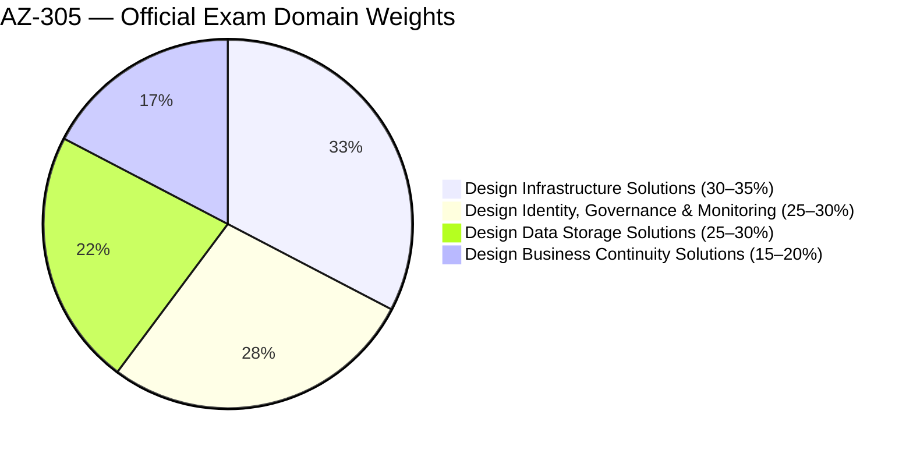
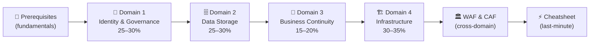

# 📘 AZ-305 Study Notes
{: .no_toc }

**Microsoft Azure Solutions Architect Expert**
{: .fs-5 .fw-300 }

[Start Studying →](#-exam-overview){: .btn .btn-primary .fs-5 .mb-4 .mb-md-0 .mr-2 }
[View on GitHub](https://github.com/marcogrimaldi29/az-305-study-notes){: .btn .fs-5 .mb-4 .mb-md-0 }

---

> 🏠 These notes are maintained by **[Marco Grimaldi](https://www.linkedin.com/in/marco-grimaldi29/)** — Cloud Consultant & Language Trainer.
> Find more certification guides, study tips, and tech content at **[marcogrimaldi29.com](https://marcogrimaldi29.com)**.

---

## 🎯 Exam Overview

| Detail | Value |
|--------|-------|
| 🏅 Certification | **Microsoft Certified: Azure Solutions Architect Expert** |
| 📝 Passing Score | **700 / 1000** |
| 💶 Price (EU) | **~€126** *(varies by country, VAT may apply)* |
| ⏱️ Duration | **~120 minutes** |
| 🔁 Renewal | **Annual** — free online assessment on Microsoft Learn |
| 🛡️ Prerequisite | **AZ-104: Azure Administrator Associate** *(active cert required)* |

---

## 📊 Domain Weights

| # | Domain | Weight | Key Focus Areas |
|---|--------|--------|----------------|
| 1 | [Design Identity, Governance & Monitoring](./01-identity-governance-monitoring/) | **25–30%** | Entra ID, RBAC, PIM, Azure Policy, Monitor, Sentinel |
| 2 | [Design Data Storage Solutions](./02-data-storage-solutions/) | **25–30%** | Azure SQL, Cosmos DB, Blob, ADLS Gen2, Synapse |
| 3 | [Design Business Continuity Solutions](./03-business-continuity/) | **15–20%** | HA, DR, SLAs, Backup, ASR, geo-replication |
| 4 | [Design Infrastructure Solutions](./04-infrastructure-solutions/) | **30–35%** | Compute, Networking, Migrations, App Architecture |

---

## 🗂️ Notes Index

<h3 style="margin-top:0;">📘 Prerequisites</h3>

Core Azure architecture: regions, availability zones, VNets, compute, storage, and identity fundamentals.

<a href="./00-azure-prerequisites/" class="btn btn-outline fs-5">Read →</a>

<h3 style="margin-top:0;">🔐 Domain 1 — Identity & Governance</h3>

<strong>25–30%</strong> of exam. Entra ID, RBAC, PIM, Conditional Access, Azure Policy, Azure Monitor, Sentinel.

<a href="./01-identity-governance-monitoring/" class="btn btn-outline fs-5">Read →</a>

<h3 style="margin-top:0;">🗄️ Domain 2 — Data Storage</h3>

<strong>25–30%</strong> of exam. SQL family, Cosmos DB consistency, Blob tiers, ADLS Gen2, Synapse, ADF.

<a href="./02-data-storage-solutions/" class="btn btn-outline fs-5">Read →</a>

<h3 style="margin-top:0;">🔄 Domain 3 — Business Continuity</h3>

<strong>15–20%</strong> of exam. SLA math, HA patterns, Azure Backup, ASR, auto-failover groups.

<a href="./03-business-continuity/" class="btn btn-outline fs-5">Read →</a>

<h3 style="margin-top:0;">🏗️ Domain 4 — Infrastructure</h3>

<strong>30–35%</strong> of exam — heaviest domain. Compute, networking, migrations, messaging, API Management.

<a href="./04-infrastructure-solutions/" class="btn btn-outline fs-5">Read →</a>

<h3 style="margin-top:0;">🏛️ Well-Architected & CAF</h3>

WAF 5 pillars (Reliability, Security, Cost, Ops, Performance) + Cloud Adoption Framework lifecycle.

<a href="./05-well-architected-framework/" class="btn btn-outline fs-5">Read →</a>

<h3 style="margin-top:0;">⚡ Quick Reference Cheatsheet</h3>

Key numbers, SLA tables, decision matrices, EU pricing, exam traps, and pre-exam checklist.

<a href="./06-quick-reference-cheatsheet/" class="btn btn-outline fs-5">Read →</a>

---

## 🧠 How to Use These Notes

These notes are structured to follow the **official AZ-305 study guide** domain order. The recommended reading flow:

### Study Tips

- 🎯 The exam tests **"why this service?"** — think in trade-offs and constraints, not just definitions
- 💶 Know **SKU tier feature gates** — what's in Premium that Standard doesn't have often decides exam answers
- 📊 **SLA uptime percentages** appear regularly in scenario questions — the cheatsheet has a full table
- ⚠️ Each section has **`Exam Caveats`** callouts — these are high-frequency exam traps
- 🔄 Each domain ends with a **quick-reference scenario table** — great for final review

---

## 📚 Official Resources

| Resource | Link |
|----------|------|
| 🎓 Microsoft Learn Path | [AZ-305 Prerequisites](https://learn.microsoft.com/en-us/training/paths/microsoft-azure-architect-design-prerequisites/) |
| 📋 Skills Measured Guide | [Official Study Guide](https://learn.microsoft.com/en-us/credentials/certifications/resources/study-guides/az-305) |
| 🧪 Free Practice Assessment | [Practice Test](https://learn.microsoft.com/en-us/credentials/certifications/exams/az-305/practice/assessment?assessment-type=practice&assessmentId=15) |
| 🏗️ Architecture Center | [Azure Architecture Center](https://learn.microsoft.com/en-us/azure/architecture/) |
| 💶 EU Exam Booking | [Pearson VUE Microsoft](https://home.pearsonvue.com/microsoft) |

---

## ✍️ About the Author

These notes are maintained by **Marco Grimaldi**, an IT professional and certification enthusiast writing about Azure, cloud architecture, and language certifications.

📍 **Find more content at [marcogrimaldi29.com](https://marcogrimaldi29.com)**

> Sharing study notes, certification tips, and tech insights for the IT community.

---

*Content based on the Microsoft Learn AZ-305 path and official study guide (October 2024 revision).
Not affiliated with or endorsed by Microsoft Corporation.*
